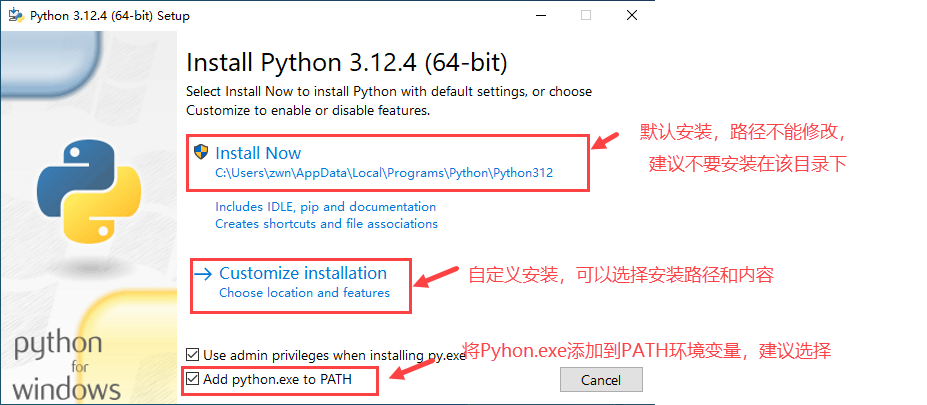
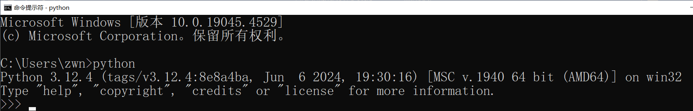
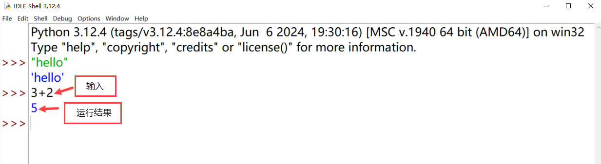
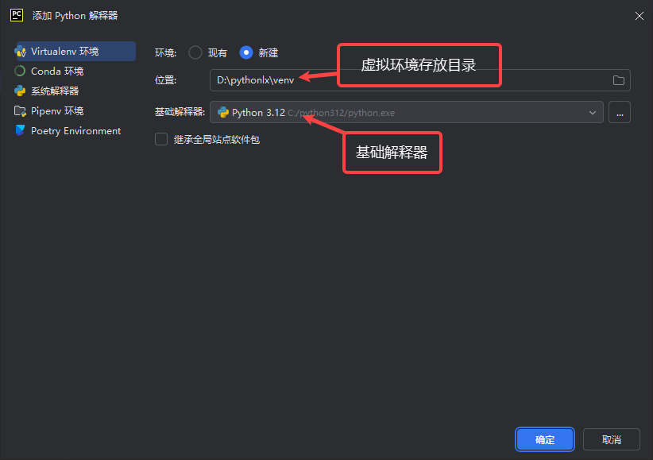
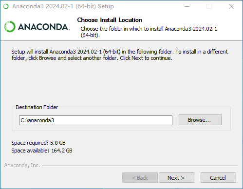
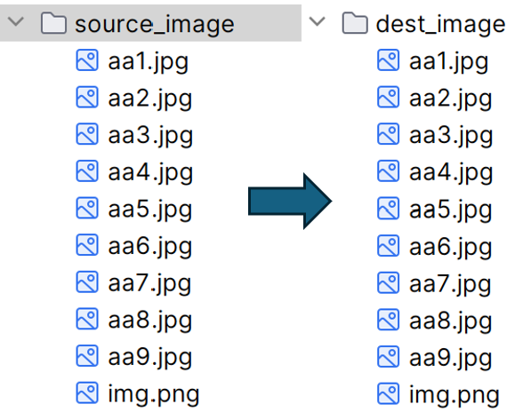
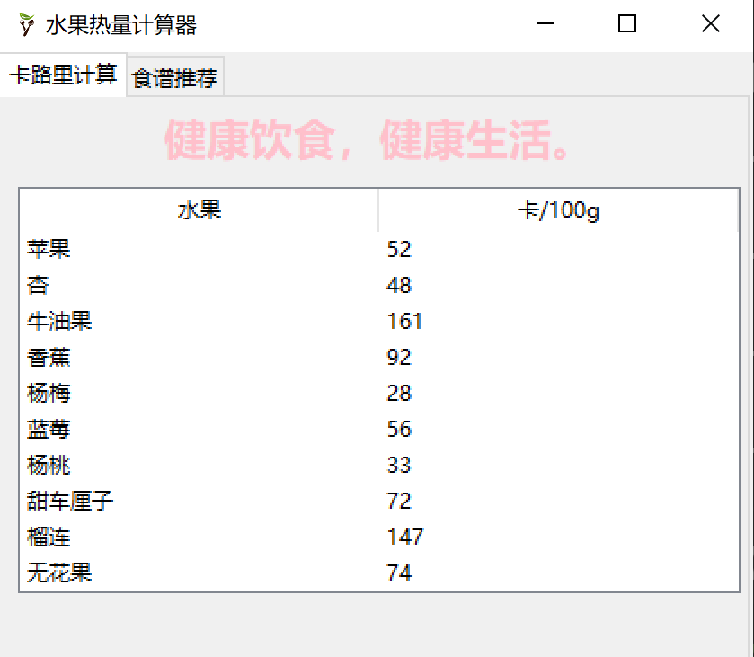
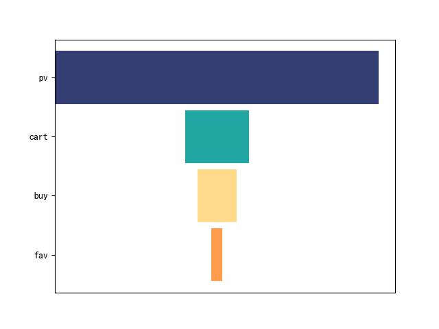

# 工作环境搭建

1. 搭建Python环境方案

---

编写Python程序需要编辑工具，运行Python程序需要解释器。Python解释器可以在Python官网（[[https://www.python.org/downloads/]](https://www.python.org/downloads/)）下载安装。常用Python
集成开发工具有：Python IDLE、PyCharm、Visual Studio Code (VS Code)、Jupyter
Notebook、Spyder等。这些开发工具除了代码编写功能，还提供了测试和调试代码所需的工具和功能。

常用Python开发环境有3种方案：

- 方案1 ：Python IDLE

> Python IDLE是Python自带的一个简单IDE，安装Python解释器后自动安装。功能有限，界面简单直观，适合初学者。

- 方案2：VSCode/PyCharm/Jupyter notebook等IDE+ Python解释器

> VSCode、PyCharm等IDE功能强大，可以提供代码自动补全，程序调试，版本控制等功能，但这些IDE本身不包含Python解释器，需在IDE中配置已安装好的解释器。此类IDE工具各有特点，在使用时可以根据自己的需求，选择安装。

- 方案3：Anaconda集成开发环境

> Anaconda 是一个开源的 Python 和 R语言的发行版，它旨在简化包管理和部署。Anaconda集成了Python解释器、Jupyter、Notebook、Spyder等常用工具，开箱即用。由于Anaconda预装了许多库和工具，导致其安装包体积较大，占用的磁盘空间较多。Anaconda中库的版本更新不一定及时，可能某些库和工具的版本较旧，无法满足某些项目的需求，也可能不同版本的库之间有依赖冲突，需要进行版本管理和依赖解决。

## 2. 安装Python 解释器

Python解释器可以在Python官网（[[https://www.python.org/downloads/]](https://www.python.org/downloads/)）下载然后安装。
以Window 10平台为例，Python下载安装过程如下：

### 下载Python安装文件

在Python官网可以方便地下载Python的安装包，具体下载步骤如下：

(1) 打开浏览器，输入Python官网地址<https://www.python.org/>，如图1‑1所示。


<p style="text-align: center;">图 1‑1 Python官网首页</p>

(2) 如图1‑2所示，左侧列出可以选择的下载项，右侧列出支持本机操作系统的最新Python版本。


<p style="text-align: center;">*图 1‑2 Downloads选项*</p>

(3) 点击图 1‑2 左侧的"Windows"打开如图1‑3页面，在列出的内容中选择自己需要的版本进行下载。

> 

<p style="text-align: center;">*图 1‑3 windows安装包选择*</p>

网站提供两种Python安装包选项Windows installer 和Windows embedding package。64-bit、32-bit、ARM64指不同的操作系统和硬件架构。用户可以通过检查自己电脑的硬件配置和操作系统类型，选择适合的Python包进行下载。

表示Python版本为3.12.4。

Windows installer通过图形界面引导用户一步一步完成Python安装。安装过程中，可以自定义Python安装路径、选择要安装的功能（如Python解释器、IDLE集成开发环境等)以及设置环境变量。Windows Installer适用于大多数用户，尤其是那些不熟悉命令行操作的用户。

Windows embeddable package是一个轻量级的安装包，专为开发者设计，无需安装，解压后即可使用，适合定制化和便携式应用。Windows embeddable package包含了Python的核心功能，但省略了一些额外的工具和库，其目的是让开发者可以轻松地将Python集成到他们的应用程序中，而不需要安装完整的Python环境。

> **说明：**
>
> 查看计算机系统及硬件结构以Windows10系统为例，在桌面上找到"此电脑"图标，右键单击图标，在弹出的菜单中点击"属性"，如图1‑4 所示。弹出"系统"窗口，在该窗口中即可看到"系统类型"，如图1‑5所示。
> 
>
> ​ <p style="text-align: center;">_图 1‑4 "此电脑"右键菜单_ </p>
>
> 

<p style="text-align: center;">*图 1‑5 属性信息* </p>

(4) 点击"Windows installer (64-bit)"，下载完成后会看到"python-3.12.4-amd64.exe"文件。

> **说明:**
> 安装Python时，不一定要安装最新版本，Python版本过新，在使用某些第三方库时，可能会由于第三方库没有及时更新，出现不能运行的情况。

### 安装Python解释器

以Windows 64位操作系统为例，说明Python解释器安装过程。

(1) 双击下载好的安装包文件，如："python-3.12.4-amd64.exe"，将显示安装向导对话框，如图1-6所示。在安装时强烈建议选中"Add Python.exe to PATH"，否则在使用中会出现"XXX不是内容或外部命令"错误。



<p style="text-align: center;">图 1‑6 安装方式选择</p>

（2） 以自定义安装为例，选择"Customize installation"打开安装选项对话框，如图 1-7所示。

> 

<p style="text-align: center;">图 1‑7 安装选项</p>

（3）单点Next按钮，打开"Advanced Options"对话框，如图1-8所示。在该对话框中，修改安装路径，然后点击"Install"开始安装Python。

> 

<p style="text-align: center;">图 1‑8 安装目录选择</p>

（4）安装完成后，出现如图 1-9界面。点击"close"关闭安装界面。

> 

<p style="text-align: center;">图 1‑9 安装完成</p>

上面安装过程完成后，将在系统中安装一批与Python开发和运行相关的程序，包括Python解释器python.exe，第三方库安装命令pip，一些常用函数等，还安装了轻量级Python语言开发环境Python
IDLE。

### 检验安装是否成功

Python安装完成后，正式使用前可以先测试一下环境是否正常，以免后续使用过程中出现找不到命令的问题。以Windows 10操作系统为例，检验Python是否安装成功过程如下：

打开"命令提示符"窗口，在命令行输入python，如果出现python版本提示，则表示python安装成功。如图 1-10所示。

> 

<p style="text-align: center;">图 1‑10 命令提示符窗口运行Python</p>

在"\>\>\>"后输入Ctrl+Z、quit()或者exit()可退出python环境。

如果出现"'python'不是内部或外部命令，也不是可运行的程序或批处理文件。"时，说明当前路径中找不到 python.exe可执行程序，可参考2.4.4小节进行Path环境变量配置。

为保障后续安装第三方库顺利，可以测试一下pip命令安装是否正常。在命令行中输入pip，出现如图 1-11所示信息，则表示pip安装成功。


<p style="text-align: center;">图 1‑11 查看pip命令</p>

如果出现"'pip'不是内部或外部命令，也不是可运行的程序或批处理文件。"时，说明当前路径中找不到pip.exe可执行程序，可参考"配置环境变量"小节进行Path环境变量配置。

### 配置环境变量

如果在"命令提示符"窗口，不能正常运行python或pip命令，则需要配置环境变量Path。下面以windows10为例介绍环境变量的设置方法。

(1) 首先找到python.exe及pip.exe所在的目录，并复制下来。如：C:\\python312及C:\\python312\\Scripts。

(2) 右键单击"此电脑"，然后在弹出的快捷菜单中选择"属性"，打开"系统"对话框，单击"高级系统设置"超链接，打开如图1‑12 "系统"属性对话框，单击"环境变量"按钮。


<p style="text-align: center;">图 1‑12 系统属性对话框</p>

（3）点击"环境变量"按钮，打开如图 1‑13"环境变量"对话框。


<p style="text-align: center;">图 1‑13 环境变量对话框</p>

在环境变量中有"系统变量"和"用户变量"两种变量。"系统变量"对系统中所有用户都有效，无论是系统管理员还是普通用户。"用户变量"只对当前用户有效，不会影响其他用户的环境设置。如这里选择系统变量中的"Path"变量，然后单点"编辑"。

（3）在弹出的"编辑环境变量"对话框中，单击"新建"按钮。并且在光标所在位置分别输入刚才保存的python.exe及pip.exe所在的目录。如图1-14所示，单击"确定"完成环境变量的设置。


<p style="text-align: center;">图 1‑14 设置Path环境变量</p>

### Python IDLE的使用

Python解释器安装完成后，会自带一个Python IDLE IDE。Python IDLE 提供交互式和文件式两种工作模式。

1.  **交互模式**

单击Windows 10的"开始"菜单，找到IDLE菜单，打开Python IDLE。

> ## 

<p style="text-align: center;">图 1‑15 Python IDLE菜单</p>

> 

<p style="text-align: center;">图 1‑16 Python IDLE窗口</p>

在Python提示符"\>\>\>"每写完一条语句，按回车键后，就会执行该语句，如图1-17所示。



<p style="text-align: center;">图 1‑17 Python IDLE交互模式</p>

交互模式适合单句运行、练习。在实际开发时，不可能只写一条语句，通常需要多条语句完成一个完整的逻辑，这时就需要用文件模式来完成。

**2. 文件模式**

点击Python IDLE"File"菜单中的"New File"或者用快捷键"Ctrl+N"，即可新建一个Python文件。Python文件默认的扩展名为.py或.pyw。".py"文件用python.exe解释，运行时会出现控制台窗口，"\*.pyw"文件用pythonw.exe解释，运行时不会出现控制台窗口，主要用于一些要图形界面的程序。如新建一个python文件，输入如图 1-18所示代码：


<p style="text-align: center;">图 1‑18 示例代码</p>

点击"File"/"Save"或"Save As"菜单可保存文件，点击"Run"/"Run Module"可运行该文件，运行结果如图 1-19所示：


<p style="text-align: center;">图 1‑19 运行结果</p>

在Python IDLE中除了利用菜单外，还可以利用快捷键进行程序编写、编辑和运行。常用快捷键如表 1‑1所示。

<p style="text-align: center;">表 1‑1 Python IDLE常用快捷键</p>

| 快捷键       | 功能                         |
| ------------ | ---------------------------- |
| Alt+P        | 浏览历史命令（上一条）       |
| Alt+N        | 浏览历史命令（下一条）       |
| Alt+/        | 自动补全前面曾经出现过的单词 |
| Alt+3        | 注释代码块                   |
| Alt+4        | 取消代码块注释               |
| Ctrl+Z       | 撤消一步操作                 |
| Ctrl+Shift+Z | 恢复上一次的撤消操作         |
| Ctrl+S       | 保存文件                     |
| Ctrl+\]      | 缩进代码块                   |
| Ctrl+\[      | 取消代码块缩进               |

Python IDLE是轻量级的语言开发环境，所提供的功能有限，在实际开发项目时，可以选择Visual Studio Code或PyCharm等IDE工具+Python解释器搭建Python开发环境。

## 2. 搭建VS Code开发环境

VSCode是一款由微软开发的免费、开源的代码编辑器。它支持多种编程语言，拥有丰富的功能和扩展插件，便于用户快速高效地进行软件开发。VSCode具有强大的代码编辑功能、智能代码补全功能、调试工具、Git版本控制集成等特性。用户可能通过安装各种扩展定制VSCode满足足不同开发需求。在VSCode中安装Python插件，配置Python解释器后即可进行Python代码编写、运行。下面以Windows10操作系统中VSCode工作环境搭建为例进行说明。

### VS Code安装

(1) 在VS Code官网（<https://code.visualstudio.com>）下载适合自己计算机的安装包并安装。首页会自动检测适合本机操作系统的版本，或者点单击"Download"菜单找到适合的版本下载。


<p style="text-align: center;">图 1‑20 VS Code下载界面</p>

(2) 单击下载完成的\*.exe可执行文件，按照向导点击"下一步"进行安装。安装过程中建议修改安装路径，如图1-21所示。

> 

<p style="text-align: center;">图 1‑21 VS Code安装路径选择</p>

#### VS Code插件安装

VS Code是一款通用的代码编辑器，为了满足开发者的特定需求，VSCode支持通过插件来扩展其功能。

**1. 安装中文汉化包**

（1）如图 1-22所示，打开安装好的VS Code，点击左侧边栏中的扩展图标（Extensions），或使用快捷键Ctrl+Shift+X（Windows/Linux）或Cmd+Shift+X（Mac）打开扩展商店。

（2）在搜索框中输入你想要安装的插件名称或关键词"Chinese"，然后按回车键进行搜索。

（3）在搜索结果中找到你需要的插件"Chinese (Simplified) Language Pack for Visual Studio Code"，点击插件右侧的"Install"按钮。


<p style="text-align: center;">图 1‑22 VS Code插件安装</p>

安装并重启之后，Visual Studio Code会变为中文菜单。如果重启后，菜单还不是中文，点击"管理/命令面板\..."或按"Ctrl + Shift + P "键打开命令面板,输入"Configure Display Language"，然后选择"中文（简体）"，选择后根据提示重启即可。


<p style="text-align: center;">图 1‑23 设置中文显示</p>

**2. 安装Python插件**

> 如图 1‑24所示，搜索"Python"插件进行安装。


<p style="text-align: center;">图 1-24 安装Python插件</p>

#### 配置Python解释器

如图 1‑25所示，点击"管理\|命令面板\..."或按"Ctrl + Shift +P" 键打开命令面板,输入 "Python:Select Interpreter "命令，配置默认的解释器。


<p style="text-align: center;">图 1‑25 配置解释器</p>

选中要使用的解释器对应的"PythonXX.exe"，如图 1‑26所示。可以从列出的内容选择也可以输入解释器路径选择。


<p style="text-align: center;">图 1‑26 选择解释器</p>

### 利用VS Code编辑运行Python程序

VSCode是以文件夹为基础来管理项目的。在 VSCode中，一个项目通常对应一个文件夹，这个文件夹被称为工作区(Workspace)。可以通过选择"打开文件夹"来打开一个项目，这样 VS Code就会将这个文件夹及其子文件夹中的所有文件视为一个项目。

#### 新建Python程序

创建一个名为"Pythonlx"的文件夹，然后在VS
Code中选择"文件"\|"打开文件夹\..."打开"Pythonlx"文件夹作为项目的根目录。利用"文件"\|"新建文件"或点击"新建文件"按钮，新建一个名为"hello.py"的文件，如图1‑27所示。


<p style="text-align: center;">图 1‑27 VS Code 窗口介绍</p>

注意新建文件时，要输入包含扩展名的完整文件名，如："hello.py"，因为VSCode是通用编辑器，若新建文件不带扩展名，编辑器便不知道文件格式，只有标注了扩展名".py"，VS Code才会将其识别为Python文件。在新建的文件中输入下列代码：

```python
msg = 'Hello World'
print(msg)  
```

点击VSCode右上角的运行按钮或在代码窗口单击右键，选择"运行Python/在终端中运行Python文件"，运行完成后可看到运行结果。

还可以通过其他方式在 VS Code 中运行 Python 代码片段：

选择一行或多行，然后按Shift+Enter或右键单击并选择在 "Python终端中运行选择/行"，如图 1-28所示。此命令适用于仅测试文件的一部分。


<p style="text-align: center;">图 1‑28 Python终端中运行选择内容</p>

或者从命令面板 ( Ctrl+Shift+P ) 中选择"Python: StartREPL"命令，为当前选定的 Python解释器打开终端。在终端中，您可以一次输入并运行一行代码。如图 1-29所示。


<p style="text-align: center;">图 1‑29 在终端运行代码</p>

#### VS Code使用中的一些快捷键

使用VS Code 编辑程序时可以使用快捷键进行操作，常用快捷键如表1-2所示：

<p style="text-align: center;">表 1‑2 VS Code常用快捷键</p>

| **快捷键**      | **作用**     |
| --------------- | ------------ |
| **Ctrl+"+"**    | 放大编辑窗口 |
| **Ctrl+"-"**    | 缩写编辑窗口 |
| **Alt+Z**       | 自动换行     |
| **Alt+Shift+F** | 代码格式化   |
| **Ctrl+"/"**    | 切换注释     |

## 3. 搭建PyCharm开发环境

PyCharm是一种由JetBrains开发的IDE，它提供了丰富的功能，如智能代码编辑器、全行代码补全、远程开发、集成式数据库管理等。PyCharm还支持Django、Flask等Python框架，并提供了丰富的插件生态系统。PyCharm提供专业版和社区版两个版本：专业版收费，具备更高级的功能和服务，适合专业开发者和团队使用；社区版免费，基本功能都有，可以满足初学者的开发需求。

### PyCharm安装

下面介绍在Windows 10操作系统中搭建PyCharm环境。

（1） 下载安装PyCharm

打开PyCharm官方（[[https://www.jetbrains.com/pycharm/]](https://www.jetbrains.com/pycharm/)），点击页面中的"Dowload"按钮，进入到PyCharm的环境和版本选择页面。

（2） 选择下载Windows平台的社区版（Community Edition），如图 1-30所示。

> 

<p style="text-align: center;">图 1‑30 PyCharm版本选择</p>

（3）下载完成后，双击下载好的安装文件"pycharmXXX.exe"，在打开的界面中点击"下一步"进行下一步安装。

（4） 在软件安装路径的设置界面，设置合适的安装路径，建议不要安装在过深的目录中。


<p style="text-align: center;">图 1‑31 PyCharm安装路径选择</p>

（5） 选择路径后，点击"下一步"，出现如图1-32界面:


<p style="text-align: center;">图 1‑32 PyCharm安装选项</p>

四个安装选项的含义分别是：

勾选后，在桌面上创建PyCharm的快捷方式，方便快速启动。

勾选后，右键点击文件夹时，会出现"Open Folder as PyCharm Project"选项，可以选择使用PyCharm直接打开该文件夹作为一个项目。这样可以更快捷的方式来管理和编辑项目文件，无需先打开PyCharm再手动选择项目文件夹。

勾选后，.py文件可以与PyCharm关联，双击.py文件即可在PyCharm中打开。

勾选后，电脑重启后会更新环境变量，使得可以直接在命令行或终端输入pycharm便可启动PyCharm。

根据自己需求去选择就好了，一般选择就行。

（6） 勾上自己需要的配置选项，点击"下一步"，进入到如图1‑33所示界面，直接点击"安装"就行，然后正式进入到安装过程。


<p style="text-align: center;">图 1‑33 PyCharm安装界面</p>

（7）安装完成后，选择是否重启，然后点击"完成"即可完成安装。


<p style="text-align: center;">图 1‑34 PyCharm安装完成界面</p>

### PyCharm配置

#### Pycharm汉化

（1）打开PyCharm，点击左上角的"File"菜单，然后选择"Settings"。

（2）在设置界面中，找到并点击"Plugins"。

（3）在插件市场中，搜索"Chinese"，选择中文语言包，点击右边的"Install"按钮进行安装。

（4）安装完成后，重启PyCharm即可看到中文界面。


<p style="text-align: center;">图 1‑35 PyCharm 汉化配置界面</p>

#### 配置Python解释器

（1）打开PyCharm，选择新建项目或打开已有的项目。

（2）点击菜单"文件"\|"设置"，打开如图1‑36所示对话框。选择"项目\*\*\*"\|"Python解释器"

> 

<p style="text-align: center;">图 1‑36 Python解释器设置</p>

（3）点击"添加解释器"进入解释器添加界面。

> 

<p style="text-align: center;">图 1‑37 添加Python解释器</p>

- Virtualenv环境：创建一个新的虚拟环境。选择一个基础解释器，然后设置文件夹存放虚拟环境。确认后，PyCharm会自动创建并配置虚拟环境。

- Conda 环境：如果计算机系统中已经安装了Anaconda，可以使用此选项创建一个新的 Conda 环境。选择一个 Python版本，设置环境名称和位置，然后确认，PyCharm 将自动配置 Conda 环境。

- 系统解释器：从计算机系统中选择已安装的 Python 版本。（例如，在Windows 上为 python.exe，在 macOS 或 Linux 上为 python 或 python3）

Virtualenv虚拟环境是独立的Python环境，与系统中的其他解释器隔离，这有助于管理不同的项目依赖项，并防止冲突。每个虚拟环境中可以安装不同的包，从而避免不同项目之间的依赖冲突。系统解释器是Python安装附带的解释器，可以直接使用系统中已安装的Python版本来执行代码。如果你需要管理多个项目的依赖并避免版本冲突，建议配置虚拟环境解释器。如果你希望简化配置过程并节省时间，可以选择系统解释器。

### 编辑运行Python文件

（1）利用"文件"\|"新建"\|"Python文件"或者右键单击新建好的项目，在弹出的菜单中选择"新建"\|"Python文件"新建Python文件。


<p style="text-align: center;">图 1‑38 PyCharm新建文件</p>

（2） 输入文件名"hello"，新建hello.py文件，在代码编辑区输入相应代码，点击"运行"按钮，即可运行代码。如图1‑39所示。

> 

<p style="text-align: center;">图 1‑39 PyCharm窗口</p>

> PyCharm中除了可以利用"运行"按钮运行文件，也可以选中代码，单击右键打开快捷菜单，选择运行文件或选中代码。

## 4. 搭建Anaconda集成开发环境

Anaconda是一个Python的集成环境，它自带Python解释器并集成众多常见的第三库，如Numpy、Pandas等数据处理科学计算软件包。同时，它还提供了包管理工具 pip 与conda，以及Jupyter Notebook、Spider代码编辑工具。如果经常使用Python进行数据分析或科学计算，可以直接安装Anaconda，这样可以省去安装众多数据分析包的麻烦。

### Anaconda 安装

**1\. 安装Anaconda**

（1）在官网（https://www.anaconda.com/products/individual）或国内镜像（如：https://mirrors.tuna.tsinghua.edu.cn/anaconda/archive/）下载个人免费版本。


<p style="text-align: center;">图 1‑40 Anaconda下载界面</p>


<p style="text-align: center;">图 1‑41 Anaconda国内镜像</p>

（2） 下载完成后，双击下载的"AnacondaXXX.exe"文件，单击"Next"进行安装，在"Lincense Agreement"对话框选择"I Agree"，选择安装类型，如图 1‑42所示。


<p style="text-align: center;">图 1‑42 Anaconda安装类型选择</p>

（3）选择安装路径，点击"Next"。



<p style="text-align: center;">图 1‑43 Anaconda安装路径选择</p>

（4）如图 1‑44所示，选择高级安装选项，然后点击"Install"开始安装。


<p style="text-align: center;">图 1‑44 Anaconda安装选项选择</p>

（5）等待安装过程结束后，点击"Finish"完成安装。

#### 检查Anaconda是否安装成功

如果可以成功启动Anaconda Navigator则说明安装成功。

### 使用Jupyter新建交互脚本

Jupyter Notebook是一个开源的Web应用程序，它支持交互式编程，可以在Jupyter Notebook 中直接编写代码并执行，实时查看结果。Jupyter Notebook支持富文本格式，既可以在Jupyter单元格中书写程序代码，也可以用Markdown语言，添加格式化文本、链接、图片、视频等。Anaconda安装好后会自动安装Jupyter
Notebook，也可以通过pip 安装Jupyter 包。

（1）启动Jupyter Notebook

点击"开始"菜单中的"Jupyter notebook"或者在"开始"菜单的搜索框中输入Jupyter notebook，即可启动Jupyter Notebook。

（2） 创建新的Notebook

在Jupyter Notebook界面中，点击右上角的"New"按钮，可以选择新建的内容，如图1‑45所示。选择"Notebook"可新建Notebook文件，第一次新建文件，需要选择"Kernel"，如图1‑46所示。在创建新的Notebook时，可以选择不同的内核。


<p style="text-align: center;">图 1‑45 Jupyter Notebook新建文件</p>


<p style="text-align: center;">图 1‑46 选择Jupyter Notebook内核</p>

（3） 运行代码

在Notebook中，将光标放在要执行的代码单元格中。按下"Shift+Enter"键或通过"Run"菜单或"运行"按钮运行所选单元格的代码。

（4） 保存Notebook

在Notebook中，通过"File"菜单的相关选项可将Notebook保存为.ipynb文件，也可以用"Save and Export Notebook As..."把Notebook导出为不同的文件格式。

1. AI辅助编码

---

### 大模型API辅助编程

大模型是指利用海量数据、通过先进的算法和技术，训练得到的具有强大预测和决策能力的人工智能模型。可以利用大模型API，通过提示词轻松生成代码。如：
打开文心一言（https://yiyan.baidu.com/），输入提示词"请用Python编程计算1-100之间所有奇数和"，然后会自动生成如图1‑47所示代码，并给出相应解释。


<p style="text-align: center;">图 1‑47 文心一言生成代码</p>

点"复制代码"，将复制的代码粘贴到Python IDE中，如粘贴到VSCode新建的Python文件中，运行即可看到程序结果。

### AI编程插件

AI编程插件是一种利用人工智能技术辅助编程的工具，这些工具提供自动代码生成、智能化代码补全、错误检测、代码优化等功能，降低学习门槛，帮助程序员更快地编写高质量的代码。目前使用较多的AI编程插件有：

**GitHub Copilot：**是由GitHub与OpenAI合作开发的一款智能代码生成和补全工具，广泛应用于多种编程语言中。

**CodeGeeX：**是由清华大学和智谱AI联合打造的多语言代码生成工具，支持超过300+种编程语言，适配多种主流IDE平台，包括Visual
Studio Code、JetBrains IDEs、Visual
Studio、HBuilderX、DeepIn-IDE等。CodeGeeX能够实现自动生成代码与补全、翻译代码、重构代码、编写文档以及回答编程问题等。

**通义灵码**：是阿里推出的基于通义大模型的AI编码助手，提供代码智能生成、研发智能问答等功能。

……

下面以在VSCode中安装、使用CodeGeex为例，说明如何利用AI编程插件辅助编程。

#### CodeGeeX安装

如图 1‑48所示，打开VS Code点击左侧Extensions（扩展）按钮,在搜索框中输入"codegeex"并搜索, 在搜索结果中点击安装。


<p style="text-align: center;">图 1‑48 安装CodeGeex插件</p>

#### CodeGeeX使用

（1） 根据提示词生成代码

在提示词框中输入提示词回车，即可自动生成代码，可以复制、插入代码到文件。


<p style="text-align: center;">图 1‑49 CodeGeex提示词框</p>

（2）自动补全代码

当打开一个代码文件后，开始编码。在编码过程中稍等一下，即可看到CodeGeeX根据上下文代码内容，推理出来的可能代码。如果认为推理出的代码合理，使用快捷键Tab对生成的代码进行采纳。如果认为内容不合适，任意键取消推荐的内容，继续手动编码。另外编写注释后回车，也可看到推理出来的可能代码。

（3）其他功能

如图1‑50所示，选中代码单击右键，可以进行代码解释、生成注释、代码审查等。更多CodeGeeX功能可以查看CodeGeeX官网使用手册。


<p style="text-align: center;">图 1‑50 CodeGeex右键菜单</p>

#### AI辅助编程思考

既然AI工具可以编程，还需要学习编程吗？答案是需要，而且还要学得更扎实。在编程方面,AI工具可以实现自动编码和智能代码补全，也可以根据提示词进行代码调试，这在很大程度上提高了代码编写效率，降低了初学者门槛。但生成的代码是否符合用户意图还需要人工判断，对于复杂业务的处理，还需要人类意识。读者应该先学好Python基础知识，在具备基本编程和程序评判能力的基础上，借助AI能力，达到更好的编程能力和更快的编程速度。

## 思考与练习

1.  在自己的计算机上搭建一种Python开发环境，并编写程序输出"Hello，World!"

2.  利用AI编程工具辅助编写Python程序绘制一颗红心。


# 模拟科学实验------标记重捕法

<div style="background-color:green">
科学实验是科学研究的基础，通过实验可以验证科学理论、发现新现象和探索未知领域。随着计算机技术的不断发展，利用计算机模拟科学实验已成为一种重要的研究方法。Python作为一种通用的编程语言，具有丰富的科学计算和数据分析库，这为模拟科学实验提供了有力的支持。本章使用Python模拟估计生物种群大小的"标记重捕法"。通过案例学习，体会计算思维在模拟科学实验领域的应用。了解模拟科学实验的基本思路，学习Python编程基础知识。

## 需求分析

计算思维的本质就是抽象和自动化。使用计算思维不仅可以解决生活问题，也可以用于科学探究。在科学研究中常常需要借助程序进行辅助计算、模拟、预测等。

标记重捕法（Mark-Recapture Method）是一种生态学方法，用于估计一个种群的大小。标记重捕法基于这样一个假设：在第一次捕捉并标记一部分个体后，第二次捕捉时捕获的标记个体与未标记个体的比例是恒定的。利用这个比例可以估计整个种群的大小。

本章引入生物学科的科学问题，通过模拟真实的研究过程，统计模拟结果，验证"标记重捕法"公式的准确性。

</div>

## 学习目的

### 熟悉Python基础知识

本案例首先会对python编程基础知识进行回顾。包括：列表的使用、程序基本结构、库的使用、Matplotlib库进行数据可视化、函数定义等Python基础知识。

### 掌握科学研究方法

使用计算机模拟科学实验有助于探索和理解复杂系统的行为，是科学研究方法的一个重要组成部分。通过计算机模拟验证，可以更全面理解科学现象、探索未知领域。本案例模拟验证"标记重捕法"，通过案例的实现熟悉利用计算机进行科学实验模拟的过程。本案例包括数据获取、实验设计、结果分析等。

### 提高数据分析能力

模拟实验将要解决的科学实验问题进行抽象，利用数据和算法模拟现实世界中的实验过程。计算机模拟可以方便处理复杂且难以直接实验的问题，如核物理学和气象学的研究。模拟实验可方便地改变实验条件，进行多次重复实验，这对于验证假设、发现新思路、预测未来等都很有帮助。

### 促进跨学科学习

本章介绍的"标记重捕法"涉及生态学、统计学、计算机科学等多个学科。通过本案例体会计算思维在解决其他学科问题中的应用，理解计算思维对问题求解的意义。

## 环境要求

Matplotlib库

## 相关知识

### 列表

Python列表是包含0个或多个元素的**有序序列**，列表中的元素类型不限，可以是数值型、字符型、逻辑型等。同一个列表中的元素类型可以不同。列表中的元素也可以是另一个列表、元组，形成这些结构的嵌套。如：

```python
student1=["张三",18,[99,98,100]] 
```

student1列表中包含了字符型数据"张三"，数值型数据18以及列表[99,98,100\]。

列表的长度和内容都是可变的，可对列表中的元素进行增加、删除或修改。如表 2‑1所示，列举了列表常用的方法。

<p style="text-align: center;">表 2‑1列表常用方法</p>

| 操作         | 描述                                                     | 示例                                                      |
| ------------ | -------------------------------------------------------- | --------------------------------------------------------- |
| `append()`   | 在列表末尾添加一个元素                                   | `my_list.append("black")`                                 |
| `extend()`   | 将另一个列表（或任何可迭代对象）的元素添加到当前列表末尾 | `my_list.extend(["yellow","purple"])`                     |
| `insert()`   | 在列表的指定位置插入元素                                 | `my_list.insert(1,"pink")`（在索引1的位置插入元素"pink"） |
| `remove()`   | 移除列表中第一个出现的指定元素                           | `my_list.remove('pink')`                                  |
| `pop(index)` | 移除列表中指定位置的元素，并返回该元素的值               | `my_list.pop(0)`（移除索引为0的元素）                     |
| `index()`    | 返回列表中指定元素第一个匹配项的索引                     | `my_list.index("green")`                                  |
| `count()`    | 返回列表中指定元素出现的次数                             | `my_list.count("blue")`                                   |
| `reverse()`  | 反转列表中元素的顺序                                     | `my_list.reverse()`                                       |
| `sort()`     | 对列表中的元素进行排序                                   | `my_list.sort()`                                          |
| `sorted()`   | 返回列表的一个已排序的副本，原列表不变                   | `sorted_list = sorted(my_list)`                           |
| `len()`      | 返回列表的长度                                           | `length = len(my_list)`                                   |
| `in`         | 判断一个元素是否存在于列表中                             | `"black" in my_list`                                      |
| `not in`     | 判断一个元素是否不存在于列表中                           | `"black" not in my_list`                                  |

例：列表操作

```python
my_list=["red","green","blue","white"]# 创建列表
my_list.append("black") # 添加元素，到末尾添加元素
my_list.insert(1, "pink")# 在索引为1的位置插入"pink"
first_element = my_list[0]# 获取第一个元素
last_element = my_list[-1]# 获取最后一个元素
my_list[0] = "orange"# 修改第一个元素
del my_list[0]# 删除索引为0的元素
last_element = my_list.pop()# 删除并返回列表的最后一个元素：
my_list.sort()# 升序排序
my_list.sort(reverse=True)# 降序排序
my_list.reverse()# 反转列表
length = len(my_list) # 列表长度
# 遍历列表
for item in my_list:
    print(item,end=" ") 
```

在Python
IDE中运行上述代码，输出每一次操作后的my_list，体会列表的创建、插入、删除、元素访问、元素遍历等操作。

### 程序控制结构

程序控制结构是以某种顺序执行一系列动作。基本程序控制结构有：顺序结构、分支结构和循环结构。

#### 顺序结构

顺序结构是最基本的控制结构，也是大多数程序的基础。顺序结构程序中的代码按照从上到下的顺序依次执行。顺序结构流程图如图 2‑1所示。


<p style="text-align: center;">图 2-1 顺序结构流程图</p>
例：求矩形的面积和周长。

```python
# 从键盘接收用户输入的长和宽
length = float(input("请输入矩形的长: "))
width = float(input("请输入矩形的宽: "))
# 计算矩形的面积
area = length * width
print(f"矩形的面积是: {area}")
# 计算矩形的周长
perimeter = 2 * (length + width)
print(f"矩形的周长是: {perimeter}") 
```

```
运行结果：

请输入矩形的长: 5
请输入矩形的宽: 6.8
矩形的面积是: 34.0
矩形的周长是: 23.6
```

#### 选择结构

当需要分情况进行不同的处理时，就需要用选择结构。选择结构又称分支结构，是依据条件来选择执行路径。根据分支路径的多少分为：单分支结构、双分支结构和多分支结构。

（1）单分支结构

单分支结构流程图如图 2‑2所示。单分支结构中如果条件为真，则执行代码块中的代码；如果条件为假，则不执行代码块中的代码，直接跳过代码块继续执行后续的代码。


 <p style="text-align: center;">图 2‑2单分支结构流程图</p>

（2）双分支结构

双分支结构如图 2‑3所示，条件表达式为真时，执行语句块1，否则执行语句块2。


<p style="text-align: center;">图 2‑3 双分支结构流程图</p>

双分支语法结构如下：

```python
if 条件表达式:
    语句序列1
else:
    语句序列2  
```

例：根据输入的学生成绩，输出"及格"或"不及格"。

```python
score = eval(input("输入学生成绩："))
if score>=60:
    print("通过！")
else:
    print("没有通过！")
```

```
运行结果：
输入学生成绩：88
通过！
```

多分支结构

多分支结构流程图如图 2‑4所示。多分支结构使用if-elif-else语句来实现。如果表达式1为真，则执行语句块1，否则判断条件表达式2是否为真，如果为真则执行语句块2，......，如果所有条件都为假，则执行语句块n+1中的代码。


<p style="text-align: center;">图2-4 多分支结构流程图</p>

语法结构如下：

```
if 条件表达式1:
    语句序列1
elif 条件表达式2:
    语句序列2
……
elif 条件表达式 n:
    语句序列n
else:
    语句序列n+1
```

如：利用多分支结构，根据输入的百分制学生成绩，打印出"优秀、良好、中等、及格、不及格"等级。

```python
# 从键盘接收用户输入的分数
score = float(input("请输入分数: "))
# 使用多分支结构判断成绩等级
if score >= 90:
    grade = "优秀"
elif score >= 80:
    grade = "良好"
elif score >= 70:
    grade = "中等"
elif score >= 60:
    grade = "及格"
else:
    grade = "不及格"
# 打印成绩等级
print(f"该分数的成绩等级是: {grade}")  
```

运行结果：

```
请输入分数: 89
该分数的成绩等级是: 良好
```

#### 循环结构

程序中重复做某件事的现象称为循环。在使用循环结构时必须弄清楚：（1）重复做的工作是什么(循环体)（2）重复的条件（循环条件）是什么。

根据循环执行的次数是否确定，循环可以分为确定次数循环和非确定次数循环。确定次数的循环在Python中采用"for....... in......"结构的"遍历循环"实现，其中，循环次数由遍历结构中的元素个数确定。非确定次数的循环用while结构的条件循环实现，通过循环条件判断是否继续执行循环体。

(1) 遍历循环

遍历循环流程图如图 2‑5所示。每遍历一个元素执行一次循环体，直到迭代结构中的元素被全部遍历。


<p style="text-align: center;">图 2‑5 遍历循环流程图</p>

遍历循环的语法结构如下：

```
for \<循环变量\> in \<遍历结构\>:

循环体语句块
```

例：输出购书清单中每一本书的名称和价格。

```python
# 定义购书清单列表
book_list = [
    {"title": "Python编程", "price": 99.00},
    {"title": "深度学习", "price": 66.00},
    {"title": "机器学习实战", "price": 86.00},
    {"title": "人工智能", "price": 69.00}
]
# 使用for循环遍历购书清单
for book in book_list:
    print(f"书名: {book['title']}, 价格: {book['price']}元")
```

运行结果：

```
书名: Python编程, 价格: 99.0元

书名: 深度学习, 价格: 66.0元

书名: 机器学习实战, 价格: 86.0元

书名: 人工智能, 价格: 69.0元
```

遍历结构可以是任何可迭代的元素，除了上述的列表结构，也常用range()函数形成的数字序列。range(start,stop[,step\])函数返回从start到stop（不包含stop）步长为step的整数序列。其中start为开始的数值，默认从0开始；stop为结束的数值，生成的序列不包括该值；step为步长，默认为1。

如：求100以内的奇数和。

```python
sum=0 # 初始化总和为0
for i in range(1,100,2): # range生成1到100步长为2的奇数序列
    sum += i      # 将当前数字加到总和上
print(f"1+3+5+……+99={sum}") 
```

运行结果：

```
1+3+5+......+99=2500
```

(2) 条件循环

条件循环用于在满足特定条件的情况下重复执行一组语句。只要条件表达式为真，就执行循环体。条件循环的语法结构如下：

```
while 条件表达式:
循环体语句
```

如：求100以内的偶数和。

```python
# 初始化变量
s= 0
i = 2  # 偶数从2开始
# 使用while循环计算100以内的偶数和
while i <= 100:
    s += i
    i += 2  # 每次循环增加2，以保证是偶数
print(f"2+4+6+……+100={s}") 
```

运行结果：

```
2+4+6+......+100=2550
```

### 库的使用

在Python中经常会听到库、模块、包，这三个概念在含义上是有区别的，但在引用方法上都一样，因此本书不做概念上的区分统一称为库。Python中有丰富的可以实现不同功能的库，这些库可以分为标准库和第三方库。标准库是在安装Python解释器时默认安装的库，如：math、random、turtle库等，使用时直接导入就可以。第三方库是由Python开发者编写并在PyPI平台上开源的文件，第三方库需要先安装再导入。

#### 第三方库的安装方法

安装第三方库可以在线安装也可以离线安装。离线安装时先下载第三方库文件，然后按照相关说明进行安装。在线安装使用pip工具进行安装，如果安装了Anaconda，还可以使用conda命令进行安装。下面以pip工具为例说明在线安装第三方库的方法。

（1）打开命令行界面

在 Windows 上，打开"命令提示符"或"PowerShell"。

在 macOS 或 Linux 上，打开"终端"。

(2) 使用pip 安装库

```
pip install 库名 
```

因为pypI服务器在国外，有时在线安装比较慢，这时可以使用国内镜像进行安装。

```
pip install 库名 -i 国内镜像地址 
```

常用的国内镜像地址有：

清华大学： <https://pypi.tuna.tsinghua.edu.cn/simple>

中国科学技术大学 : <https://pypi.mirrors.ustc.edu.cn/simple>

豆瓣：<http://pypi.douban.com/simple/>

阿里云：<http://mirrors.aliyun.com/pypi/simple/>

如：安装matplotlib库

```
pip install matplotlib
```

或使用清华镜像安装matplotlib

```
pip install matplotlib -i https://pypi.tuna.tsinghua.edu.cn/simple 
```

#### 常用导入库的方式：

- 方式1：**import \<库名\>**

使用：**\<库名\>.\<函数名\>(\<函数参数\>)**

特点：这种方式引入了整个库，包括其中的变量和函数。不会出现函数重名问题，但由于每个函数都要写库名，程序代码会比较繁琐。

如：

```
import math
print(math.ceil(2.8)) #向上取整，值为3 
```

- 方式2：**from \<库名\> import \<函数名\>**

调用：**\<函数名\>(\<函数参数\>)**

特点：这种方式引入了库中指定的函数。调用时不需要带库名，直接写函数名即可，代码比较简单。但在引用多个库的情况下可能会存在函数重名问题。如果需要引用模块中所有函数，可以用**from\<模块名\> import**的形式。

如：

```python
from math import ceil
print(ceil(2.8)) #向上取整，值为3 
```

- 方式3：**import\<库名\>as\<别名\>**

调用：**\<别名\>.\<函数名\>(\<函数参数\>)**

特点：这种方式引入了整个库，并给库以别名，在后续程序调用时使用别名即可。这种方式一般将繁琐难写的库名用其他字符代替，既简化了代码书写，又避免了函数重名。

如：

```python
import matplotlib.pyplot as plt
x = [0, 1, 3, 5, 7]
y = [0, 2, 4, 6, 10]
plt.plot(x, y, 'r--o')
plt.show() 
```

### random库

随机数在模拟实验、数据采样、密码学等领域中都有重要的应用。random库是Python中用于生成随机数的标准库。random库提供了多种方法来生成不同类型的随机数，包括生成随机整数、随机浮点数以及从序列中随机选择元素等。random库常用方法如表
2‑2所示。

<p style="text-align: center;">表 2‑2 random常用方法</p>

| 函数                         | 描述                                                                                       |
| ---------------------------- | ------------------------------------------------------------------------------------------ |
| random()                     | 生成一个[0.0,1.0)之间的随机小数                                                            |
| randint(a,b)                 | 生成一个[a,b]之间的整数                                                                    |
| uniform(a,b)                 | 生成一个[a,b]或[a,b)之间的随机小数(是否包含终点b依赖于式子a+(b-a)\*random()四舍五入的结果) |
| randrange(start,stop[,step]) | 生成一个[start,stop)之间以step为步长的随机数                                               |
| seed(N)                      | 初始化随机数生成器,可以使用固定种子来获得可重复的结果。                                    |
| choice(seq)                  | 从序列seq中随机取一个元素                                                                  |
| shuffle(seq)                 | 将seq序列中的元素随机排列，返回打乱顺序后的序列                                            |
| sample(pop,k)                | 从pop中随机选取k个元素，以列表类型返回                                                     |

如：

```python
import random # 导入random模块
random.uniform (1,5) # 生成一个1到5之间的随机浮点数 
```

### Matplotlib库

Matplotlib是Python的一个绘图库，主要用于数据可视化。它提供了多种高质量的图形形式，包括折线图、柱状图、散点图、饼图等。Matplotlib的核心是pyplot模块，该模块常用于绘制各种静态、动态和交互式的二维图形。

#### matplotlib.pyplot绘图的基本步骤

1.  导入matplotlib.pyplot

```python
import matplotlib.pyplot as plt 
```

2.  准备数据

准备要绘制图形的数据。

3.  绘制图形

使用绘图方法（如：plt.plot()、 plt.scatter()、 plt.bar()......）绘制折线图、散点图、条形图等，常用绘图方法如表2‑3所示。

 <p style="text-align: center;">表2‑3 matplot.pyplot常用绘图方法</p>

| 方法      | 描述                 | 示例代码                   |
| --------- | -------------------- | -------------------------- |
| plot()    | 绘制折线图           | plt.plot(x, y)             |
| scatter() | 绘制散点图           | plt.scatter(x, y)          |
| bar()     | 绘制条形图           | plt.bar(x, y)              |
| hist()    | 绘制直方图           | plt.hist(x, bins=10)       |
| boxplot() | 绘制箱线图           | plt.boxplot(x)             |
| pie()     | 绘制饼图             | plt.pie(x, labels)         |
| subplot() | 创建一个子图布局     | plt.subplot(2, 2, 1)       |
| figure()  | 创建一个新的图形对象 | plt.figure(figsize=(8, 6)) |

1.  添加图表元素

添加图表元素包括：设置图表标题、坐标轴标签、图例等（plt.title，plt.xlable，plt.legend......），添加图表元素常用方法如表2‑4所示。

<p style="text-align: center;">表 2‑4图表元素常用方法</p>

| 方法      | 描述           | 示例代码                    |
| --------- | -------------- | --------------------------- |
| title()   | 设置图表标题   | plt.title(\'ChartTitle\')   |
| xlabel()  | 设置X轴标签    | plt.xlabel(\'XAxisLabel\')  |
| ylabel()  | 设置Y轴标签    | plt.ylabel(\'YAxisLabel\')  |
| legend()  | 设置图例       | plt.legend(\[\'1\',\'2\'\]) |
| xlim()    | 设置X轴的范围  | plt.xlim(0,5)               |
| ylim()    | 设置Y轴的范围  | plt.ylim(0,35)              |
| grid()    | 是否显示网格   | plt.grid(True)              |
| show()    | 显示绘制的图形 | plt.show()                  |
| savefig() | 保存图形到文件 | plt.savefig(\'plot.png\')   |

1.  保存/显示图表

```python
plt.savefig()/plt.show()
```

> 如果需要保存并显示图形，保存图形一定放在显示图形前面，否则所保存的图形为空白。

例: 绘制不同部门销售折线图

```python
import matplotlib.pyplot as plt
# 指定中文字体
plt.rcParams["font.family"]="SimHei"
x=["第一季度","第二季度","第三季度","第四季度"]
y1=[2,11,12.5,19]
y2=[5,6.8,19,19]
#绘制折线图
plt.plot(x,y1,color='red',linestyle='-',marker='o',label='销售一部')
plt.plot(x,y2,color='blue',linestyle='--',marker='x',label='销售二部')
#添加标题和标签
plt.title('部门季度产品销量')
plt.xlabel('季度')
plt.ylabel('产品销量（万）件')
plt.legend()        # 显示图例
plt.xlim(0,3)        # 设置坐标轴范围
plt.ylim(0,20)
plt.grid(True)     # 添加网格
plt.savefig("销售图.jpg")          # 保存绘制的图形
plt.show()          # 显示图形 
```

效果如图 2‑6所示。

#### {width="3.728620953630796in" height="2.8734536307961505in"}

<p style="text-align: center;">图 2‑6 各部门每季度产品销量图</p>

- 绘制折线图

绘制折线图函数语法如下：

```python
plt.plot(x,y, format\_string,\*\*kwargs) 
```

参数说明：

- x, y： x轴，y轴数据

- format_string：控制折线格式的字符串，包括颜色、线条样式和标记样式。format_string常用的属性如下表2‑5所示：

<p style="text-align: center;">表 2‑5 折线图常用属性</p>

| **参数**        | **说明**                         |
| --------------- | -------------------------------- |
| color           | 折线的颜色                       |
| linestyle       | 线条类型，默认值为" --" 实线     |
| linewidth       | 线条粗细，默认值为 1             |
| marker          | 折线上标记点的形状，默认值为None |
| markeredgecolor | 标记点的边框颜色                 |
| markerfacecolor | 标记点的填充颜色                 |
| markersize      | 标记点的大小                     |
| alpha           | 点的透明度                       |
| label           | 图例内容                         |

- 设置图表元素

图表元素包括：图表标题、坐标轴标签、图例等，添加图表元素常用方法如表2‑6所示。

<p style="text-align: center;">表2‑6 图表元素常用方法</p>

| 方法      | 描述           | 示例代码                    |
| --------- | -------------- | --------------------------- |
| title()   | 设置图表标题   | plt.title(\'ChartTitle\')   |
| xlabel()  | 设置X轴标签    | plt.xlabel(\'XAxisLabel\')  |
| ylabel()  | 设置Y轴标签    | plt.ylabel(\'YAxisLabel\')  |
| legend()  | 设置图例       | plt.legend(\[\'1\',\'2\'\]) |
| xlim()    | 设置X轴的范围  | plt.xlim(0,5)               |
| ylim()    | 设置Y轴的范围  | plt.ylim(0,35)              |
| grid()    | 是否显示网格   | plt.grid(True)              |
| show()    | 显示绘制的图形 | plt.show()                  |
| savefig() | 保存图形到文件 | plt.savefig(\'plot.png\')   |

- 设置中文字体

例子中plt.rcParams[\"font.family\"\]=\"SimHei\"是为了解决中文显示的问题。Matplotlib
默认不支持中文，设置plt.rcParmas[\'font.fmaily\'\]为系统中任意一个中文字体名称即可在图表中正常显示中文。如：plt.rcParams[\'font.family\'\]
= \'SimHei\'

不同操作系统支持的中文字体名称不一样。如：
Windows系统常用SimHei、SimSun等。MacOS常用Heiti
TC等。也可以用同时设置多个字体。如：plt.rcParams[\'font.family\'\] =
[\'SimHei\',\'SimSun\'\]，表示首先选用第一个字体，若第一个字体不能显示，则选用第二个字体，依次类推。Winodws系统中常用中文字体名称中英文对照表如表 2‑7所示。

<p style="text-align: center;">表2‑7中英文字体名称对照表</p>

| **字体** | **字体英文表示** | **字体** | **字体英文表示** |
| -------- | ---------------- | -------- | ---------------- |
| 宋体     | SimSun           | 仿宋     | FangSong         |
| 黑体     | SimHei           | 幼圆     | YouYuan          |
| 楷体     | KaiTi            | 华文宋体 | STSong           |
| 微软雅黑 | Microsoft YaHei  | 华文黑体 | STHeiti          |
| 隶书     | LiSu             | 华文仿宋 | STFangsong       |
| 华文楷体 | STKaiti          | 华文隶书 | STLiti           |

#### 在一个画布中展现多张图表内容

利用plt.subplots函数创建子图布局，可以将一个大的画布分成多块子画布，每个子画布中显示一个图表。subplots函数语法如下：

```python
plt.subplots(nrows, ncols, figsize=None, dpi=None, facecolor=\'w\',
edgecolor=\'k\') 
```

其中：

- nrows和ncols：指定子图的行数和列数。

- figsize：指定整个图表的宽度和高度，单位是英寸。

- dpi：指定图表的分辨率，默认值为 100。

- facecolor和edgecolor：指定图表的背景颜色和边缘颜色。

例：绘制包含两个子图的图表，左侧柱状图显示"一季度不同类别图书的销量"分布；右侧饼图显示"四个季度购书总量"在总体中的占比。

```python
import matplotlib.pyplot as plt
# 指定中文字体
plt.rcParams["font.family"]="SimHei"
#不同类别的图书销量
categories1 = ['文学', '经济学', '哲学', '自然科学', '医药卫生']
books_sold1 = [25, 30, 45, 30, 20]
#四个季度的销售总量
categories2 = ['第一季度', '第二季度', '第三季度', '第四季度']
books_sold2 = [500, 350, 250, 650]
# 创建一个大的画布，分成两个子画布
fig, (ax1, ax2) = plt.subplots(1, 2, figsize=(12, 6))
# 在第一个子画布上绘制柱状图
ax1.bar(categories1, books_sold1, color='blue')
ax1.set_title('一季度图书销量分布')
ax1.set_xlabel('类别')
ax1.set_ylabel('销量（万册）')
# 在第二个子画布上绘制饼图
ax2.pie(books_sold2, labels=categories2, autopct='%1.1f%%', startangle=140)
ax2.set_title('四个季度图书销量占比')
plt.legend()
# 显示图表
plt.tight_layout()
plt.show() 
```

效果如图 2‑7所示。


<p style="text-align: center;">图 2‑7创建子图分布</p>

### 自定义函数

有些功能模块需要在不同项目中或者同一项目的不同模块中重复使用，这时可以将这些模块封装为函数，在需要的地方调用即可。函数可以实现代码复用，提高开发效率。

#### 函数定义

```python
def 函数名(形参(0个或多个)):
    函数体
return 返回值
```

形式参数代表参数的个数、顺序与类型。形参只能是变量名，不能是常量或表达式。

可以没有形参，也可以有多个形参，多个形参用逗号,进行分隔。

return语句用来传递返回值。函数可以有返回值，也可以没有。没有return语句的函数会在执行完函数体最后一条语句后自动返回None。返回值可以赋给一个变量或者作为表达式的一部分。返回值有多个时，中间用逗号隔开（实际为元组），返回结果可按顺序赋值给多个变量。

#### 函数调用

```python
函数名(实参(0个或多个)) 
```

例：定义函数，实现任意两个数的加法运算。

```python
#函数定义
def add(number1,number2):
    result=number1+number2
    return result
#函数调用
result= add(3,5)
print(result) 
```

### 标记重捕法（Mark-Recapture Method）

<div style="background-color:grey">

标记重捕法是一种用于估算活动能力强、活动范围较大的动物种群密度的生物统计方法。

#### 种群

种群，指同一时间生活在一定自然区域内同种生物的所有个体。

#### 标记重捕法原理

标记重捕法是在被调查种群的活动范围内，捕捉一部分个体，做上标记后再放回原来的环境中，经过一段时间后进行重新捕捉，根据重新捕捉到的带标记个体占重捕个体比例，来估计种群的总体数量（密度）。

#### 计算公式

$$N = \frac{X*Y}{Z}$$

其中：𝑁表示种群密度。X表示第一次捕捉并标记的个体数量。Y表示第二次捕捉的个体数量。Z表示第二次样本中被标记的个体数（即：两次都被捕捉的个体数）

例如，在花园里有很多蝴蝶，第一次捕捉40只蝴蝶，给它们做上标记，放回花园；经过一段时间，重新捕捉80只蝴蝶，假设重捕后的蝴蝶中有16只蝴蝶带有标记，那么可以估算花园里蝴蝶的总数N为：N=40\*80/16=200只蝴蝶。

即：N=第一次捕捉并标记的个数$\times$第二次捕捉的个数/第二次捕捉到的带有标记的个数

## 案例目标

使用Python模拟标记重捕法过程，验证是否可以用N=X$*$Y/Z估计一个生物种群的规模。即：验证由该公式计算得出的生物种群数量是否与假设的种群数量相近。

</div>

## 案例实现

标记重捕法思路如图 2‑8所示。


<p style="text-align: center;">图 2‑8 "标记重捕法"求解思路</p>

### 模拟种群环境

假设调查区域有N只蝴蝶，且个体均匀随机分布。蝴蝶分布的位置坐标可以用random.uniform(a,b)来模拟。使用循环结构循环N次后，将所有个体的横坐标存储至列表xList中，纵坐标存储至列表yList中。

下面模拟N=1000只蝴蝶的位置，用xList保存所有横坐标，yList保存所有纵坐标。使用循环生成N只蝴蝶的坐标。

参考代码：

```python
import random
import matplotlib.pyplot as plt
# 指定中文字体
plt.rcParams["font.sans-serif"]="SimHei"
plt.rcParams['axes.unicode_minus'] = False    # 解决保存图像时负号'-'显示为方块的问题
N=1000 #种群个体总数
# 将随机产生的个体位置的横、纵坐标分别保存至xList、yList列表
xList=[]
yList=[]
for i in range(N):
    x=random.uniform(-1,1)
    y=random.uniform(-1,1)
    xList.append(x)
    yList.append(y)
# 可视化种群位置
plt.plot(xList,yList,'bo')
plt.show() 
```

> 模拟的分布结果如图 2‑9所示。


<p style="text-align: center;">图 2‑9生物种群分布模拟图示</p>

### 第一次捕捉个体并做标记

假设每个个体有20%
的概率被捕捉到。如何模拟某个个体是否被捕捉到？random.uniform(0,1)生成0-1之间均匀分布的随机小数，因而产生小于等于0.2的数的概率是20%，因此对于每个个体可以用random.uniform(0,1)产生的数是否小于等于0.2模拟是否被捕捉。根据个体是否被捕捉到，分别存储，将第一次捕捉到的个体横、纵坐标的值分别存储至xList1、yList1列表中；没有被捕捉到的个体横、纵坐标的值分别存储至xList2、yList2列表中。

第一次捕捉模拟流程如图 2‑10所示。


<p style="text-align: center;">图 2‑10第一次捕捉模拟流程图</p>

参考实现：

```python
import random
import matplotlib.pyplot as plt
# 指定中文字体
plt.rcParams["font.sans-serif"]="SimHei"
plt.rcParams['axes.unicode_minus'] = False
N=1000 #种群个体总数
# 将随机产生的个体位置的横、纵坐标分别保存至xList、yList列表
xList=[]
yList=[]
for i in range(N):
    x=random.uniform(-1,1)
    y=random.uniform(-1,1)
    xList.append(x)
    yList.append(y)
xList1=[] #存储被捕捉到的生物横坐标
yList1=[] #存储被捕捉到的生物纵坐标　
xList2=[] #未被捕捉到的生物横坐标
yList2=[] #未被捕捉到的生物纵坐标
for i in range(N):
    if random.uniform(0, 1) <= 0.2:
        xList1.append(xList[i])
        yList1.append(yList[i])
    else:
        xList2.append(xList[i])
        yList2.append((yList[i]))
#种群个体的位置可视化显示在图表上，被标记的个体与未被标记的个体使用不同的颜色区分
plt.plot(xList1, yList1, 'ro') # 标记的为红色
plt.plot(xList2, yList2, 'bo') # 未标记的为蓝色
plt.legend(['被捕捉', '未被捕捉'])
plt.title("第一次捕捉的结果") 
```

第一次捕捉后，将捕捉到的个体以红色标记，没有被捕捉到的个体用蓝色表示，可视化模拟结果如图
2‑11示。


<p style="text-align: center;">图 2‑11第一次捕捉结果示意图</p>

### 有放回地重新捕捉

第一次捕捉并标记后，将捕捉的个体放回其生态环境，隔一段时间后进行重新捕捉。假设每个个体有20%的概率被捕捉到。经过第二次重捕之后，所有个体被分为四类，分别是：第1次被捕捉且第2次被捕捉，第1次被捕捉但第2次未被捕捉，第1次未被捕捉但第2次被捕捉，第1次未被捕捉且第2次未被捕捉，考虑到标记重捕法的计算，将第2次未被捕捉的作为一类考虑，最终将这些数据分类3类，如图2‑12所示。


<p style="text-align: center;">图 2‑12标记重捕法示意</p>

程序代码段：

```python
import random
import matplotlib.pyplot as plt
# 指定中文字体
plt.rcParams["font.sans-serif"]="SimHei"
plt.rcParams['axes.unicode_minus'] = False
N=1000 #种群个体总数
# 将随机产生的个体位置的横、纵坐标分别保存至xList、yList列表
xList=[]
yList=[]
for i in range(N):
    x=random.uniform(-1,1)
    y=random.uniform(-1,1)
    xList.append(x)
    yList.append(y)
xList1=[] #存储被捕捉到的生物横坐标
yList1=[] #存储被捕捉到的生物纵坐标　
xList2=[] #未被捕捉到的生物横坐标
yList2=[] #未被捕捉到的生物纵坐标
for i in range(N):
    if random.uniform(0, 1) <= 0.2:
        xList1.append(xList[i])
        yList1.append(yList[i])
    else:
        xList2.append(xList[i])
        yList2.append((yList[i]))
# #种群个体的位置可视化显示在图表上，被标记的个体与未被标记的个体使用不同的颜色区分
# plt.plot(xList1, yList1, 'ro') # 标记的为红色
# plt.plot(xList2, yList2, 'bo') # 未标记的为蓝色
# plt.legend(['被捕捉', '未被捕捉'])
# plt.title("第一次捕捉的结果")
# plt.show()
 
M=len(xList1)#第一次捕捉到并做标记的个数
xListA=[] #重捕且已做过标记的个体
yListA=[]
xListB=[] #重捕但未做过标记的个体
yListB=[]
xListC=[] #未重捕的个体
yListC=[]
#记录已标记的列表中再次被标记的情况
for i in range(M):
    if random.uniform(0, 1) <= 0.2:
        xListA.append(xList1[i])
        yListA.append(yList1[i])
    else:
        xListC.append(xList1[i])
        yListC.append(yList1[i])
#记录未标记的列表中再次被标记的情况
for i in range(N - M):
    if random.uniform(0, 1) <= 0.2:
        xListB.append(xList2[i])
        yListB.append(yList2[i])
    else:
        xListC.append(xList2[i])
        yListC.append(yList2[i])
#可视化显示种群位置
plt.plot(xListA,yListA,'ro')
plt.plot(xListB,yListB,"b^")
plt.plot(xListC,yListC,"g*")
plt.legend(['被捕捉','未被捕捉','再次被捕捉'])
plt.title("第二次捕捉的结果")
plt.show() 
```

第二次捕捉后生物种群分布情况如图 2‑13所示。


<p style="text-align: center;">图 2‑13第二次捕捉结果示意图</p>

### 计算种群个数

种群计算方法为：N=第一次捕捉个数\*第二次捕捉的个数/第二次捕捉到的带有标记的个数，由上面的模拟过程可知:

第一次捕捉个数=len(xList1)

第二次捕捉个数=len(xListA)+len(xListB)

第二次捕捉到带有标记的个数=len(xListA)

所以计算代码如下：

```python
n=len(xList1)\*(len(xListA)+len(xListB))/len(xListA)
print(n) 
```

运行会输出一个1000左右的数据，如本次输出为995.7。单次实验结果具有偶然性，要使实验结果更具有说服力，需进行多次模拟实验，然后将多次的实验结果取平均值，观察平均值与最初实验设定是否接近。

### 多次模拟并可视化

将一次模拟实验的过程定义为函数，利用循环结构进行函数的多次调用，并将每次的函数返回值保存至列表。循环结束后，求列表的均值，该值就是多次模拟实验后得到的种群数量。

重点代码片段：

```python
import random
import matplotlib.pyplot as plt
#函数定义：
def marking_recapture():
    #标记重捕法模拟过程
    ……
    n=len(xList1)*(len(xListA)+len(xListB))/len(xListA)
    return n 
#用循环进行多次模拟：
n_sim=int(input("请输入要模拟的次数:"))
result=[]
for i in range(n_sim):
    result.append(marking_recapture())
average = sum(result) / n_sim
print(average) 
```

如：输入要模拟的次数:1000，运行结果是1021.4280287753212。实验结果如图
2‑14所示。可见大部分数据是集中在1000左右，说明标记重捕法科学可用。


<p style="text-align: center;">图 2‑14多次模拟实验结果</p>

### 案例完整代码

```python
import random
import matplotlib.pyplot as plt
def marking_recapture():
    #初始生物种群构造
    N=1000 #种群个体总数量
    xList=[]
    yList=[]
    for i in range(N):
        x=random.uniform(-1,1)
        y=random.uniform(-1,1)
        xList.append(x)
        yList.append(y)
    #第一次捕捉过程
    xList1=[]#被捕捉到的生物横坐标
    yList1=[]#被捕捉到的生物纵坐标　
    xList2=[]#未被捕捉到的生物横坐标
    yList2=[]#未被捕捉到的生物纵坐标
    for i in range(len(xList)):
        x=xList[i]
        y=yList[i]
        isCap=random.uniform(0,1)<=0.2
        if isCap:
            xList1.append(x)
            yList1.append(y)
        else:
            xList2.append(x)
            yList2.append(y)

    #第二次捕捉过程
    xListA=[] #重捕且已做标记
    yListA=[]
    xListB=[] #重捕且未做标记
    yListB=[]
    xListC=[] #未重捕
    yListC=[]
    #记录已标记的组中再次被标记的情况
    for i in range(len(xList1)):
        isCap=random.uniform(0,1)<=0.2
        if isCap:
            xListA.append(xList1[i])
            yListA.append(yList1[i])
        else:
            xListC.append(xList1[i])
            yListC.append(yList1[i])
    #记录未标记的组中再次被标记的情况
    for i in range(N-len(xList1)):
        isCap=random.uniform(0,1)<=0.2
        if isCap:
            xListB.append(xList2[i])
            yListB.append(yList2[i])
        else:
            xListC.append(xList2[i])
            yListC.append(yList2[i])
    n=len(xList1)*(len(xListA)+len(xListB))/len(xListA)
    return n
 
#用循环进行多次模拟：
n_sim=int(input("请输入要模拟的次数:"))
result=[]
for i in range(n_sim):
    result.append(marking_recapture())
average = sum(result) / n_sim
print(average)
plt.plot(range(n_sim),result)
plt.show() 
```

## 案例总结及思考

计算机模拟实验在现代科学研究和工程领域扮演着至关重要的角色，它为探索、理解和解决现实世界中的复杂问题提供了一种强大的工具。本研究案例通过验证标记重捕法，了解了计算机进行科学实验模拟的过程。单次模拟存在偶然性，因此在实际操作中，需进行多次模拟以观察结果的稳定性。在本案例中，我们发现各次实验结果围绕假设值波动，这表明所假设的计算公式是适用于种群数量估计的。

标记重捕法基于几个核心假设：捕捉过程是随机的，且标记的个体在两次捕捉间隔内不会死亡或离开种群。这种方法提供的是一个估计值，而非种群的确切数量，其精确度依赖于捕捉数据的准确性和标记比例的合理选择。

**思考：**

1.  案例中原始种群、捕捉、未捕捉种群位置均是由循环生成的随机数列表存储，如果不用循环，还可以用什么数据结构实现多个数据的存储？

2.  标记重捕法在理论上是基于等概率捕捉假设的，即每次捕捉时被捕获的个体都有相同的概率被选中。然而，在实际操作中，由于动物的移动性、捕捉设备的偏好性以及其他因素，等概率捕捉可能难以实现。如果动物的捕捉概率不是等概率的，请提出一种处理方法。

## 举一反三

### 模拟掷硬币实验

利用Python程序模拟掷硬币实验，探索概率和统计的奥秘。假设要模拟一枚硬币连续抛掷1000次的结果。请完成模拟实验，并将实验结果进行可视化表示。

实验步骤提示：

1.  实验参数初始化：确定实验中掷硬币的次数以及设置正面和背面的计数器。

2.  模拟掷硬币过程：对于每次掷硬币，随机选择"正面"或"反面"。

3.  统计结果：统计正面和反面的出现次数。

4.  可视化结果：创建柱形图展示正面和反面的出现次数。

5.  分析结果：比较正面和反面的出现次数，分析掷硬币的公平性。

如图 2‑15所示，展示了在1000次掷硬币的过程中，正面和反面出现的次数。


<p style="text-align: center;">图 2‑15模拟抛硬币概率</p>

从图中可以看到每次得到正面或反面的概率相当，这个实验也印证了伯努利实验"每次试验只有两种结果且概率固定、各次试验相互独立"的特点。

### 生日悖论

根据直觉，班级中两个人生日相同的概率应该是很小的，如图3‑16所示。但是实际上，如果某个班级里一共有23名学生，不考虑闰年，出现共享生日（生日相同）情况的概率超过了50%。并且，随着班级人数的增多，这个概率不断提高，当人数达到50人时，这个概率达到了97%。这种现象被称为"生日悖论"。


<p style="text-align: center;">图2-16 生日卡片</p>

生日悖论是一个关于概率的经典问题，它提出了一个看似违反直觉的结论：在一个相对较小的群体中，两个人拥有相同生日的概率远高于人们的直觉预期。

使用 Python
进行生日悖论的科学实验，可以随机生成多个人的生日，然后计算在这些生日中至少有两个人生日相同的概率。

实验步骤提示：

（1） 使用Python的random模块模拟随机生日，并使用列表来存储和比较这些生日是否相同。

（2）在每次模拟中，生成指定数量的随机生日，并检查是否有重复的生日，记录在每次模拟中是否找到相同生日的情况。通过循环结构模拟多次实验。

（3）计算在所有模拟中找到相同生日的频率。使用这个频率来估计在给定群体大小下，至少有两个人生日相同的概率。

（4）数据结果可视化，使用图表来直观地展示概率是如何随着群体大小的改变而变化的。实验效果如图
2‑17所示。


<p style="text-align: center;">图 2‑17生日悖论模拟</p>

由图2‑17可见，当实验人数是23人时，本次实验存在共享生日的情况占总实验次数的大约50%；当实验人数是50人时，共享生日的占比高达97.2%。

生日悖论揭示了概率分布的有趣特性，即在相对较小的样本中，某些事件发生的概率可能比我们预期的要高。这种现象不仅在生日问题中出现，在其他领域也有类似的应用，例如密码学中的碰撞概率等。通过生日悖论的验证，我们可以更好地理解概率和统计在实际生活中的应用和重要性。

### 蒙特卡罗法求花格透光率

"蒙特卡罗法"是一种统计模拟方法，是基于"随机数"的计算方法。例如，可以用蒙特卡罗法求圆的面积，可以想象，地面有一个正方形，内部有一个内切圆，拿了一袋豆子倒在正方形内，豆子的总数量为M，落入圆内的豆子数量为N，将正方形的面积记为Y，圆的面积记为X，可以得到如下公式：
X=N/M\*Y

求花格透光率的思路与上面的一致，可以理解为，统计在镂空部分的豆子数量，推算出镂空部分与花格总面积的比例，进而求出花格的透光率。

实验步骤提示：

（1）定义模拟参数：确定圆形镂空部分的半径和模拟中使用的随机点的总数。

（2）生成随机点：在花格的总面积范围内生成大量随机点，每个点代表一个豆子的随机出现位置。

（3）判断点是否落在镂空部分：对于每个随机点，判断其是否落在圆形镂空圆内。（可以通过判断点到原点的距离是否小于或等于圆的半径来实现。）

（4）统计落在镂空部分的点数：统计所有落在圆镂空部分内的随机点的数量。

（5）计算透光率：将落在镂空部分的点数除以总点数，得到的结果就是花格的透光率。

（6）可视化模拟过程：创建一个图形，展示随机点在花格上的分布情况。

（7）显示结果：在执行模拟和可视化的同时，打印出估算的透光率。

如图2‑18所示，镂空部分用黑色圆形表示，落在圆形内的点用蓝色表示，而落在圆形外的点用红色表示。通过这种方法，可以直观地看到随机点的分布。


<p style="text-align: center;">图 2‑18蒙特卡罗模拟实验结果</p>

根据蒙特卡罗方法的模拟结果，对于这个假设的花格模型（其中包含一个半径为1的圆形镂空部分），估算的透光率大约为79.60%。这个结果是基于10000个随机点的模拟得出的，因此它是一个近似值。通过增加模拟点的数量，可以得到更精确的透光率估计。

# 图像处理实例

<div style="background-color:grey">
图像处理是指利用计算机对图像进行分析和处理以达到所需要求，图像处理广泛应用于工业自动化、医疗诊断、安全监控等生产生活各个领域。Python中用于图像处理的库有：OpenCV、Pillow（PIL）、SimpleCV等。Pillow是Python Imaging Library（PIL)库的一个分支，是一个支持广泛图像文件格式、具有强大图像处理能力的第三方库。本章介绍利用Pillow库进行图像文件读写、图像裁剪、旋转、缩放等基本操作以及图像合成、图像特效等常用图像处理。

## 需求分析

- 我们常常会从各种各样的渠道收集照片，或者自己拍摄一些照片，这些照片的尺寸大小各不相同。那么，怎样才能对它们进行批量处理，从而满足特定的展示需求呢？

- 读入图像文件，如何让系统自动对图像展开一系列的处理呢？比如进行颜色调整、图像增强以及添加滤镜等操作。
</div>

## 学习目的

- 理解图像的存储、处理原理

通过图像文件的读写、编辑操作，深刻领会图像在计算机内部的存储机制、处理方法，为进一步探索图像处理和数字艺术创作奠定坚实的理论基础。

- 学会图像处理，提升创意表达能力

熟悉图像编辑的各种方法，深入了解数字艺术创作所涉及的技巧和方法，将创意用技术实现，为艺术表达注入新的活力，使作品更具感染力和独特性。

- 学会自动批量处理图像，提升工作效率

学会运用程序将创意过程转化为可执行的代码，实现对图像的自动批量处理，提高工作效率，让创意的实现更加高效、便捷。

## 环境要求

安装Pillow库

```python
pip install pillow 
```

## 图像处理1------图像文件操作

### 相关知识

#### 图像色彩模式

图像作为视觉媒体，离不开光色原理，需要利用某种方式将颜色描述出来。在计算机中要记录和处理色彩就需要通过有效的方法将颜色数字化描述出来。色彩模型就是按一定规则来描述（排列）颜色的方法。不同的色彩模式有不同的应用场景和特点。常用的色彩模式有：RGB(红绿蓝)、CMYK (青色、品红色、黄色、黑色)、HSV(色相、饱和度、亮度)、Lab模式等。

1.  RGB色彩模式

RGB色彩模式基于色度学中最基本的三基色原理。色光的基色或原色为红（R）、绿（G）、蓝（B）三色，也称光的三基色。三基色以不同的比例混合，可形成各种色光，但原色却不能由其他色光混合而成。

如图4-1所示，红色（R）与绿色（G）相加混合得到黄色（Y），绿色（G）与蓝色（B）相加混合得到青色（C），红色（R）与蓝色（B）相加混合得到洋红色（M）。红色（R）、绿色（G）、蓝色（B）三者相加混合得到白色。

若两种色光相混合而形成白光，这两种色光互为补色。因此红色与青色、绿色与洋红色、蓝色与黄色互为补色。在RGB颜色空间中，任意色光F都可以用R、G、B三色不同分量的相加混合而成：F=r[R]+g[G]+b[B]。RGB色彩空间还可以用一个三维的立方体来描述。当三基色分量都为0（最弱）时混合为黑色光；当三基色都为k（最大，值由存储空间决定）时混合为白色光，如图
4‑1所示。


<p style="text-align: center;">图 4‑1 RGB色彩模型</p>

RGB色彩模型是工业界的颜色标准，是目前屏幕显示使用的最广泛的模型，主要适用于显示器、投影仪、扫描仪、数码照相机等。

1.  CMYK色彩模式

CMYK色彩模式是由光线的反射原理来设定的，青（Cyan）、洋红（Magenta）、黄（Yellow）被称为减法三原色。CMYK色彩模型是针对印刷业设定的颜色标准，印刷品基本是由这四种油墨相互组合而成，因为颜料本身不发光，因而印刷机或彩色打印机只能使用那些能够吸收特定光波而反射其他光波的油墨或颜料。CMYK是从白光中吸收某些色光而反射其他色光，也称为减色法原理。

油墨或颜料的三原色是青、洋红和黄。理论上说，任何一种由颜料表现的色彩都可以用这三种原色按不同的比例混合而成，但在实际使用时，青色、洋红和黄色很难叠加出真正的黑色，因此引入了K，代表黑色，用于强化暗调，加深暗部色彩。彩色打印机和彩色印刷系统采用
CMYK色彩空间，以浓度 0%\~100% 表示油墨的混合比例，如图 4‑2所示。


<p style="text-align: center;">图 4‑2 CMYK色彩模式</p>

1.  HSV色彩模式

HSV 是一种将 RGB 色彩空间中的点在倒圆锥体中的表示方法，如所示。HSV
即色相（Hue）、饱和度（Saturation）、明度（Value），又称 HSB（B即Brightness）。色相是色彩的基本属性，就是颜色的名称，如红色、黄色等。饱和度是指色彩的纯度，饱和度的值越高色彩越纯，值越低则逐渐变灰，取0%\~100% 的数值。明度取 0\~max（计算机中 HSB取值范围和存储的长度有关）。HSV颜色空间可以用一个圆锥空间模型来描述。圆锥的顶点处，V=0，H 和 S
无定义，代表黑色。圆锥的顶面中心处 V=max，S=0，H 无定义，代表白色，如图
4‑3所示。


<p style="text-align: center;">图 4‑3 HSV色彩模式</p>

人的视觉系统经常采用HSV色彩模式，它比RGB色彩模式更符合人的视觉特性。

1.  Lab色彩模式

Lab颜色模型是由CIE(国际照明委员会)制定的一种色彩模式。与YUV色彩模式类似，也是用亮度和色差来描述色彩分量，其中L为亮度、a和b分别为各色差分量。如图4‑4所示。

Lab色彩模式弥补了RGB和CMYK两种色彩模式的不足，它所定义的色彩最多，以数字化方式来描述人的视觉感应，与设备无关。处理速度和RGB色彩模式一样快，可以在图像编辑时使用。


<p style="text-align: center;">图 4‑4 Lab色彩模式</p>

色彩模式是数字图像中表示颜色和色彩信息的方法。不同的色彩模式适用于不同的应用场景，它们决定了图像中可以使用的颜色数量和类型。图像处理中有时需要将图像从一种色彩模式转换为另一种模式，以满足特定的需求。如图
4‑5所示，分别以HSB、RGB、Lab和CMYK表示颜色信息。


<p style="text-align: center;">图 4‑5 多种色彩模式</p>

#### Image库

Image是 Pillow
库中最为重要的模块，在Pillow中，任何一个图像文件都可以用Image对象表示,调用该对象的一系列属性和方法可以对图像进行处理。Image库中常用的方法如表4‑1所示：

<p style="text-align: center;">表 4‑1 Image库常用方法</p>

| 方法        | 描述                                       | 示例                                             |
| ----------- | ------------------------------------------ | ------------------------------------------------ |
| open()      | 打开图像文件                               | img=Image.open(\'图像文件\')                     |
| show()      | 显示图像                                   | img.show()                                       |
| save()      | 保存图像                                   | img.save(\'图像文件\')                           |
| crop()      | 裁剪图像                                   | cropped_img=img.crop((x1,y1,x2,y2))              |
| resize()    | 调整图像大小                               | resized_img=img.resize((width,height))           |
| rotate()    | 旋转图像                                   | rotated_img=img.rotate(angle)                    |
| transpose() | 水平翻转图像                               | flipped_img=img.transpose(Image.FLIP_LEFT_RIGHT) |
| translate() | 平移图像                                   | translated_img=img.translate((x,y))              |
| convert()   | 转换图像格式                               | converted_img=img.convert(\'图像模式\')          |
| split()     | 分离图像通道                               | channels=img.split()                             |
| merge()     | 合并图像通道                               | merged_img=Image.merge(\'图像模式\',channels)    |
| copy()      | 复制图像                                   | copied_img=img.copy()                            |
| paste()     | 将一个源图像粘贴到一个目标图像的指定位置上 | destination_img=img.paste(another_img,(x,y))     |
| composite() | 创建遮罩合成效果                           | composite_img=Image.composite(img1,img2,mask)    |

新建图像文件相对复杂，这里单独介绍一下。使用Image.new( mode, size, color
)方法，新建图像文件并指定图像的模式、大小和背景颜色。

【参数说明：】

- mode：图像的模式。常用图像模式如表 4‑2所示。

<p style="text-align: center;">表 4‑2 图像色彩模式</p>

| 图像颜色模式 | 说明                                                      |
| ------------ | --------------------------------------------------------- |
| 1            | 单色通道，1 位像素，取值范围 0-1，0表示黑，1 表示白。     |
| L            | 灰度图，8 位像素，取值范围 0 -255。                       |
| RGB          | 真彩色，三色通道，3 x 8位像素，每个通道的取值范围 0-255。 |
| RGBA         | 真彩色+透明通道，四色通道，4 x 8位像素。                  |
| CMYK         | 四色通道，4 x 8位像素，适用于打印图像。                   |
| LAB          | L \* a \* b颜色空间，3 x 8位像素。                        |
| HSV          | 3 x 8位像素，色相，饱和度，明度颜色空间。                 |

- size：图像尺寸的元组(width, height)。

- color：图像背景颜色；其默认值为0，即黑色。

例：打开图像文件，查看图像的基本信息。

```python
#导入库
from PIL import Image
#打开图像
img = Image.open("images/校园风光1.jpg")
#显示图像
img.show()
# 通过size属性获得图像宽度和高度的元组
print(f"图像的大小为:{img.size}")
#查看图像的格式、色彩模式、某个像素的RGB值
print(f"图像的格式为：{img.format}")
print(f"图像的模式为：{img.mode}")
print(f"获取(100,100)处的像素值：{img.getpixel((100,100))}") 
```

结果图像如4-6所示：


<p style="text-align: center;">图 4‑6显示的图像内容</p>

图像属性如图4-7所示。


<p style="text-align: center;">图 4‑7图像属性</p>

例：将图像转换为四种不同的图像模式，并将结果显示在新建图像文件中。（eg 4_2\_图像模式转换.py）

操作步骤：

1.  打开原始图片，并获取其图像尺寸。

```python
#导入库
from PIL import Image
# 打开原始图像文件
image = Image.open("images/街景.jpg")
#获取图像的宽和高
w,h=image.size 
```

1.  新建图像对象。

创建一个新的图像对象，使用RGB模式，图像的尺寸(w \* 2+10, h \*
2+10)，背景颜色使用默认黑色。

```python
new_image = Image.new('RGB', (w * 2+10, h * 2+10)) 
```

3.  将不同的图像模式和其位置坐标存储至列表。

```python
# 图像模式列表存储四种图像模式：“位图”、HSV、RGB、“灰度”
modes = ['1', 'HSV', 'RGB', 'L']
#要将四张图片粘贴到新建的图片文件上，就需要记录每张图片粘贴的位置，这里存储每张图像粘贴入的左上角坐标位置。
positions = [(0, 0), (w+10, 0), (0, h+10), (w+10, h+10)] 
```

4.  使用循环结构，将原始图像以不同的模式粘贴到新建图像的指定位置。

```python
for mode, pos in zip(modes, positions):
    # 转换图像模式
    converted_image = image.convert(mode)
    # 将转换后的图像粘贴到新建图像中
    new_image.paste(converted_image, pos) 
```

5.  保存、显示新建的图像文件。

```python
new_image.save('new_image.jpg')
new_image.show() 
```

新建图像的最终效果如图4-8所示。


<p style="text-align: center;">图 4‑8不同图像模式效果</p>

#### OS模块

OS模块提供了与操作系统交互的一些功能，常用于操作文件和目录、获取系统信息、执行操作系统命令等。以下列出了OS模块中与文件和目录操作相关的一些常用方法及其功能描述,如表4‑3所示。

<p style="text-align: center;">表 4‑3 OS模块常用方法</p>

| 方法                       | 描述                           |
| -------------------------- | ------------------------------ |
| os.path.basename(path)     | 从路径字符串中提取基本的文件名 |
| os.mkdir(path)             | 创建一个新目录                 |
| os.remove(path)            | 删除一个文件                   |
| os.rename(src,dst)         | 重命名文件或目录               |
| os.listdir(path)           | 列出目录中的所有文件和子目录   |
| os.chdir(path)             | 改变当前工作目录               |
| os.getcwd()                | 获取当前工作目录               |
| os.path.exists(path)       | 检查路径是否存在               |
| os.path.isdir(path)        | 检查路径是否为目录             |
| os.path.isfile(path)       | 检查路径是否为文件             |
| os.path.join(path,\*paths) | 将多个路径组合后返回           |
| os.path.split(path)        | 将路径分割成目录和文件名       |
| os.path.splitext(path)     | 分割路径，返回文件名和扩展名   |
| os.path.abspath(path)      | 返回路径的绝对路径             |

例如：查看"file.txt"的文件名和扩展名。

```python
import  os
filename='file.txt'
#使用os.path.splitext分离文件名和扩展名
file_name,file_extension=os.path.splitext(filename)
print(f"文件名：{file_name}")
print(f"扩展名：{file_extension}") 
```

输出结果：

文件名：file

扩展名：.txt

当需要对某一类型的文件进行处理时，常使用os.path.splitext进行文件类型的提取。

### 案例目标

将一张图像分割成九张图像，再将九张图像拼合成九宫格。（eg4_3\_九宫格分割与拼合.py）

本案例利用Image模块实现图像的分割与拼合。通过本案例

- 掌握Image模块的基本操作，如：读取图像文件，获取其基本属性；

- 裁切图像、并保存；

- 新建图像文件并编辑。

### 案例实现

操作步骤：

#### 图像分割

将一张较大的图像分割成9个小图像，并将每个小图像保存为独立的文件。

1.  导入库

```python
import os
from PIL import Image 
```

2.  读取图像文件并计算裁剪尺寸

```python
# 读取图像
im = Image.open('images/校园风光.jpg')
# 宽高各除 3，获取裁剪后的单张图像大小
width = im.width // 3
height = im.height // 3 
```

3.  初始化坐标、命名变量

```python
# 设置裁剪图像的左上角坐标
start_x = 0
start_y = 0
# 初始化变量z为1，用于图像命名。确保每个裁剪后的图像都有唯一的名称
z = 1 
```

4.  循环裁切图像

使用双重循环，分别对应图像的3行和3列，总共裁剪出9张小图像。

```python
# 循环裁剪图像
for i in range(3):
    for j in range(3):
        # 裁剪图像并保存
        crop = im.crop((start_x, start_y, start_x + width, start_y + height))
        # 判断文件夹是否存在
        if not os.path.exists('imgs'):
            os.mkdir('imgs')
        crop.save('imgs/' +"aa"+str(z) + '.jpg')
        # 将左上角坐标的 x 轴向右移动
        start_x += width
        z += 1
 
       # 当第一行裁剪完成后，需要将左上角坐标的x轴重置为0，并调整y轴坐标，以便开始裁剪第二行
    start_x = 0
    # 裁剪第二行
    start_y += height  
```

在每次循环中，使用im.crop()函数根据当前的坐标和计算出的尺寸,裁剪出一个小图像。使用crop.save()函数将裁剪好的小图像保存到名为imgs的文件夹中。文件名由变量z和前缀\"aa\"组成，确保每个图像的名称都是唯一的。每次循环后，将左上角坐标的x轴向右移动裁剪尺寸的宽度，确保每次循环都能裁剪出新的图像区域。每次循环结束后，将计数器z增加1，以便为下一个裁剪的图像命名。程序运行后，imgs文件夹中的内容如图4-9所示。


<p style="text-align: center;">图 4‑9 图像分割结果</p>

#### 拼合图像

将九张小图像拼合为一张九宫格图像

1.  新建一个图像

创建一个新的空白图像im_out，其尺寸比原始图像大20像素，背景色为白色。

```python
im_out=Image.new("RGB",(im.width+20,im.height+20),"white") 
```

2.  初始化坐标

设置两个变量x和y为0，用于记录图像粘贴的起始位置。

```python
x = 0
y = 0 
```

3.  循环读取小图像

在每次循环中，使用Image.open()函数从文件夹imgs中读取图像文件，将读取的图像对象添加到列表im中。

```python
im=[]
for i in range(9):
    i=i+1
    im.append(Image.open('imgs/' +"aa"+str(i) + '.jpg')) 
```

4.  循环粘贴图像

使用双重循环，循环3次，分别对应图像的3行和3列，在每次循环中，使用im_out.paste()函数将列表im中的第p张图像粘贴到新图像im_out上，粘贴的位置由变量x和y确定。每次粘贴后，将变量x增加裁剪后的单张图像大小加上10像素（加10像素的目的是使得图像间有10个像素的间隙），以确保下一张图像不会覆盖当前的图像。每次循环后，将变量i增加1，并将变量p增加1，以便为下一张小图像粘贴做准备。

```python
p=0
# 循环粘贴图片
for i in range(3):
    for j in range(3):
        im_out.paste(im[p],(x, y, x + width, y + height))
        x += width+10
        i += 1
        p=p+1 
```

调整坐标：当第一行图像粘贴完成后，需要将变量x重置为0，并将变量y增加裁剪后的单张图像的高度值加上10像素（加10像素的目的是使得上下两张图像间有10像素的间隙），以便开始粘贴第二行图像。

```python
x = 0
y += height+10 
```

5.  显示新图像

```python
im\_out.show() 
```

图像效果如图4-10所示。


<p style="text-align: center;">图 4‑10 九宫格效果</p>

### 案例总结及思考

#### 图像模式

不同的图像模式会影响图像的显示效果、文件大小和处理方式。在处理图像时，了解图像模式及其特性是非常重要的。

用Photoshop或其他图像处理软件打开一张RGB彩色图像，然后以不同的模式查看图像，总结在不同图像模式下，图像的颜色深度是多少位？所包含的通道数是多少？试将同一张图像转换为不同的图像模式保存，比较其文件大小，根据实验结果填写表
4‑4的内容。尝试用Python程序实现图像模式转换，并查看不同模式下图像的属性。

<p style="text-align: center;">表 4‑4图像模式</p>

| 图像模式 | 颜色描述 | 通道数 | 文件大小 |
| -------- | -------- | ------ | -------- |

RGB  
 RGBA  
 L (灰度)  
 CMYK  
 1位

#### 图像通道

在数字图像处理中，通道是一个核心概念，它决定了图像的颜色模式和每个像素点的颜色信息。在大多数情况下，图像的通道数量和类型决定了图像的颜色空间和最终的视觉效果。以RGB模式为例，它有三个通道，每个通道中以一张独立的灰度图来表示单个颜色分量（如红色、绿色或蓝色）的颜色分布与数值的大小。因为RGB是加色原理，所以在通道的灰度图中，发白的地方表示该通道的原色值较大。

1.  通道分离

可以根据不同的图像模式将其通道内容进行分离。

打开一个RGB模式的图像文件，进行通道分离，可以得到各个通道的灰度图像如图4-11所示。

程序代码：

```python
from PIL import Image
img = Image.open("images/花朵.jpg")
# 分离三通道
r, g, b = img.split()
img.show()
r.show()
g.show()
b.show() 
```


<p style="text-align: center;">图 4‑11原始RGB图像以及分离的三通道灰度图</p>

1.  通道合并

指定通道合并后图像对象的模式，以及每个通道要使用的灰度图像对象内容（可以用变量、元组或列表表示），就可以完成通道的合并。

```python
img1 = Image.merge("RGB", [b, g, r])
img1.show() 
```

这里用分离出来的蓝通道、绿通道、红通道的灰度图指定为合成图像红通道、绿通道和蓝通道的值,合成效果如图4-12所示。


<p style="text-align: center;">图 4‑12 通道合成效果</p>

通道所用灰度图不同，经过通道合并后会呈现不同的图像效果，如图4-13所示。


<p style="text-align: center;">图 4‑13 指定不同通道内容合并效果</p>

### 举一反三

#### 将灰度图像混合为彩色图像

其实，只要是灰度图像大小相同，就可以进行通道合并。下面将三张灰度图像利用通道合并，将其合并成一张RGB模式的彩色图像。

例：将"茶壶.jpg"、"茶杯.jpg"、"菊花.jpg"进行通道合并，合并效果如图4-14所示。(eg4_4茶壶通道合并.py)


<p style="text-align: center;">图 4‑14 通道合并效果</p>

实现过程：

1.  图像模式转换

将三张彩色图像进行图像模式的转换，将其转换成三张灰度图像。

2.  调整三张灰度图的大小，使其尺寸一致。

3.  进行不同形式的通道合并，得到合成的彩色图像，保存图像。

程序代码段：

```python
from PIL import Image
img1 = Image.open("images/茶壶.jpg")
img2 = Image.open("images/茶杯.jpg")
img3 = Image.open("images/菊花.jpg")
img = Image.merge("RGB", [img1, img2, img3])
img.save("merge.png")
img.show() 
```

4.  思考通道的本质，体会不同图像模式的原理。

#### 图像自然融合

思考：如何完成两张图像的自然融合？原始图像"blend1.jpg"、"blend2.jpg"、合成效果图如图4-15所示。


<p style="text-align: center;">图 4‑15 图像的自然融合</p>

提示：可以使用素材文件夹中的"遮罩1.png"文件，其内容如图4-16所示。（eg4_5\_图像渐变混合.py）


<p style="text-align: center;">图 4‑16遮罩图像</p>

参考代码：

```python
from PIL import ImageChops,Image
#打开两个合成文件和一个遮罩文件
im1=Image.open("images/blend1.jpg")
im2=Image.open("images/blend2.jpg")
im3=Image.open("images/遮罩1.png")
#将三个文件大小统一
im2=im2.resize(im1.size)
im3=im3.resize(im1.size)
# 使用ImageChops.composite合成图像
im4=ImageChops.composite(im1,im2,im3)
# 显示合成后的图像
im4.show() 
```

## 图像处理2------图像的混合

### 相关知识------图像的混合模式

两个图像的混合模式决定了新图像像素点的R、G、B值是如何由原始图像对应像素点计算得来，不同的混合模式产生不同的视觉效果。Pillow库的内置模块ImageChops中包含了多个用于实现图像混合的函数，可以创建多种图像叠加效果。

以下是一些常用的混合模式：

- **正片叠底**："正片叠底"模式混合两个图像对应的像素点A和B，使之变得较暗，是一种"减色"运算。实现方法为：multiply(image1,image2)，两张图像相混合的结果为out=image1\*image2/MAX，其中MAX=255，。

- **滤色**："滤色"模式与"正片叠底"模式正相反，它混合两个图像使之变得明亮，是一种"加色"运算。实现方法为：screen(image1,image2)，两张图像相混合的结果为out=MAX-((MAX-image1)\*(MAX-image2)/MAX)。

- **变暗：**混合后的图像比两个单独图像中的任何一个都要暗。实现方法为：darker(image1,image2)，两个图像相叠加，结果图像的像素值为原始图像两个值中的较小者。

- **变亮**：与变暗模式相反，混合后的图像比两个单独图像中的任何一个都要亮。实现方法为：lighter(image1,image2)，两个图像相叠加，结果图像的像素值为原始图像两个值中的较大者。

- **相加**：add(image1,image2,scale,offset)，两个图像对应像素值相加，然后除以变量scale，再加上变量offset。如果省略，变量scale为1.0，变量offset为0.0。即：out=(image1+image2)/scale+offset

- **相减**[]{#OLE_LINK22
  .anchor}：subtract(image1,image2,scale,offset)，两个图像对应像素值相减，然后除以变量scale，再加上变量offset。如果忽略，变量scale为1.0，变量offset为0.0。即：out=(image1-image2)/scale+offset，若计算的结果为负数则值为0。

- **反相**：图像反相，相当于照片的负片。实现方法：invert(image)，返回255减去当前值的图像。

- **叠加**：结合了"正片叠底"和"滤色"模式的特点，通常用于创建一种光泽或金属效果。实现方法：Overlay(image1,image2)。

- **柔光**：Soft
  Light(image1,image2)，在这种模式下，根据image1颜色，使image2的颜色通道值变暗或变亮。

例: 使用"screen"混合模式将
"夜色.jpg"和"烟花.jpg"进行图像合成，合成效果如图4-17中"合成效果"所示。(eg4_6\_图像合成.py)


<p style="text-align: center;">图 4‑17 "screen"模式图像合成</p>

参考代码：

```python
# 导入PIL库中的Image和ImageChops模块
from PIL import Image,ImageChops
# 打开名为"夜色.jpg"的图片
img1=Image.open("images/夜色.jpg")
# 打开名为"烟花.jpg"的图片
img2=Image.open("images/烟花.jpg")
# 对img1和img2进行屏幕合成，将结果保存在img3中
img3=ImageChops.screen(img1,img2)
# 显示img3
img3.show()  
```

在img3.show()前面加入下列语句，输出各图像(100,100)处的像素值，观察并理解图像合成时，图像像素值的变化：

```python
# 打印图片在坐标(100,100)处的像素值
print(f"原始图像1在坐标(100,100)处的像素值：{img1.getpixel((100,100))}")
# 打印图片在坐标(100,100)处的像素值
print(f"原始图像2在坐标(100,100)处的像素值：{img2.getpixel((100,100))}")
# 打印img3在坐标(100,100)处的像素值
print(f"合成图像在坐标(100,100)处的像素值：{img3.getpixel((100,100))}")
```

运行结果如图4-18所示：


<p style="text-align: center;">图 4‑18 图像合成前后的像素值</p>

"screen"模式的混合的结果为out=MAX-((MAX-image1)\*(MAX-image2)/MAX)，所以合成图像在（100，100）处的RGB值为：

R=255-(255-38)\*(255-255)/255=255；

G=255-(255-25)\*(255-255)/255=255；

B=255-(255-45)\*(255-216)/255=223。

可见，在"screen"模式下会直接将黑色屏蔽掉，原始图像与合成图像效果如图4-17所示。

### 案例目标

<div style="background-color:grey">
图像混合是一种常见的图像处理技术，它可以将两张或多张图像按照一定的比例和规则合成为一张新的图像。

本案例学习常用的图像混合方法，如：通过设置图像的不透明度进行图像混合；使用Pillow库中ImageChops模块的各种混合模式（相加、相减、变暗、变亮、正片叠底、滤色、偏移图像等）实现图像的混合；通过添加遮罩文件实现图像的混合。

</div>

### 案例实现

本案例介绍三种图像的混合方式：使用Image.blend()设置不透明度进行图像混合、利用图像混合模式混合以及利用遮罩进行图像混合。

#### 使用Image.blend()方法进行混合

Image.blend(im1,im2,alpha)方法根据指定的不透明度alpha将两个图像im1,im2进行进行渐变混合，生成一个新的图像。其中alpha取值为0-1，取0时显示im1原图，取1时显示im2原图。Image.blend()方法要求im1和im2两个图像具有相同尺寸和图像模式。

例： 将图像A和图像B合成图像C的效果。如图4-19所示。
（eg4_7\_图像混合blend.py）


<p style="text-align: center;">图 4‑19 blend图像合成效果</p>

参考实现：

```python
from PIL import Image
# 打开两个图像
img1 = Image.open('images/blend1.jpg')
img2 = Image.open('images/blend2.jpg')
# 确保两个图像的大小相同
if img1.size != img2.size:
    img2 = img2.resize(img1.size)
# 设置alpha从0到1，alpha=0 表示全是img1，alpha=1 表示全是img2
alpha = 0.6
# 进行图像混合
blended_img = Image.blend(img1, img2, alpha)
# 保存混合后的图像
blended_img.save('blended_image.jpg')
# 显示混合后的图像
blended_img.show()  
```

#### 利用ImageChops模块中的"混合模式"进行图像混合

两个图像的混合模式决定了两个图像的像素如何进行混合，使最终像素点的R、G、B值发生变化，从而产生不同的颜色视觉。Pillow库的ImageChops模块中包含了多个实现图像混合的混合模式，可以创建多种图像叠加效果。

例：定义函数，实现不同混合模式的图像混合。

1.  导入库，定义图像混合的函数，按照用户需求进行图像混合。

```python
from PIL import Image, ImageChops

# 定义图像混合函数，根据传入的两个图像文件和混合方式，输出合成结果
def blend_images(image1, image2, mode):
    if mode == 'normal':     # 简单的平均混合
        return ImageChops.blend(image1, image2, 0.5)
    elif mode == 'darker': # 变暗混合模式
        return ImageChops.multiply(image1, image2)
    elif mode == 'lighter':   # 变亮混合模式
        return ImageChops.screen(image1,image2)
    elif mode == 'invert':   # 反相混合模式
        return ImageChops.invert(image1)
    #可以在这里添加更多的混合模式……
    else:
        raise ValueError("Unsupported blend mode") 
```

2.  打开要进行图像混合的两个文件并使其大小一致。

```python
# 打开两个图像文件
image1 = Image.open('images/天坛.jpg')
image2 = Image.open('images/天空.jpg')
#按照图像1的大小调整图像2，使两图像文件尺寸相同
if image1.size != image2.size:
        image2 = image2.resize(image1.size)
```

原始图像如图4-20所示：


<p style="text-align: center;">图 4‑20"天坛"和"天空"图像</p>

1.  调用不同的混合模式函数，并将返回的图像混合结果保存。

```python
blended_image = blend_images(image1, image2,mode='normal')
blended_image.save('blended_image_normal.png')
blended_image = blend_images(image1, image2,mode='darker')
blended_image.save('blended_image_darker.png')
blended_image = blend_images(image1, image2,mode='lighter')
blended_image.save('blended_image_lighter.png')
blended_image = blend_images(image1, image2,mode='invert')
blended_image.save('blended_image_invert.png') 
```

使用不同混合模式的图像效果，如图4-21所示。


（a）正常模式 （b）变暗模式 （c）变亮模式 （d）反相模式

<p style="text-align: center;">图 4‑21不同混合模式效果</p>

#### 使用遮罩进行图像的混合

ImageChops模块中的composite(im1,im2,mask)
函数可用于将im1,im2两个图像按照指定的模式进行合成。mask
是一个蒙版图像，它决定了 im1 和 im2
的哪些部分会显示在合成图像中。如果未提供mask，则默认使用全白图像（即所有像素值为255）。变量mask的模式可以为"1"，"L"或者"RGBA"。composite()函数中的3个图像文件大小必须一致。

例：以"小鹿.png"为遮罩文件，将"风光.jpg"
"草地.jpg"进行图像混合。原始图像效果如图4-22所示。


<p style="text-align: center;">图 4‑22 原始图像</p>

合成效果如图4-23所示：


<p style="text-align: center;">图 4‑23 合成效果</p>

参考实现：

```python
from PIL import ImageChops,Image
#打开两个合成文件和一个遮罩文件
im1=Image.open("images/风光.jpg")
im2=Image.open("images/草地.jpg")
im3=Image.open("images/小鹿.png")
#将三个文件大小统一
im2=im2.resize(im1.size)
im3=im3.resize(im1.size)
# 使用ImageChops.composite合成图像
im4=ImageChops.composite(im1,im2,im3)
# 显示合成后的图像
im4.show() 
```

### 案例总结及思考

图像混合是常用的图像处理技术，它是一种创造性的图像编辑方法。在图像处理前应该做到：

- 明确最终效果：在进行图像混合之前，明确想要达到的视觉效果，选择合适的合成方法和技术。

- 预处理图像：在进行图像混合之前，对图像进行预处理，如调整大小、裁剪、色彩平衡等，以确保它们在合成过程中能够更好地匹配。

图像处理中要做到：

- 适度调节图像混合的透明度：适当的透明度可以创造出自然的过渡效果，但过低的透明度可能看不出混合效果、过度的透明度又会导致图像模糊不清。

- 多次尝试使用不同的混合模式：ImageChops提供了多种混合模式，如正片叠底、滤色、叠加等。实验不同的混合模式，找到最适合目标的混合模式。

> 图像混合是个复杂的处理过程，思考下面问题应该如何解决？

- 当两张图像的色彩模式、尺寸等不匹配时，混合后的图像可能会出现色彩失真。如何统一两张图像的色彩模式和尺寸？

- 在混合图像时，注意色彩的一致性和匹配。如果两张图像的色彩风格差异较大，可能需要进行色彩调整以达到和谐的效果。如何进行色彩调整？（图像色彩调整可结合下面介绍的ImageEnhance模块进行处理）

在进行图像混合时，还应该逐步调整参数，如透明度、亮度、对比度等，以便于观察最终效果并及时调整。

### 举一反三

#### 选取适当的图像混合模式，完成图像混合

将图像"叶子.jpg"和"鸭子.jpg"进行图像混合，实现如图4-24所示合成效果。


<p style="text-align: center;">图 4‑24 "multiply"模式图像混合</p>

要求：

- 观察图像特点选取混合模式

- 获取"叶子.jpg"和"鸭子.jpg"指定点（如（100,100））的像素RGB值，按照使用的混合模式算法，计算混合后该点图像像素点的值，验证结果的正确性

> 提示：使用"multiply（）"正片叠底将图像"叶子.jpg"和"鸭子.jpg"进行图像混合。
> 程序中获取了两个原始图像在（100，100）处像素点的RGB值如图4-25所示：


<p style="text-align: center;">图 4‑25 像素点RGB值</p>

两张图像相混合的结果为out=image1\*image2/MAX，其中MAX=255，所以合成图像在（100，100）处的RGB值为：R=62\*170/255=41；G=79\*185/255=57；B=27\*161/255=17。可见，在"multiply"模式下会直接将白色屏蔽掉。"正片叠底"模式混合两个图像对应的像素点A和B，使之变得较暗，是一种"减色"运算。

#### 完成图像的遮罩合成

要求：

给定图像"树叶.jpg"、"螺旋.png"、"美景1.jpg"，进行图像合成。原始图像如4-26所示。


<p style="text-align: center;">图 4‑26 原始图像素材</p>

提示：

- 遮罩文件的图像模式只能是"1"、"L"、"RGBA"；

- 这三个图像文件的尺寸必须一致

混合效果如图4-27所示。


<p style="text-align: center;">图 4‑27 遮罩合成效果</p>

## 图像处理3------图像的批处理

### 相关知识

#### 图像增强------ImageEnhance模块

Pillow库的ImageEnhance模块包含了多个用于增强图像效果的方法，主要用来调整图像的色彩、对比度、清晰度和亮度等。常用方法如表
4‑5所示。

<p style="text-align: center;">表 4‑5 ImageEnhance模块常用方法</p>

| 方法               | 描述                                                                                                                                        |
| ------------------ | ------------------------------------------------------------------------------------------------------------------------------------------- |
| enhance(factor)    | 增强图像的某个特性，如亮度、对比度、锐度、颜色等。factor是一个浮点数，表示增强的程度。1.0表示原始效果，小于1.0表示减弱，大于1.0则表示增强。 |
| Brightness(factor) | 调整图像的亮度。factor是一个浮点数，1.0表示原始亮度，小于1.0表示更暗，大于1.0表示更亮。                                                     |
| Contrast(factor)   | 调整图像的对比度。factor是一个浮点数，1.0表示原始对比度，小于1.0表示更柔和，大于1.0表示更鲜明。                                             |
| Sharpness(factor)  | 调整图像的锐度。factor是一个浮点数，1.0表示原始锐度，小于1.0表示更模糊，大于1.0表示更清晰。                                                 |
| Color(factor)      | 调整图像的颜色。factor是一个浮点数，1.0表示原始颜色，小于1.0表示更颜色减淡，大于1.0表示颜色增强。                                           |

使用方法：首先创建对应的增强调整器；然后调用enhance()方法，根据指定的增强系数（小于1表示减弱，大于1表示增强，等于1表示原图不变）进行调整；最后输出调整后的图像。

例：打开\"校园.jpg\"，分别对图像进行"亮度增强"、"对比度增强"、"颜色增强"、"清晰度增强"，最终效果如图4-28所示。


参考代码：

```python
from PIL import Image , ImageEnhance
img=Image.open("images/校园.jpg")
img.show()
#获取亮度调整器、调整亮度
img1=ImageEnhance.Brightness(img)
img_brightness=img1.enhance(3)
img_brightness.show()
#获取对比度调整器、调整对比度
img2=ImageEnhance.Contrast(img_brightness)
img_contrast=img2.enhance(1.5)
img_contrast.show()
#获取颜色调整器、调整颜色
img3=ImageEnhance.Color(img_contrast)
img_color=img3.enhance(1)
img_color.show()
#获取清晰度调整器、调整清晰度
img4=ImageEnhance.Sharpness(img_color)
img_sharpness=img4.enhance(1.8)
img_sharpness.show()
```

#### 图像滤镜------ImageFilter模块

Pillow中的ImageFilter模块提供了多种滤镜可以实现不同艺术效果。ImageFilter模块常用滤镜如表4‑6所示。

<p style="text-align: center;">表 4‑6 ImageFilter模块常用滤镜</p>

| 滤镜名称                       | 滤镜作用           |
| ------------------------------ | ------------------ |
| BLUR                           | 模糊滤镜           |
| GaussianBlur(n)                | 高斯模糊           |
| SHARPEN                        | 锐化               |
| CONTOUR                        | 轮廓滤镜           |
| DETAIL                         | 细节增强滤镜       |
| EDGE_ENHANCE                   | 边缘增强滤镜       |
| EDGE_ENHANCE_MORE              | 更多的边缘增强滤镜 |
| EMBOSS                         | 浮雕滤镜           |
| FIND_EDGES                     | 查找边缘滤镜       |
| []{#OLE_LINK132 .anchor}SMOOTH | 平滑滤镜           |
| SMOOTH_MORE                    | 深度平滑           |

使用方法：

image.filter(ImageFilter.滤镜)

例：为图像添加轮廓滤镜、浮雕滤镜、查找边缘滤镜以及锐化滤镜，添加各个滤镜后的效果如图4-29所示。


<p style="text-align: center;">图 4‑29 滤镜效果</p>

参考代码：

```python
from PIL import Image,ImageFilter
im=Image.open("images/骏马.jpg")
#图像轮廓处理
im_out1=im.filter(ImageFilter.CONTOUR)
im_out1.show()
#图像浮雕效果处理
im_out2=im.filter(ImageFilter.EMBOSS)
im_out2.show()
#图像查找边缘效果处理
im_out3=im.filter(ImageFilter.FIND_EDGES)
im_out3.show()
#图像锐化效果处理
im_out4=im.filter(ImageFilter.SHARPEN)
im_out4.show() 
```

#### 添加文字------ImageDraw模块

在Pillow库中，ImageDraw模块提供了一系列的绘图方法。通过该模块可以创建一个新的图形，或者在现有的图像上再绘制一个图形，从而起到对原图注释和修饰的作用。ImageFont模块用于加载不同格式的字体文件，以便在图像上使用ImageDraw模块绘制文本。

例：在图像上添加文字水印，效果如图4-30所示。


<p style="text-align: center;">图 4‑30 图像上添加文字</p>

实现步骤：

(1) 导入库

```python
from PIL import Image, ImageFont, ImageDraw 
```

(2) 打开或创建一个新的图像

```python
image=Image.open('images/校园一角.jpg')
#或者使用Image.new('RGB',(width,height),color='white') 
```

(3) 创建一个可以在image上绘图的对象

```python
draw=ImageDraw.Draw(image) 
```

(4) 加载字体，指定文字大小，创建字体对象

```python
font_path=r'C:\Windows\Fonts\STXINGKA.TTF'#替换为自己的字体文件路径
font_size=80
font=ImageFont.truetype(font_path,font_size)  
```

(5) 使用text方法添加文字到图像上

```python
text="@中国传媒大学"
text_position=(30,30)#文字的起始位置（左上角）
text_color='red'
draw.text(text_position,text,fill=text_color,font=font) 
```

(6) 保存、显示图像

```python
image.save('output_image.jpg')
image.show() 
```

例：制作文字印刷错位和阴影文字效果，如图4-31所示。


<p style="text-align: center;">图 4‑31 文字多种效果</p>

通过在不同位置添加不同颜色的文字实现文字印刷错位效果和带阴影效果的文字。

参考代码如下：

```python
from PIL import Image, ImageFont, ImageDraw
# 打开图片，返回 Image对象
im = Image.open("images/校园图书馆.jpg")
# 创建画笔对象
draw = ImageDraw.Draw(im)
# 加载计算机本地字体文件
font = ImageFont.truetype('STXINGKA.TTF', size=85)
# 在原图像上添加文本，制作印刷错位效果
draw.text((270, 80), text='@中国传媒大学', fill='#0F0', font=font)
draw.text((280, 80), text='@中国传媒大学', fill='#00F', font=font)
draw.text((290, 80), text='@中国传媒大学', fill='#F00', font=font)
# 在原图像上添加文本，制作带阴影的文字效果
draw.text((270, 200), text='@中国传媒大学', fill='#000', font=font)
draw.text((280, 210), text='@中国传媒大学', fill='#0FF', font=font)
im.show() 
```

### 案例目标

<div style="background-color:grey">
图像批处理是指对一组图像执行相同的或一系列预定义的操作。本案例将对原始图像文件夹中的图像进行统一的图像增强和滤镜效果的批处理，并将结果自动保存至指定的目标文件夹中。
</div>

### 案例实现

首先导入必要的第三方库，然后定义一个批处理函数：内容包括图像增强处理和应用滤镜效果等。通过调用函数完成对指定文件夹中的所有文件的批处理。

批处理函数是整个求解问题的核心，该函数的程序流程图如图4-32所示。


<p style="text-align: center;">图 4‑32 批处理函数流程图</p>

本案例要完成的主要步骤如下：

(1) 导入案例所需类库

```python
from PIL import Image, ImageEnhance,
ImageDraw, ImageFilter,ImageFont

import os,logging 
```

(2) 指定批处理的源文件夹和处理完存储的目标文件夹

```python
# 源文件夹和目标文件夹的路径
input_folder = 'source_image'
output_folder = 'dest_image'  
```

(3) 定义批处理函数

```python
def batch_process_images(input_folder, output_folder): 
```

函数参数input_folder为源文件夹路径，output_folder为目标文件夹路径。

**在函数中完成：**

(1) 读取图像文件，根据需求选择图像增强方法或所需滤镜

```python
Image.open(input\path) 
```

应用增强（例如，增强对比度）

```python
enhancer = ImageEnhance.Contrast(img)

enhanced\img = enhancer.enhance(2.0) 
```

应用滤镜（例如，加强清晰度滤镜）

```python
enhanced\img = enhanced\img.filter(ImageFilter.SHARPEN) 
```

(2) 将图像名称写入批处理后的目标图像上，并保存图像

使用Pillow的"ImageDraw"模块在图像上添加文字（即图像名称）

```python
# 添加文字、创建画笔对象
draw = ImageDraw.Draw(enhanced_img)
# 加载计算机本地字体文件
font = ImageFont.truetype('C:/Windows/Fonts/msyh.ttc', size=50)
# 在图像上添加文本
complete_name = os.path.basename(input_path)  # 文件名.扩展名
file_name, _ = os.path.splitext(complete_name)  # 去掉扩展名
draw.text((50, 80), text=file_name, fill='#ff0', font=font)
# 保存处理后的图片
enhanced_img.save(output_path) 
```

(3) 遍历文件夹中的所有图像

依次遍历源文件夹中的所有图像文件，对每张图像进行图像增强、滤镜效果、文字添加等操作。

\# 遍历输入文件夹中的所有文件

```python
for filename in os.listdir(input\_folder):
```

\# 检查文件是否是图像格式

```python
if filename.lower().endswith(('.png', '.jpg', '.gif', '.jpeg')):
            # 构建完整的文件路径
            input_path = os.path.join(input_folder, filename)
            output_path = os.path.join(output_folder, filename)
# 处理图像（增强和滤镜），上面的第（1）部分内容
# 将图像名称写入图像并保存，上面的第（2）部分内容
```

(4) 记录日志

Python的logging库是一个用于记录日志的标准库，可以用来记录错误信息、警告信息、调试信息等，对于跟踪软件运行状态和诊断问题非常有用。生成一个日志文件，用来记录批处理过程，这样可以更好的了解批处理的状态，并在出现问题时快速定位异常的位置。

```python
import logging
#将日志记录到文件
logging.basicConfig(filename='batch_process.log', level=logging.INFO)
logging.info(f"Processed {filename}")
#可以记录不同级别的日志消息：
logging.debug('This is a debug message')
logging.info('This is an info message')
logging.warning('This is a warning message')
logging.error('This is an error message')
logging.critical('This is a critical message') 
```

(5) 异常处理

异常处理是程序设计中的一个重要方面，它可以使程序更加健壮。在批处理过程中，可能会遇到各种异常，如文件不存在、文件不是图像格式等，需要编写代码来处理这些异常情况。

使用try......except结构完成异常处理，由try中的代码所引发的任何类型的异常，都会跳转到except模块，并将异常对象作为e返回。

```python
try:
    # 处理图片
except Exception as e:
    #如果发生异常，则执行这里的代码
    print(f"Error processing {filename}: {e}") 
```

#### 案例的完整代码

下面的代码段中原始图像文件夹是"source_image"，目标文件夹是"dest_image"。

该案例的完整代码：

```python
from PIL import Image, ImageEnhance, ImageDraw, ImageFilter,ImageFont
import os,logging
 
# 定义批处理函数
def batch_process_images(input_folder, output_folder):
    # 遍历输入文件夹中的所有文件
    for filename in os.listdir(input_folder):
        # 检查文件是否是图片格式
        if filename.lower().endswith(('.png', '.jpg', '.gif', '.jpeg')):
            # 构建完整的文件路径
            input_path = os.path.join(input_folder, filename)
            output_path = os.path.join(output_folder, filename)
 
            try:
                # 打开图片
                with Image.open(input_path) as img:
                    # 应用增强（例如，增强对比度）
                    enhancer = ImageEnhance.Contrast(img)
                    enhanced_img = enhancer.enhance(2.0)
 
                    # 应用滤镜（例如，模糊滤镜）
                    enhanced_img = enhanced_img.filter(ImageFilter.SHARPEN)
```

源文件夹中的部分图像效果，如图4-33所示。


<p style="text-align: center;">图 4‑33 源文件夹中部分图像内容</p>

批处理后目标文件夹中部分图像效果，如图4-34所示。


<p style="text-align: center;">图 4‑34 批处理后图像文件夹中的部分图像效果</p>

批处理的日志文件，部分内容如图4-35所示。


<p style="text-align: center;">图 4‑35日志文件内容</p>

### 案例总结及思考

#### 丰富批处理函数内容

本案例的批处理函数内容相对简单，可以根据具体的应用场景，对批处理函数进行修改或扩展，以满足不同的需求。如：在批处理中调整大小、裁剪、旋转、应用滤镜、调整颜色等。

#### 用户界面与交互

可以用后续章节的图形用户界面（GUI）设计技术为本章图像处理的案例打造一个图形化界面，使其更加方便。

#### 错误处理和日志记录

批处理的特点是数据量较大，难以确保所有数据都符合处理要求。因此加强错误处理能力和日志的记录尤为重要。

请查阅相关资料，丰富案例中的错误处理模块，使其能够更多的捕获和处理程序中可能发生的异常。日志记录模块用于记录程序的运行情况，可进一步扩展记录范围，如：错误信息、处理进度和统计信息等，以便更好地监控和分析程序的运行情况。

### 举一反三

#### 将一张图像分割成六个部分，制作六宫格效果。

要求：

1.  制作六宫格图像

自选一张图像（自己拍摄的图像，禁止使用有版权的图像）。将图像分割成等大的六份，将这些图像保存至image文件夹。

2.  图像处理

分别将分割后的每张图像做调色或滤镜效果。

3.  将分割的六张图像混合一张六宫格图像。

4.  添加文字信息。

为每张图像添加文字，文字内容为该图像所使用的效果。示例效果如图4-36所示。


<p style="text-align: center;">图 4‑36原图以及最终图像效果</p>

#### 将指定文件夹中的图像文件批处理成指定尺寸照片

1.  知识补充

在调整图像尺寸时，会用到image.resize方法，其格式：

image.resize(size, resample=Image.XXXX,
\*\*kwargs)，其中image是要调整的图像对象；size是指定的新的尺寸；resample:是可选参数，用于指定图像缩放时使用的滤波器。常用滤波器如表4‑7所示。

<p style="text-align: center;">表 4‑7常用滤波器</p>

| 滤波器       | 描述                                                                           |
| ------------ | ------------------------------------------------------------------------------ |
| NEAREST      | 邻近插值，使用最近的像素值来填充新的像素。                                     |
| BILINEAR     | 双线性插值，使用4个最接近的像素值来计算新的像素值。                            |
| BICUBIC      | 双三次插值，使用16个最接近的像素值来计算新的像素值。                           |
| LANCZOS      | Lanczos插值，使用更少的像素值来计算新的像素值，但可以提供更平滑的图像质量。    |
| HAMMING      | Hamming插值，类似于Lanczos插值，但计算更快。                                   |
| BOX          | 盒式插值，使用周围的像素值来计算新的像素值。                                   |
| HANING       | Hanning插值，类似于Box插值，但提供更平滑的边缘。                               |
| BASIC        | 基本插值，类似于Box插值，但提供更平滑的边缘。                                  |
| BICUBIC_FAST | 快速双三次插值，使用较少的像素值来计算新的像素值，但可以提供更平滑的图像质量。 |
| LANCZOS2     | Lanczos2插值，使用更少的像素值来计算新的像素值，但可以提供更平滑的图像质量。   |
| LANCZOS3     | Lanczos3插值，使用更少的像素值来计算新的像素值，但可以提供更平滑的图像质量     |

1.  操作步骤提示：

(1) 导入Image库和os库

(2) 初始化数据：定义证件照的照片的尺寸、指定源文件夹位置、创建或者指定目标文件夹位置

(3) 遍历源文件夹中的文件：

- 检查图像文件格式

- 打开图像

- 调整图像尺寸、设置证件照四周10个像素的白色背景

- 保存图像

- 打印处理信息

如图4-37所示为原始图像文件夹和批处理后的目标文件夹。



<p style="text-align: center;">图 4‑37批处理文件夹</p>

如图4-38所示，是一张原始图像和处理后的带白色边框的一寸照片。


<p style="text-align: center;">图 4‑38 照片处理效果</p>

# GUI图形化界面设计------水果卡路里计算器

## 需求分析

<div style="background-color:grey">
现在人们越来越关注自己的身心健康。饮食健康是健康生活的重要组成部分。以正常成年人，60公斤标准体重的人为参照，每天需要的热量在1500\~2500千卡之间。我们每天吃的食物有多少热量，是否满足我们的需求？本案例以水果热量计算为例，利用python的GUI标准库tkinter来制作水果卡路里计算器。案例包含两个界面，如图
5‑1所示。第一个界面为水果卡路里计算的界面，用户可以浏览各种水果每100g的热量，输入对应的水果名称和重量，单击"计算"按钮就可以得到相应水果的热量。第二个界面是食谱推荐，展示的是一些健康食谱，可以通过相应按钮在食谱间切换。


<p style="text-align: center;">图 5‑1 水果卡路里计算界面</p>
</div>
学习目的
--------

1.  理解图形化界面GUI的基本框架和各种组件。

2.  掌握简单图形化工具的设计与创建。

## 环境要求

VS Code+TONGYI Lingma、tkinter库、pillow库、os库、csv库

## 相关知识

1. GUI简介

   (1) 什么是GUI？

我们是通过各种应用程序来使用计算机的。当我们打开一个应用程序时，就会出现这个程序提供给我们的一个图形化的窗口，例如：


<p style="text-align: center;">图 5‑2 图形化窗口示意</p>

在这些窗口中我们会看到可以输入信息的输入框，可以提交信息的按钮，可以选择的菜单等。我们通过这些窗口元素来与程序交互信息，其中窗口元素就被称为GUI（Graphical User Interface）。

GUI开发就是在窗口界面中有效地安排标签、按钮、菜单等这些组件，最终通过这些组件来完成相应的功能。

(2) Python中的GUI库

怎样设计程序的图形化界面呢？这需要GUI库的支持。在Python中有很多优秀的GUI库，例如tkinter、wxPython、PyQt、PyGtk、Kivy等。

tkinter（tk interface） 是 Python 标准 GUI 库。tkinter拥有良好的跨平台性，支持 Windows、Linux、Mac平台。tkinter提供了丰富的组件和功能，包括窗口、菜单、按钮、标签、文本框、列表框、滚动条等，使用比较简单，适合初学者和小型桌面应用。在本案例中使用tkinter进行图形化界面的开发。

wxPython是wxWidgets库的Python封装，提供了一套强大的、跨平台的GUI工具，可用于开发复杂的图形化界面。

PyQt是Python编程语言和Digia公司强大的图形程序框架Qt的成功融合。最新PyQt6版本发布于2020年12月11日，包含了对Q6框架的完整支持，并且提供了丰富的API和工具，使开发者可以很轻松的构建功能强大的桌面应用程序，很适合复杂的大型应用。

PyGtk是一套用Python和C编写的GTK+GUI库的包装器。它是GNOME（主要用于Linux发行版的桌面环境）项目的一部分。

Kivy也是一个开源的 Python
GUI库，专为快速开发多点触控应用程序而设计。它具有丰富的小部件和工具，适用于创建适应移动设备和桌面的用户界面。

1.  tkinter中的组件Widget

组件是构成用户界面的任何元素,如：标签、按钮、画布、框架等。控件是用户可以直接与之交互的组件，它们是用户界面中可操作的部分，如：按钮（Button）、文本框（TextBox）、滑动条（Slider）等。

tkinter中包含丰富的组件如图 5‑3所示：


<p style="text-align: center;">图 5‑3 tkinter中的组件</p>

除此之外，tkinter还提供了对话框子模块。消息框messagebox由tkinter.messagebox模块提供，文件选择对话框filedialog由tkinter.filedialog模块提供，颜色对话框colorchooser由tkinter.colorchooser模块提供，简单对话框由simpledialog由tkinter.simpledialog模块提供。

ttk子模块是在tkinter8.5中引入的新特性，它提供了更现代化和美观的外观设计，并分离控制代码和样式代码。ttk模块中包含了tkinter中的12种组件，分别是Button、Checkbutton、Entry、Frame、Label、LabelFrame、 Menubutton、PanedWindow、Radiobutton、 Scale、 Scrollbar 以及Spinbox。ttk模块中还有6个新的组件，如图 5‑4所示。


<p style="text-align: center;">图 5‑4 ttk子模块新增组件</p>

tkinter和ttk中的部分组件默认样式有所不同，如图
5‑5所示。ttk中的组件相对tkinter的组件更加的美观，并且控制代码和样式代码的分离更有利于程序的复用和修改。


<p style="text-align: center;">图 5‑5 Tkinter与ttk组件对比</p>

1.  图形化界面编程的基本流程

使用Tkinter创建图形化界面的基本流程如下：

(1) 导入 tkinter 模块

(2) 创建主窗口——root 窗口（即根窗口）

(3) 添加人机交互控件，同时编写相应的事件函数

(4) 窗口布局，设置各控件在窗口中的位置

(5) 通过主循环（mainloop）来显示主窗口

4.  事件处理

所谓事件（event），就是在窗口界面中发生的事情，例如鼠标单击某一个按钮，或者用户敲击了键盘的某个按键。tkinter中的事件包括鼠标事件、键盘事件、窗口和组件相关事件等。

tkinter中常见的事件类型如表5-1所示：

<p style="text-align: center;">表 5‑1 Tkinter中的常见事件</p>

| 事件               | 描述                                                                               |
| ------------------ | ---------------------------------------------------------------------------------- |
| <Bi-Motion\>       | B1-Motion、B2-Motion、B3-Motion分别表示按住鼠标左键、中键、右键移动。              |
| <Button-i\>        | Button-1、Button-2、Button-3分别表示按下鼠标左键、中键、右键。                     |
| <ButtonRelease-i\> | ButtonRelease-1、 ButtonRelease-2、ButtonRelease-3分别表示释放鼠标左键、中键、右键 |
| <Double-Button-i\> | Double-Button-1、Double-Button-2、Double-Button-3分别表示双击鼠标左键、中键、右键  |
| <MouseWheel\>      | 滚动鼠标滚轮                                                                       |
| <Enter\>           | 鼠标进入组件区域                                                                   |
| <Leave\>           | 鼠标离开组件区域                                                                   |
| <Key\>             | 表示按下键盘的一个键                                                               |
| <Return\>          | 表示按下 "Enter"回车键                                                             |
| <BackSpace\>       | 表示按下BackSpace键                                                                |

事件处理是指在发生特定事件时,程序要采取相应的操作方式来处理这些事件或情况。例如在鼠标单击"计算"按钮时，调用相应的函数来完成水果热量的计算并显示结果。事件处理是实现人机交互的关键。

可以在创建组件时，使用command属性绑定事件处理函数。也可以通过bind方法来绑定组件和相应的时间处理函数。其语法格式如下：

```python
widget.bind (event，func) 
```

widget代表对应的组件对象，event是指事件类型（表5-1中所示），func代表的是相应的事件处理函数。

1.  布局管理

布局管理就是指定如何将各个组件放在窗口的指定位置。组件创建之后，必须对组件进行有效合理的布局，组件才能在窗口中显示出来。在tkinter中提供了三种布局方式，分别为pack布局、grid布局、place布局。后续案例中会进行详细讲解。

## 案例实现

1. 创建主窗口和选项卡

   (1) 主窗口

每一个GUI程序首先都需要有个主窗口，然后在主窗口中添加组件。导入tkinter库，使用Tk()方法构建主窗口。创建主窗口后，通过mainloop()启动窗口主循环，启动后窗口会一直显示，直到窗口被关闭。如：

```python
import tkinter as tk
root_window = tk.Tk()
root_window.mainloop() 
```

可以创建一个默认的空窗口，如图 5‑6所示。


<p style="text-align: center;">图 5‑6 tk窗口</p>

创建窗口时，可以为窗口设置标题、图标、背景等属性。常用窗口设置如表
5‑2所示：

<p style="text-align: center;">表 5‑2常用窗口设置</p>

| 函数                                    | 说明                                                                                                                                                                                                                                    |
| --------------------------------------- | --------------------------------------------------------------------------------------------------------------------------------------------------------------------------------------------------------------------------------------- |
| root_window.title(\"my title\")         | 为窗口设置标题                                                                                                                                                                                                                          |
| root_window.geometry()                  | 设定主窗口的大小以及位置，如:root_window.geometry("400x200+150+200")，表示创建的窗口大小为400x200像素，位置在距离屏幕左上角水平150，垂直200的位置。 参数为空时，窗口最初是一个较小的默认大小，之后会根据添加的组件和布 局自动调整大小。 |
| root_window.resizable()                 | 是否允许用户改变主窗口大小，默认为可更改，当设置为 resizable(0,0)或者resizable(False,F alse)时不可更改。                                                                                                                                |
| root_window.iconbitmap()                | 设置窗口左上角的图标（图标文件需是.ico类型）。                                                                                                                                                                                          |
| root_window.config(background=\*\*\*\*) | 设置窗口的背景颜色，可以是颜色名称也可以是16 进制的颜色值。                                                                                                                                                                             |
| root_window.attributes("-alpha",0.5)    | 设置窗口的一些属性，比如：透明度（-alpha）、是否置顶（-topmost）即将主屏置于其他图标之上、是否全屏（-fullscreen）全屏显示等。                                                                                                           |

(2) 选项卡

对于一个稍微复杂的软件，为了方便界面中组件的管理，通常会采用分级管理的模式，在界面上划分多个功能区，每个功能区内部又可以有一些子功能区。因此在tkinter中提供了一些作为容器的控件。在tkinter中，作为Widget组件容器的有Frame和LabelFrame。Frame顾名思义，就是页面上分多个"块"，每个块相互可以区分。如图5‑7 A所示，通过Frame组件将窗口分为三个区域，每个Frame中可以放入标签、按钮等组件。LabelFrame就是在Frame上添加了文本标签，如图5‑7 B所示。


<p style="text-align: center;">图 5‑7 Frame组件</p>

ttk模块中的Notebook组件类似于一个多页的Frame，一个选项卡对应一个Frame，通过单击顶部标签选项卡可以选择不同的Frame容器。

在案例中我们需要两个选项卡，首先通过Notebook()创建一个Notebook对象，然后创建两个Frame对象frame1
和
frame2，最后通过Notebook的add方法将其加入到Notebook中，在添加时可以通过text属性设定选项卡的名称。

(3) 参考代码

```python
import tkinter as tk
from tkinter import ttk 
# 创建主窗口
root_window = tk.Tk()
root_window.title("水果热量计算器")
root_window.geometry("420x560") 
# 设置窗口图标
root_window.iconbitmap('icon/food.ico')
# 创建Notebook控件，即选项卡容器
notebook = ttk.Notebook(root_window) 
# 创建第一个选项卡
tab1 = ttk.Frame(notebook)
notebook.add(tab1, text="卡路里计算") 
# 创建第二个选项卡
tab2 = ttk.Frame(notebook)
notebook.add(tab2, text="食谱推荐") 
# 将Notebook添加到主窗口
notebook.pack(expand=1, fill='both') 
# 运行主循环
root_window.mainloop() 
```

运行结果如下：


<p style="text-align: center;">图 5‑8 水果卡路里计算窗口及选项卡</p>

1.  制作"卡路里计算"选项卡界面
    (1) 添加标题文本

Label组件用于在屏幕上显示文本或图像。Label组件显示的文本是单一字体，但文本可以跨越多行。使用tkinter中的Label()方法可以创建一个Label对象。其构造方法如下：

```python
tk.Label(master,options) 
```

master为其所在的容器，options为可选参数，常用的参数如表 5‑3所示。

<p style="text-align: center;">表 5‑3 master方法option参数说明</p>

| 参数           | 说明                                                                                                                                         |
| -------------- | -------------------------------------------------------------------------------------------------------------------------------------------- |
| text           | 要显示的文本                                                                                                                                 |
| textvariable   | 要显示的动态变量（通常是一个 StringVar 变量）                                                                                                |
| anchor         | 设置文字在组件内的位置，取值有 "n", "ne", "e", "se", "s", "sw", "w", "nw", "center" （n表示北，s为南，w为西，e代表东），默认为居中'center'。 |
| fg/ foreground | 设置文本颜色，支持16进制颜色值。                                                                                                             |
| bg/background  | 设置文本的背景颜色                                                                                                                           |
| font           | 设置文本的样式，包括family(字体)、size（字号）、weight（文字粗细）、slant（斜体）、underline（下划线）、overstrike（删除线）                 |
| width          | 设置宽度。如果不设置，会自动根据 Label 的内容计算出宽度。                                                                                    |
| height         | 设置高度。如果不设置，会自动根据 Label 的内容计算出高度。                                                                                    |
| image          | 指定要显示的图片，需要PhotoImage，BitmapImage对象。                                                                                          |
| justify        | 设置如何对齐多行文本 ，值为"left"、"right" 或 "center"，默认为'center'                                                                       |
| relief         | 指定边框样式。可以设置"flat"、 "groove" 、 "raised" 、 "ridge" 、 "solid" 或者 "sunken"，默认是 "flat"。                                     |
| padx           | 指定 Label 水平方向上的额外间距（内容和边框间），单位是像素                                                                                  |
| pady           | 指定 Label 垂直方向上的额外间距（内容和边框间），单位是像素                                                                                  |

想在"卡路里计算"界面显示标题文字，需在tab1中添加一个Label对象。如：在tab1
中创建一个Label控件，显示的文本是"健康饮食，健康生活"，字体为"微软雅黑"，字号18，加粗，颜色为粉色，anchor属性为居中。

```python
title1 = "健康饮食，健康生活"
label1 = ttk.Label(tab1, text=title1, font=("微软雅黑", 18, "bold"), foreground="pink", anchor="center") 
```

除了在生成Label标签对象的时候直接设置其各个属性，也可以先生成Label对象，然后通过调用对象的config()方法来配置其样式，比如颜色、大小**等。**

```python
# 在tab1中创建一个Label标签，显示的文本是title1
label1 = ttk.Label(tab1, text=title1)
# 使用ttk子库，设置label1中的文本字体为“微软雅黑”，字号18，加粗，颜色为粉色，anchor属性为居中。
label1.config(font=("微软雅黑", 18, "bold"), foreground="pink", anchor="center") 
```

在ttk模块中组件的控制代码和样式代码可以是分离的。要设置组件的样式，需要首先构建一个Style对象，然后通过Style对象的configure()方法来配置组件的样式。当程序有多个界面窗口的时候，使用样式可以更加有效的统一外观风格。其代码如下：

```python
title1 = '健康饮食，健康生活。'
style = ttk.Style()
style.configure('TLabel',foreground='pink',font=('微软雅黑',18,'bold'))
label1= ttk.Label(frame1,text=title1,style='TLabel') 
```

添加了控件后，必须为控件布局才能在窗口中显示。为了观察label1标签添加后的状态，先将label1按pack方式布局。

```python
#在tab1中为label1布局
label1.pack() 
```

运行效果如图 5‑9所示：


<p style="text-align: center;">图 5‑9 添加标题文本</p>

（2） 添加水果热量数据表格

TreeView组件是ttk模块提供的组件之一，既可以作为树结构使用，也可以作为表格展示数据。本案例中，使用TreeView构建表格展示各种水果每100g的热量值。

其构造方法如下：

```python
ttk.TreeView(master，options) 
```

TreeView组件的参数及其含义,如表 5‑4所示。

<p style="text-align: center;">表 5‑4TreeView方法参数说明</p>

| 参数           | 说明                                                                                                     |
| -------------- | -------------------------------------------------------------------------------------------------------- |
| columns        | 列标识符，用列表的形式来设置，列表里的每一个元素为一个列的标识符。                                       |
| displaycolumns | 设置列表是否显示以及显示顺序，设置为"\#all"表示全部显示。                                                |
| height         | 表格的高度。                                                                                             |
| padding        | 设置文本颜色，支持16进制颜色值。                                                                         |
| selectmode     | 设置文本的背景颜色。                                                                                     |
| show           | 设定要显示的列，"tree heading"为显示所有列，"tree"显示第一列（图标栏），"headings"显示第一列以外的其他列 |

下面在frame1中添加一个TreeView组件，组件的名称为fruit_tree，组件的第一列（"\#0"）固定为图标列，另外两列的标识分别设置为"name"和"cal"，设置显示除第一列以外的列。

```python
fruit_tree = ttk.Treeview(tab1, columns=("name", "cal"), show="headings") 
```

接下来通过组件对象的heading()设置列的显示标题。

```python
# 设置列的标题，name列为“水果”，cal列为“卡/100g”
fruit_tree.heading("name", text="水果")
fruit_tree.heading("cal", text="卡/100g")  
```

在tab1中设置为fruit_tree布局。

```python
fruit_tree.pack()  
```

组件当前的状态如图 5‑10A所示，如果将show的值设置为"tree heading"则如图5‑10 B所示，会在最前面显示出一个图标列。


<p style="text-align: center;">图 5‑10 水果热量数据表格</p>

接下来，我们需要往表格中添加具体的数据。添加表格数据是通过组件对象的insert()方法来做的。其语法格式如下：

```python
insert(parent，index，ID，option) 
```

parent指定父节点，如果为空""，代表插入根节点。

index指定插入位置，如果设为'END'表示从表格最后插入，设为"0"表示在头部插入。ID是程序员为该项菜单设置的ID，如果省略，会由TreeView自动分配。

option是可选参数，一共有5个，具体参数及说明如表 5‑5所示。

<p style="text-align: center;">表 5‑5 insert方法option参数说明</p>

| 参数   | 说明                             |
| ------ | -------------------------------- |
| text   | 属性菜单中子项目显示的名称       |
| image  | 子项目前面的图标                 |
| values | 子项目一行的值，未赋值的列是空列 |
| open   | 子菜单展开或关闭                 |
| tags   | 与item关联的标记                 |

例如，在fruit_tree控件中添加一行数据，其name列为"苹果"，cal列为"52"，效果如图
5‑11所示。

```python
fruit_tree.insert("", "end", values=("苹果", "52")) 
```


<p style="text-align: center;">图 5‑11 表格中插入记录</p>

在案例中，各种水果每100g的热量数据保存在data文件夹中的"水果卡路里.csv"文件中，需要从文件中读取数据，然后将其显示在表格中。定义一个函数get_fruitsdata()完成从csv文件中逐行读取数据并显示到表格中。

```python
def get_fruitsdata():
    fruits_data = open(".\\data\\水果卡路里.csv ", "r", encoding="utf-8")
    fruits_dict = {}
    for line in fruits_data:
        line = line.strip()
        line = line.split(",")
        fruit_tree.insert("", "end", values=line)
        fruits_dict[line[0]] = line[1]
    fruits_data.close()
```

函数get_fruitsdata()，读取data文件夹里的"水果卡路里.csv"文件，读取的数据添加到控件fruit_tree中，name列为文件中的第一列，cal列为文件中的第二列。为了方便后续对文件中水果数据的访问，将读出来的数据存储到一个字典中，字典的键为第一列水果的名称，值为第二列卡路里的数值。

在主程序中调用这个函数：

```python
fruitsdata = get_fruitsdata() 
```

运行效果如图 5‑12所示：



<p style="text-align: center;">图 5‑12 显示水果卡路里数据</p>

(3) 添加水果名称输入组合框

在案例中，我们要计算摄入水果的热量，需要通过用户输入相应的水果名称和重量来计算。对于水果名称的输入，除了直接输入，也可以让用户在以上列表中的水果名称当中选择。要实现这样的效果，可以选取ttk中的Combobox组件来实现，它是文本输入框和下拉菜单的组合。其构造方法如下：

```python
ttk.Combobox(master,options) 
```

master为组件所在容器，options为可选参数，具体说明如表 5‑6所示：

<p style="text-align: center;">表 5‑6 Combobox方法options参数</p>

| 参数         | 说明                                           |
| ------------ | ---------------------------------------------- |
| textvariable | 输入框中显示的内容，需要是StringVar对象。      |
| value        | Combobox下拉菜单中的选项内容，以元组方式存在。 |

在tab1中添加一个Combobox组件和一个Label组件。Label组件用于显示提示文本。将上面获得的水果数据fruitsdata中的水果名称部分设置为Combobox组件的选项值。

```python
# 在tab1中添加一个标签控件，名称为"info_text1"，显示的文本为“请选择水果种类：”，文本字体为“微软雅黑”，字号12，加粗，颜色为蓝色。
info_text1 = ttk.Label(tab1, text="请选择水果种类：", font=("微软雅黑", 12, "bold"), foreground="blue")
#在tab1中添加一个下拉列表控件，其名称为“fruit_list”，列表选项为字典fruitsdata中的key值。
fruit_list = ttk.Combobox(tab1, values=list(fruitsdata.keys())) 
```

(4) 添加水果重量输入框

继续添加重量的输入框，可以使用Entry组件来实现单行文本输入框。Entry控件是 Tkinter GUI编程中的基础控件之一，它的作用就是允许用户输入内容，从而实现 GUI程序与用户的交互，比如当用户登录软件时，输入用户名和密码。其构造方法如下：

```python
tk.Entry(master,options) 
```

Entry组件的常用参数设置如表 5‑7所示：

<p style="text-align: center;">表 5‑7 Entry组件常用参数</p>

| 参数           | 说明                                                                                   |
| -------------- | -------------------------------------------------------------------------------------- |
| textvariable   | 输入框内的值 。                                                                        |
| width          | 设置输入框的宽度。                                                                     |
| font           | 设置输入框的字体属性。                                                                 |
| bg             | 设置背景颜色。                                                                         |
| fg             | 设置文本颜色。                                                                         |
| show           | 设置文本框的输入内容显示为指定字符，如：输入密码，可以设置show="\*"。                  |
| xscrollcommand | 用于文本框的水平方向滚动条，一般在用户输入的文本框内容宽度大于文本框的显示宽度时使用。 |

在tab1中添加一个Entry组件和一个Label组件。Label组件用于显示提示文本，Entry组件为一个空的文本框，用于用户输入水果的重量值。

```python
# 在tab1中添加一个标签控件，名称为"info_text2"，显示的文本为“请输入重量（g）：”，文本字体为“微软雅黑”，字号12，加粗，颜色为蓝色。
info_text2 = ttk.Label(tab1, text="请输入重量（g）：", font=("微软雅黑", 12, "bold"), foreground="blue")
# 在tab1中添加一个文本框控件，名称为"weight_entry"，文本框的宽度为23。
weight_entry = ttk.Entry(tab1, width=23) 
```

(5) 添加计算按钮

当用户输入了水果名称和重量，我们该怎么提交这些输入的数据给后台的程序计算呢？这时候我们就需要Button按钮控件了。

Button控件其构造方法如下：

```python
tk.Button(master,options) 
```

Button 控件是 Tkinter
中常用的窗口部件之一，同时也是实现程序与用户交互的主要控件。用户在点击按钮时，一般都会有一个像"提交数据"这样的目标，这个目标是通过回调函数来实现的。也就是说用户点击按钮会触发一个函数的调用，它是通过Button按钮的command属性来绑定的。

Button控件常用属性如表 5‑8所示：

| 参数    | 说明                                                                  |
| ------- | --------------------------------------------------------------------- |
| text    | 按钮控件要显示的文本。                                                |
| image   | 按钮上要显示的图片。                                                  |
| command | 设置用来执行按钮关联的回调函数。当按钮被单击时，执行该函数。          |
| font    | 设置按钮文本的字体属性。                                              |
| bg      | 设置按钮背景颜色。                                                    |
| fg      | 设置按钮的前景色。                                                    |
| state   | 设置按钮的可用状态，可选参数有NORMAL/ACTIVE/DISABLED，默认为 NORMAL。 |
| height  | 按钮的高度。                                                          |

<p style="text-align: center;">表 5‑8 Button控件常用属性</p>

在tab1中添加"计算"按钮，并通过Button的"command"属性定义了回调函数"calculate"，当按钮被单击时，将会调用calculate函数。

```python
calculate_button = ttk.Button(tab1, text="计算", command=calculate) 
```

(6) 添加结果控件

在案例中，计算的结果我们也需要在界面中显示出来。我们添加了个Label标签对象result_label来显示计算结果，初始是空的。当有计算结果时，就更新它的值。

```python
# 在tab1中添加一个标签控件，名称为"result_label"，标签的文本为""，颜色为蓝色，文本字体为“微软雅黑”，字号12，加粗。
result_label = ttk.Label(tab1, text="", foreground="blue", font=("微软雅黑", 12, "bold")) 
```

(7) calculate事件处理函数

当单击"计算"按钮时，将会调用calculate函数来完成水果热量的计算。怎么来获取到用户输入的数据呢？像Combobox和Entry这些交互式组件都会给我们提供相应的方法来获取用户输入的数值。

Combobox提供的常用方法有：

<p style="text-align: center;">表 5‑9 Combobox组件常用方法</p>

| 方法       | 说明                     |
| ---------- | ------------------------ |
| get()      | 获取当前选中选项的内容。 |
| current(i) | 设置默认选中的选项。     |

Entry提供的常用方法有：

<p style="text-align: center;">表 5‑10 Entry组件常用方法</p>

| 方法         | 说明               |
| ------------ | ------------------ |
| get()        | 获取输入框内的值。 |
| set（Value） | 设置输入框内的值。 |

在calculate函数中通过组件的get()方法获取到用户输入的数据，然后根据这些数据完成水果热量的计算，需要注意的是我们从输入框获得的数据返回的是字符串，如果要进行数学运算，需要将其转换为数字类型。当计算完成后，更新result_label的text属性值，完成结果的显示。

如：定义函数calculate，从fruit_list控件中获取水果名称fruit_name,根据fruit_name从fruitsdata字典中获取相应的值，从weight_entry控件中获取重量weight，计算结果为"float(weight)\*cal/100"，计算结果更新到result_label控件中。如果输入不合法或者计算出现异常，则弹出提示框,提示"输入错误，请重新输入！"。

```python
def calculate():
    try:
        fruit_name = fruit_list.get()
        weight = float(weight_entry.get())
        cal = float(fruitsdata[fruit_name])
        result = weight * cal / 100
        result_str = "摄入的水果热量是："+"%.2f" % result + "卡"
        result_label.config(text=result_str)
    except:
        messagebox.showinfo("提示", "输入错误，请重新输入！") 
```

在这里进行了异常处理，当用户输入错误时，比如输入的重量不是数字，将给出错误提示。如图
5‑13所示：


<p style="text-align: center;">图 5‑13 错误提示框</p>

这样的消息提示，可以使用tkinter提供的消息对话框messagebox来实现。消息对话框是一种程序向用户显示信息很方便的方式。消息对话框主要起到信息提示、警告、说明、询问等作用，通常配合事件函数一起使用。通过使用消息对话框，可以提升用户的交互体验。要使用消息对话框，首先需要将messagebox模块导入：

```python
from tkinter import messagebox 
```

messagebox提供的常用消息框如图 5‑14所示，常用方法如表5‑11所示。在这些方法中常用的参数中，title表示对话框的标题，message表示显示的消息文本。

<p style="text-align: center;">表 5‑11 messagebox常用方法</p>

| 方法                           | 说明              |
| ------------------------------ | ----------------- |
| showinfo()                     | 消息提示框        |
| showwarning()                  | 消息警告框        |
| showerror()                    | 错误消息框        |
| askqusetion()/askyesno         | "是/否"对话框     |
| askretrycancel()/askokcancel() | "重试/取消"对话框 |


<p style="text-align: center;">图 5‑14 messagebox 的消息框</p>

(8) 组件布局

在窗口中添加的所有组件，都必须进行布局才能在窗口中显示。tkinter库提供了三种布局方式，具体如表5‑12所示。

<p style="text-align: center;">表 5‑12 tkinter布局方法</p>

| 布局    | 说明                                                                     |
| ------- | ------------------------------------------------------------------------ |
| pack()  | 相对布局，将组件按照一定的顺序依次排列。                                 |
| grid()  | 网格布局，以网格的方式对组件进行布局管理，让整个布局显得非常简洁、优雅。 |
| place() | 精确布局，通过指定组件的绝对位置，精确的控制组件在容器中的位置和大小。   |

- pack布局

pack布局使用起来非常简单，一般用于组件较少的简单界面。pack布局的常用参数如表 5‑13所示：

<p style="text-align: center;">表 5‑13 pack()方法布局参数</p>

| 参数   | 说明                                                                                         |
| ------ | -------------------------------------------------------------------------------------------- |
| side   | 指定控件应该放置在容器的哪个方向，可以是top、bottom、left、right等。                         |
| fill   | 指定控件在容器中应该如何填充空间，可以是none、x、y或both，此选项在expand设置为True时起作用。 |
| expand | 指定控件是否扩展以填充可用空间。                                                             |
| anchor | 指定控件在容器中的位置参考点。                                                               |

如图 5‑15所示为按照顶端对齐的pack布局效果：


<p style="text-align: center;">图 5‑15 pack布局效果</p>

参考代码如下：

```python
label1.pack(side=tk.TOP)
fruit_tree.pack(side=tk.TOP)
info_text1.pack(side=tk.TOP)
fruit_list.pack(side=tk.TOP)
info_text2.pack(side=tk.TOP)
weight_entry.pack(side=tk.TOP)
calculate_button.pack(side=tk.TOP)
result_label.pack(side=tk.TOP) 
```

- grid布局

grid布局为网格布局，将窗口看成是划分了若干行和若干列的表格，根据需要将组件放到相应的单元格中。可以使用row和column参数指定组件所在的行和列，使用rowspan和columnspan参数指定组件跨越的行和列数量。grid布局常用参数如表5‑14所示。

<p style="text-align: center;">表 5‑14 grid()布局参数</p>

| 参数       | 说明                                                                                     |
| ---------- | ---------------------------------------------------------------------------------------- |
| column     | 设置控件对象放置的列（从0开始）。                                                        |
| row        | 设置控件对象放置的行（从0开始）。                                                        |
| columnspan | 设置控件对象所占列数。                                                                   |
| rowspan    | 设置控件对象所占行数。                                                                   |
| ipadx      | 设置控件对象左右内边距。                                                                 |
| ipady      | 设置控件对象上下内边距。                                                                 |
| padx       | 设置控件对象左右外边距。                                                                 |
| pady       | 设置控件对象上下外边距。                                                                 |
| sticky     | 设置控件位于单元格那个方位上，参数值和 anchor 相同，若不设置该参数则控件在单元格内居中。 |

利用grid布局，我们将窗口划分为6行2列的表格，其中标题和TreeView表格横跨两列。效果如图5‑16所示：


<p style="text-align: center;">图 5‑16 grid布局效果</p>

参考代码：

```python
label1.grid(row=0,column=0,columnspan=2,padx=10, pady=5)
fruit_tree.grid(row=1,column=0,columnspan=2,padx=10, pady=5)
info_text1.grid(row=2,column=0,sticky='W',padx=10, pady=5)
fruit_list.grid(row=2,column=1,padx=10, pady=5)
info_text2.grid(row=3,column=0,sticky='W',padx=10, pady=5)
weight_entry.grid(row=3,column=1,padx=10, pady=5)
calculate_button.grid(row=4,column=1,padx=10, pady=5)
result_label.grid(row=5,column=0,columnspan=2,padx=10, pady=5) 
```

- place布局

place布局通过指定组件在容器中的坐标值来进行精确的布局控制。place布局的常用参数如表5‑15所示。

<p style="text-align: center;">表 5‑15 place()布局参数</p>

| 参数   | 说明                |
| ------ | ------------------- |
| x      | 指定组件的X轴坐标。 |
| y      | 指定组件的Y轴坐标。 |
| width  | 指定组件的宽度。    |
| height | 指定组件的高度。    |

用place进行布局的效果如图 5‑17所示。


<p style="text-align: center;">图 5‑17 place布局效果</p>

参考代码：

```python
label1.place(x=10,y=0)
fruit_tree.place(x=10,y=40)
info_text1.place(x=10,y=300)
fruit_list.place(x=200,y=300)
info_text2.place(x=10,y=330)
weight_entry.place(x=200,y=330)
calculate_button.place(x=200,y=360)
result_label.place(x=10,y=390)
```

每种布局管理器都有其适用的场景，选择哪种布局管理器取决于具体的应用需求。在本案例中，使用grid布局为各组件布局。

1.  制作"食谱推荐"选项卡界面

"食谱推荐"选项卡主要是推荐食谱的展示。可以通过"上一页"和"下一页"按钮进行食谱的切换。

(1) 添加标题文本

和"卡路里计算"界面里的标题文本一样，在tab2中，添加一个Label对象来显示标题文本。

> \#在tab2中创建一个Label控件，名称为"title_label"，用于显示的文本"食谱推荐",文本字体为"微软雅黑"，字号18，加粗，颜色为粉色，anchor属性为居中。

```python
title_label = ttk.Label(tab2, text="食谱推荐", font=("微软雅黑", 18, "bold"), foreground="pink", anchor="center") 
```

(2) 食谱展示区的制作

使用tkinter生成一个窗口，在窗口中展示一张图片。

```python
# 创建主窗口
root = Tk()
root.title('图片展示')
# 加载图片
image_path = 'path_to_your_image.jpg'  # 替换为实际图片路径
img = Image.open(image_path)
img = ImageTk.PhotoImage(img)
# 创建标签控件并设置图片
label = Label(root, image=img)
label.pack()
# 进入主循环
root.mainloop() 
```

可以看到要在tkinter窗口中显示一幅图像，需用到pillow库中的Image和ImageTk模块，其中ImageTk提供了将PIL图像对象转换为tkinter组件中可用图像格式的方法。

在窗口中显示图像的一般方法是，首先通过pillow库的Image.open()打开图像文件得到PIL图像对象，然后通过ImageTK.PhotoImage()转换为tkinter可用图像格式，最后通过Label标签的image属性的设置显示图像。我们只要将"path_to_your_image.jpg"改为自己想展示的图像文件名"校园.jpg"，就可以完成在窗口中展示图像。


<p style="text-align: center;">图 5‑18 在窗口中显示图像</p>

如果想要在显示图像的同时配合一些文本，可以在上述代码的label标签中添加text属性。那文本和图像是一个什么样的位置关系呢，是图片在下面作为背景，还是将文字放在图像的旁边作为图片简介呢，这就要通过label标签的compound
属性设置。compound属性决定了文本和图像在标签内的相对位置。compound属性值如表 5‑16所示。

<p style="text-align: center;">表 5‑16 compound属性值</p>

| 属性值    | 说明                                   |
| --------- | -------------------------------------- |
| tk.LEFT   | 图像在左边，文本在右边。               |
| tk.RIGHT  | 图像在右边，文本在左边。               |
| tk.TOP    | 图像在上边，文本在下边。               |
| tk.BOTTOM | 图像在下边，文本在上边。               |
| tk.CENTER | 文本和图像都在中心，图像位于文本之上。 |

下面分别展示了compound 属性设置为CENTER和BOTTOM的效果。


<p style="text-align: center;">图 5‑19 不同compound属性值效果</p>

在案例中，推荐的食谱是放在"recipe"文件夹中的图像文件。首选需要将全部图像文件打开，转换成tkinter可用的图像格式。我们定义一个函数get_imgs()来完成recipe文件夹所有食谱文件的读取，得到一个转换后的图像列表。

> #定义函数get_imgs,读取文件夹"recipe"里的所有图像文件，并将图像文件的大小重置为(400,400)，然后转换为tkinter的PhotoImage对象，放到一个列表中，函数的返回值为该列表。

```python
def get_imgs():
imgs = []
mydir = '.\\recipe\\'
    for img_name in os.listdir(mydir):
        img = Image.open(mydir + img_name)
        img = img.resize((400, 400))
        img = ImageTk.PhotoImage(img)
        imgs.append(img)
    return imgs 
```

在主程序中，调用get_imgs()函数获取图片列表，并将其赋值给变量imgs。

```python
imgs = get\_imgs() 
```

为了将图像显示出来，需要在tab2中添加一个Label标签完成图像的显示。定义一个变量cur_img_number来代表当前显示图像在列表中的索引，初始值为0。Label标签显示的图像来自于上面得到的图像列表imgs，。

```python
#定义一个变量cur_img_number来代表当前显示图像在列表中的索引，初始值为0。
cur_img_number = 0
# 在tab2中创建一个Label控件，名称为“img_label”，用于显示图片，显示的图片来自于imgs列表，对应图片的索引值是cur_img_number。
img_label = ttk.Label(tab2, image=imgs[cur_img_number]) 
```

将标题标签title_label和图像标签img_label布局之后可以看到现在窗口中已经显示出第一张照片了，如图5‑21所示。


<p style="text-align: center;">图 5-21 第一张食谱的显示</p>

(3) 添加切换按钮

要完成推荐食谱的展示，还需要在tab2中添加两个按钮"上一页"和"下一页"完成食谱的切换。因为食谱图片要循环展示，两个按钮的回调函数都设置为update_img，只不过"下一页"按钮对应的函数参数设置为1，即显示图片的索引号往后递增，"上一页"按钮对应的函数参数设置为-1，即显示图片的索引号往前递减。

> #在tab2中创建一个Button控件，名称为"next_img_button"，显示为"下一页"，用于显示下一张图片，点击该按钮时，调用update_img函数，参数为1。

```python
next_img_button = ttk.Button(tab2, text="下一页", command=lambda: update_img(1)) 
```

> #在tab2中创建一个Button控件，名称为"previous_img_button"，显示为"上一页"，用于显示上一张图片，点击该按钮时，调用update_img函数，参数为-1。

```python
previous_img_button = ttk.Button(tab2, text="上一页", command=lambda: update_img(-1)) 
```

(4) update_img事件处理函数

当单击按钮时，调用函数update_img完成食谱图片的更新。根据传输的参数，更新cur_img_number变量。如果cur_img_number大于或等于列表的元素个数，说明已经显示完最后一幅图像，将cur_img_number重置为0。如果cur_img_number小于0,说明已经显示完第一幅图像，将cur_img_number重置为len(imglist)
-- 1。重新配置img_label的img属性，显示当前cur_img_number指向的图像。

> #定义函数update_img，将传输的参数与cur_img_number相加，更新cur_img_number变量。如果cur_img_number超过imgs的长度，则cur_img_number重置为0，如果cur_img_number为负，则cur_img_number重置为"len(imgs)-1"。根据cur_img_number的值，从imgs取到图像数据更新img_label的图片。

```python
def update_img(number):
    global cur_img_number
    cur_img_number += number
    if cur_img_number >= len(imgs):
        cur_img_number = 0
    elif cur_img_number < 0:
        cur_img_number = len(imgs) - 1
    img_label.configure(image=imgs[cur_img_number])
```

(5) 添加菜谱图像的编号

当前显示的菜谱图像编号根据用户点击相应的切换按钮会发生变化。那么如何实现编号随着图像变化？

这里我们需要了解一个特殊的对象------动态数据类型，StringVar()为动态字符串类型，和其同类的方法还有
BooleanVar()、DoubleVar()、IntVar() 方法，它们是Tkinter特有的方法。这些数据类型可以创建动态数据绑定，它可以与输入控件（如Entry，Scale，Checkbutton等）关联，以便在控件值更改时自动更新其值。也可以与Label控件关联，在它的值改变时，Label控件的内容自动更新。
在案例中，生成一个动态字符串类型，用于里面保存的是当前显示图像的编号，并将其关联到一个Label控件，在窗口中实时显示出来。

> #生成一个动态字符串，用于保存显示图片的编号，编号为cur_img_number+1

```python
img_number_text = StringVar()
img_number_text.set('第'+str(cur_img_number + 1)+'张，共'+str(len(imgs))+'张') 
```

现在的img_number_text内容是固定的，为了让它的内容随着图片的变化而进行更新，需要将这条语句加到update_img函数中。

```python
img_number_label = ttk.Label(tab2, textvariable=img_number_text) 
```

(6) 组件布局

使用grid布局为frame2中的各组件进行布局，效果如图5-1所示。

参考代码：

```python
title_label.grid(row=0, column=0, columnspan=2, padx=10, pady=5)
img_label.grid(row=1, column=0, columnspan=2, padx=10, pady=5)
img_number_label.grid(row=2, column=0, columnspan=2, padx=10, pady=5)
next_img_button.grid(row=3, column=0, sticky=tk.E, padx=10, pady=5)
previous_img_button.grid(row=3, column=1, sticky=tk.W, padx=10, pady=5) 
```

1.  程序打包

当我们完成了图形化工具的开发，是不是非常想发给其他的同学朋友们看看试用一下？可是其他的朋友可能没有Python环境，无法运行Python的源文件，该怎么办呢？

我们可以使用程序打包工具，把开发好的程序打包成可执行程序，方便他人使用。下面介绍使用第三方库pyinstaller打包程序的过程：

(1) 安装pyinstaller库

首先，需要安装第三方库pyinstaller，通过它来实现程序的打包发布。pyinstaller是一个压缩python文件成为可执行程序的一个软件。它会扫描待打包的所有Python文档，并分析所有代码从而找出所有代码运行所需的模块。然后，pyInstaller会将所有这些模块和代码放在一个文件夹里或者一个可执行文件里。

以Windows操作系统为例，在命令提示符窗口安装pyinstaller命令如下：

```python
pip install pyinstaller 
```


<p style="text-align: center;">图 5‑22 pyinstaller 安装命令</p>

(2) 更新程序中的资源文件路径

程序打包为一个可执行文件后，执行时会将打包的文件解压到一个临时目录。为了确保能正确的找到资源文件，需要将程序中文件的相对路径替换为生成路径。

首先通过\_\_file\_\_获取程序文件当前所在的目录。

```python
filedir = os.path.dirname(__file__)  
```

然后通过这个目录和资源文件的相对目录拼接一个完整的文件路径。例如：

```python
with open(os.path.join(filedir,'.\\data\\水果卡路里.csv'),encoding='utf-8') as fp:
 
```

用同样的方法将图标文件和食谱图像文件的路径修改为生成路径。

(3) 执行打包命令

最后，在命令提示符里切换到程序所在目录，执行打包命令。打包命令的语法格式是：

```python
pyinstaller options myscript.py 
```

options为可选参数，常用的参数如表 5‑17所示。

<p style="text-align: center;">表 5‑17 pyinstaller命令参数</p>

| 参数                                 | 说明                                                                      |
| ------------------------------------ | ------------------------------------------------------------------------- |
| -F                                   | 单文件模式。在打包完成后只会生成一个单独的exe文件                         |
| -D                                   | 文件夹模式。在打包完成后生成一个文件夹，其中包含一个exe文件和若干依赖文件 |
| -w                                   | 打包程序运行后隐藏控制台窗口                                              |
| -i \<FILE.ico\>                      | 设置打包后exe程序的图标                                                   |
| \--add-data \<SRC;DEST or SRC:DEST\> | 指定一个文件夹或文件（非二进制），将其嵌入到exe中。                       |

在本案例中，我们设置"-F"将程序打包成一个可执行文件，通过"-i"设置程序的图标为"food.ico"，通过"\--add-data"参数将三个资源文件夹添加到可执行文件中。在命令提示符中，首先切换到要打包的程序所在的路径，执行如下打包命令：

```python
pyinstaller -F -i .\icon\food.ico --add-data recipe:recipe –-add-data icon:icon –-add-data data:data -w 卡路里计算器.py
```

执行打包命令，当看到最后一行"Building EXE ...... completed
successfully."就成功的完成了打包工作。如图 5‑23所示。


<p style="text-align: center;">图 5‑23 程序打包过程</p>

这时候你会发现当前的文件夹里多了名为build和dist的两个文件夹和一个"卡路里计算器.spec"文件。
build文件夹中生成一些日志文件以及工作文件，而在dist文件夹中的是已经打包好的文件，如图 5‑24所示。spec文件中存储着打包时所用的命令以及要打包的相关文件，它的作用就是告诉pyinstaller如何来进行处理。我们只要分享dist文件夹里的可执行文件就可以了。


<p style="text-align: center;">图 5‑24 程序打包过程</p>

## 案例总结与反思

案例介绍了使用tkinter设计GUI程序时的主要流程，并介绍了Label、Entry、Button、TreeView、Combobox等组件的使用。

在计算卡路里界面里，结果的显示是通过Label标签来完成的，你有什么更好的想法吗？在处理按钮单击事件中，我们使用的是Button组件的command属性绑定处理函数来做的。在tkinter中还有其他事件处理的方式吗？

## 举一反三

基于已经学习的知识，充分发挥自己的创意，利用tkinter，做一个图形化界面的小程序。如图
5‑25所示的身体指数计算器、图 5‑26所示的银行利率计算器等。


<p style="text-align: center;">图 5‑25 BMI计算器</p>


<p style="text-align: center;">图 5‑26 银行利息计算器</p>

# 数据采集------新闻数据获取

<div style="background-color:grey">
需求分析
--------

AI时代大家经常会有这样的感觉------数据秒杀算法，因为如果有足够多的高质量数据，即便算法稍微差一点，得出来的结果也是不错的。数据与算法就如同工业时代的煤炭与蒸汽机的关系一样，数据是人工智能时代的新能源。如何获取待分析数据？本章将介绍常用的数据获取方式。

</div>

## 学习目的

1.  了解数据获取方式。
2.  会利用爬虫工具获取数据。
3.  掌握常见格式文件的读写方法。
4.  了解网络爬虫的基本原理。
5.  会利用requsets+beautiful Soup库获取网页信息。

## 环境要求

requests、beautiful Soup

## 相关知识

### 数据获取方式

常用的数据获取方式有以下几种：


<p style="text-align: center;">图 6‑1 常用数据获取方式</p>

待分析数据可以由提出分析需求的客户提供，也可以根据研究需求从网络上的公开数据源获取。公开数据源有很多，如：国家数据网（<https://data.stats.gov.cn/>）提供大量的中国宏观经济数据，包括国家统计局的月度、季度和年度数据等。和鲸社区（[https://www.heywhale.com/home](https://www.heywhale.com/home/dataset)）提供了数据集、项目案例、比赛及活动资源，是一个专注于数据科学领域的实践社区。Kaggle（<https://www.kaggle.com/datasets>）作为一个全球性的数据科学竞赛和社区平台，Kaggle上有大量的公开数据集供用户下载和学习。阿里天池
（<https://tianchi.aliyun.com/>）是阿里巴巴集团旗下的一个大数据竞赛平台，它提供了丰富的数据集资源，包括官方数据集、打榜数据集、聚合数据集和公共数据集，涵盖了多个行业和AI技术领域。

要获取待分析数据，还可以利用八爪鱼、易采集等爬虫工具。如果现有工具和公开数据集，不能满足分析需求时，可以自己编写爬虫程序，获取需要的数据。有关爬虫工具及其使用，大家可以到相关工具的官方网站进行学习，本书不做介绍。本书主要介绍爬虫基本原理及爬虫程序的编写。

### 利用CSV库读写CSV文件

CSV文件是一种常见的数据交换格式，以纯文本形式存储表格数据，各列之间用逗号分隔。Python中的CSV标准库可用来读写csv文件。

(1) 文件操作

Python中文件操作的基本步骤是：打开-操作-关闭

open()方法用于打开文件，实现该文件与一个程序变量关联，格式如下：

```python
<文件变量>=open(file, mode='r', buffering=-1, encoding=None,  newline=None, ……) 
```

file：指定要打开的文件，包括文件名及路径。

mode: 指定打开文件后的处理方式，默认为"rt"。mode取值及含义如下表所示。

| **方式** | **含义**                                                          |
| -------- | ----------------------------------------------------------------- |
| 'r'      | 只读模式，如果文件不存在，返回FileNotFoundError。                 |
| 'w'      | 覆盖写模式，如果文件不存在则创建，存在则完全覆盖。                |
| 'x'      | 创建写模式，如果文件不存在则创建，文件存在则返回FileExistsError。 |
| 'a'      | 追加写模式，如果文件不存在则创建，存在则在文件最后追加内容。      |
| 'b'      | 二进制文件模式。                                                  |
| 't'      | 文本文件模式。                                                    |
| '+'      | 与r/w/x/a一同使用，在原功能基础上增加同时读写功能。               |

buffering:指定读写文件的缓存模式。0表示不缓存，1表示行缓存（只对文本模式有效），\>1则表示缓冲区的大小(以字节为单位)。默认值是缓存模式。

encoding:指定文件的编码方式，只适用于文本模式，常用的有"utf-8","gbk"，"gb2312"，"utf-8-sig"等。

newline: 控制读写文本文件时如何处理换行符。newline参数可以设置为以下值之一：

- None（默认）：让 Python 自动处理行结束符。

- \'\'（空字符串）：告诉 Python
  不要将行结束符转换为特定的操作系统格式。这意味着如果你在 Windows
  上读取文件，你可能会得到 \\r\\n，而在 Unix 上读取文件，你只会得到
  \\n。在 Windows 系统写入文件时，设置
  newline=\'\'，可以确保写入文件时不会发生额外空行的问题。

- \'\\n\'、\'\\r\'、\'\\r\\n\'：显式地告诉 Python
  预期的行结束符，并在读写文件时使用这些字符。

文件使用结束后，要使用close()方法关闭，释放文件的使用授权。如：\<文件名量\>.close()

使用上下文管理器with与open()函数结合，可以简化文件操作流程，无须显示关闭文件，具体用法如下：

```python
with open(filename, mode, encoding) as fp:
```

文件操作 

在"文件操作"部分，不用关闭文件，当程序退出with代码块时，将自动关闭所打开的文件fp。

(2) 读取 CSV 文件

使用 csv.reader() 函数可以读取 CSV 文件。

例:读取data/stuinfo.csv文件，内容如下：
| 学号 | 姓名 | 成绩 |
| -------- | ---- | ---- |
| 20230001 | 张三 | 89 |
| 20230002 | 李四 | 98 |
| 20230003 | 王五 | 75 |
| 20230004 | 赵六 | 100 |
可以使用以下代码读取该文件：

```python
import csv
with open('data/stuinfo.csv','r',encoding='utf-8-sig') as csvfile:
    reader = csv.reader(csvfile)
    for row in reader:
        print(row)  
```

输出结果为：
| 学号 | 姓名 | 成绩 |
| -------- | ---- | ---- |
| 20230001 | 张三 | 89 |
| 20230002 | 李四 | 98 |
| 20230003 | 王五 | 75 |
| 20230004 | 赵六 | 100 |

每一行数据都被读取为一个列表，列表中的元素为该行的各个字段。

(3) 写入 CSV 文件

使用 csv.writer() 函数可以写入 CSV 文件。

如：可以使用以下代码将数据写入名为 output.csv 的文件：

```python
import csv
data=[['学号', '姓名', '成绩'],
['20230001', '张三', '89'],
['20230002', '李四', '98'],
['20230003', '王五', '75'],
['20230004', '赵六', '100']]
with open('output.csv', 'w', newline='') as file:
    writer = csv.writer(file)
    for row in data:
        writer.writerow(row) 
```

csv.writer()返回一个 writer 对象，该对象可以用来将数据写入 CSV文件。writer.writerow()
方法写入单行数据，参数是一个列表或元组，其中包含了该行的字段值。

writer.writerows()
方法可以一次性写入多行数据，参数是一个列表，其中包含了多个行的字段值（每个行也是一个列表或元组）。

运行以上代码后，会创建一个名为 output.csv 的文件，内容如下：

学号,姓名,成绩
20230001,张三,89
20230002,李四,98
20230003,王五,75
20230004,赵六,100

### 爬虫基础

爬虫（爬虫程序）是通过模拟浏览器上网、访问网页并提取、保存网页信息的自动化**程序**。

根据爬虫的使用场景不同，爬虫可以分为通用爬虫、聚集爬虫和增量式爬虫。通用爬虫抓取的是页面的全部内容，是搜索引擎抓取系统的重要组成部分。聚焦爬虫建立在通用爬虫的基础之上，抓取的是页面中特定的局部内容。增量式爬虫检测网站中数据更新的情况，只抓取网站中最新出来的数据。

不正确的使用爬虫会带来一些风险，如爬虫干扰了网站的正常运营，抓取了受到法律保护的特定类型的数据或信息等。在进行数据爬取时要遵循《中华人民共和国计算机信息系统安全保护条例》、《计算机软件保护条例》、《互联网信息服务管理办法》等法律法规的规定。并且要常优化自己的程序，避免干扰被访问网站的正常运行。在使用、传播爬取到的数据时，应及时审查抓取到的内容，如果发现了涉及到用户隐私或商业机密等敏感内容需要立即停止爬取或传播。

爬取网页的基本流程是：


(1) **获取网页**

**获取网页**就是利用程序模拟浏览器对目标网页发起请求，获取网页源代码。常用requests库实现网页请求。requests库为Python第三方库，使用pip命令安装如下：

```python
pip install requests 
```

**（2）提取信息**

**提取信息**是对服务器返回的内容进行分析，解析出自己需要的信息。常用re、Beautiful
Soup、XPath等库实现网页内容解析，提取需要的信息。

- BeautifulSoup

BeautifulSoup是一个Python第三方库，通过BeautifulSoup可以方便地解析HTML或XML文件，提取出需要的数据，进而进行后续的数据处理和分析。现在常用版本是BeautifulSoup4。使用pip命令安装BeautifulSoup：

```python
pip install beautifulsoup4 
```

BeautifulSoup在解析数据时需要依赖一定的解析器，常用的解析器有：Python标准库中的html.parser、第三方解析器lxml或html5lib。第三方解析器在使用前需要安装，根据自己要用的解析器，可以选择安装lxml或htmtl5lib。这两个库的安装方法如下：

```python
pip install lxml
pip install html5lib 
```

- XPath

XPath(XML Path Language)，是一种用于在XML文档中导航和查询的语言。HTML和XML都源自SGML（Standard Generalized Markup Language），都用于描述和结构化数据。因此XPath也可以用于解析HTML文档。XPath通过路径表达选择网页中的节点。

- re

正则表达式（Regular Expression）是一种用于描述字符串模式的强大工具，可以用正则表达式实现字符串的检索、替换、匹配验证等。也可以用正则表达式提取HTML代码中想要的信息。Python标准库re用于处理正则表达式。

本章案例用BeautifulSoup进行页面解析。

**（3）保存数据**

**保存数据**是将解析到的数据，保存到文件或数据库中。

### 网页结构

爬虫是利用程序自动获取网页数据，因此在写爬虫程序前，我们还需要了解一些网页基础知识，如网页基本结构、网页访问原理等。

#### 网页基本结构


例6_1：在任意一大模型API或AI编程工具中，用指定的文本生成一个网页（不同工具生成的网页代码可能不一样）。下面以Coze(GPT40mini模型) 为例：
提示词：

> 以下面内容为素材，制作一个网页。
> 何以中国  
>  ......  
>  本网页内容来自故宫博物院网站

| AI回复 |

```HTML
<!DOCTYPE html>
<html lang="zh-CN">
<head>
    <meta charset="UTF-8">
    <meta name="viewport" content="width=device-width, initial-scale=1.0">
    <title>何以中国</title>
    <style>
        body {
            font-family: Arial, sans-serif;
            line-height: 1.6;
            margin: 0;
            padding: 0;
            background-color: #f4f4f4;
        }
        .container {
            max-width: 960px;
            margin: 20px auto;
            padding: 20px;
            background-color: #fff;
            box-shadow: 0 0 10px rgba(0, 0, 0, 0.1);
        }
        h1 {
            text-align: center;
            color: #333;
        }
        h2 {
            color: #444;
            margin-top: 20px;
        }
        p {
            text-indent: 2em;
            margin-bottom: 10px;
            color: #555;
        }
        footer {
            text-align: center;
            margin-top: 20px;
            padding: 10px;
            background-color: #890215;
            color: #fff;
        }
    </style>
</head>
<body>
    <div class="container">
        <h1>何以中国</h1>
<p>中华文明，是人类历史上唯一未曾中断的原生文明，……是谓“汇”。</p>
        <h2>源</h2>
        <p>源，水之本也。为雨为露，为泉为渊。</p>
        <p>一百年来，经过几代考古人探索未知……以人为本、天人合一、道法自然、自强不息、和而不同、天下为公的民族性格和统一多民族国家的制度建构，由是奠基！</p>
        <h2>流</h2>
        <p>流，集多源之水。凭藉涓滴，方成川甽。</p>
        <p>中华文明之流，亘古及今，延绵不绝。……，凝练出天、地、人合一的东方智慧。</p>
        <p>历经数千载的积淀与传承，……地球生命共同体的道路上奋勇前行。</p>
        <h2>汇</h2>
        <p>汇，拢万流于一处，成百川之渊薮。福泽广布，济世安民。</p>
        <p>泱泱中华，万古江河，……不仅是中华文明的灿烂瑰宝，也为人类文明进步作出不可磨灭的贡献。</p>
        <p>泱泱中华，……融南北之血脉，混东西为一科。</p>
        ……
        <footer>本网页内容来自故宫博物院网站</footer>
    </div>
</body>
</html>
```

网页效果如下：


<p style="text-align: center;">图 6‑2 基本网页</p>

尽管网页还有许多待美化和修改的地方，但上述代码反映了网页的基本结构，网页文件的基本组成。
一个网页有三大部分组成------HTML、CSS和JavaScript，分别负责网页的结构、表现和行为。


HTML（Hypertext Markup Language）是用来创建网页结构和内容的标记语言，它定义了网页中各个元素的结构和层次关系，如段落、标题、图像等。如上例中：以\<\>标识的"\<p\>......\</p\>,\<h1\>......\</h1\>"等都是HTML元素。

CSS（Cascading Style Sheets）用于定义网页的样式和布局，包括字体、颜色、间距、边框等，使得网页可以更具有视觉吸引力并且更易于阅读和导航。如：

```HTML
body {
            font-family: Arial, sans-serif;
            line-height: 1.6;
            margin: 0;
            padding: 0;
            background-color: #f4f4f4;
        }
```

定义了网页的背景颜色、字体、行高等。

JavaScript
是一种用于在网页上实现交互功能的脚本语言，它可以用来处理用户输入、控制网页行为、动态修改页面内容以及与服务器进行数据交互等。

#### HTML

HTML以标签
(tag)的形式描述网页的结构和内容，HTML文件的扩展名为.html或.htm。网页与HTML文件是同一事物的两个不同侧面，用HTML语言编写的文件称为HTML文档，HTML文档在Web浏览器中的表现形式称为网页。HTML文档是由HTML元素组成的文本文件，HTML元素是通过使用HTML 标签进行定义的。HTML文档的基本结构为：

```HTML
<html>
    <head>
        ……
    </head>
    <body>
        ……
    </body>
</html> 
```

一个网页文档由\<html\>开始，\</html\>结束，一个网页文档由head和body两大部分组成，head部分包含了网页的元数据，如：网页编码方式、网页标题等。body部分是网页的正文，网页中所有显示的信息都应放在\<body\>......\</body\>中。

HTML标签通常由开始标签和结束标签组成。开始标签是被\<\>括号包围的元素名，如:\"\<body\>\"。结束标签是被\</\>括号包围的斜杠和元素名。如:\"\</body\>\"。某些
HTML 元素没有结束标签，如\"\<br\>\" 。不同的标签对应不同的功能，表
6‑1是常见标签及功能说明。

<p style="text-align: center;">表 6‑1常用html标签及功能</p>

| 标签        | 描述                 |
| ----------- | -------------------- |
| \<html\>    | 定义 HTML 文档。     |
| \<body\>    | 定义文档的主体。     |
| \<p\>       | 定义段落。           |
| \     | 定义图像。           |
| \<a\>       | 定义超链接。         |
| \<ul\>      | 定义无序列表。       |
| \<ol\>      | 定义有序列表。       |
| \<li\>      | 定义列表项。         |
| \<table\>   | 定义表格。           |
| \<div\>     | 定义通用的块级容器。 |
| \<span\>    | 定义行内容器。       |
| \<header\>  | 定义文档头部部分。   |
| \<footer\>  | 定义文档底部。       |
| \<section\> | 定义文档的某个区域。 |

在HTML中，所有标签定义的内容都是节点，这些节点构成一个HTML节点树，也称HTML DOM(Document Object Model)树。例6_1的HTML
DOM树如图 6‑3所示，在HTML DOM树中，html是根节点，树中同一级的节点称为兄弟节点，图中head与body是兄弟节点，h1与p是兄弟节点。节点的直接下级节点，称为该节点的子节点，如meta、title是head的子节点。节点的任意下级节点称为其后代节点，如h1、p、div都是body节点的后代节点。


<p style="text-align: center;">图 6‑3 HTML DOM树</p>

#### CSS

CSS （Cascading Style Sheets，层叠样式表），是一种用来为结构化文档（如HTML 文档或 XML 应用）添加样式（字体、间距和颜色等）的计算机语言，CSS文件的扩展名为".css"。

CSS通过设置选择器(selector)实现对网页中的字体、字号、颜色、背景、图像及其他元素的控制。CSS样式的定义由两部分构成：选择器和声明(声明块)。选择器是要改变样式的HTML元素（如p、h1、类名称或ID）。声明（块）用于定义样式元素，声明由两部分组成：属性和属性值，所有声明放在大括号"{}"里面。

如：

```HTML
.intro{
            font-size: 18px;
            color:#cb8123;
        }     
```

这段代码定义了名为intro的类样式，其中intro为类选择器名称，font-size（字号），color（文字颜色）为样式属性，冒号（：）后为各属性对应的属性值。

将该代码应用到相应的段中，可格式化该段的样式，如：

```HTML
……
<p class="intro">今天，面对百年未有之变局，值此民族复兴的关键时期，站在“两个一百年”奋斗目标的交汇点上，我辈更当以史为鉴、开创未来、埋头苦干、勇毅前行，为后世中华子孙，留下 “何以中国”的时代答案。</p>
        <p class="intro">当后人回望我们的事业时，希望能一如我们凝视前人的成就一样，满怀自豪地说出：“这，就是中国！”</p>
…… 
```

网页效果为：


常用的CSS选择器有标签选择器、类选择器、ID选择器、后代选择器。每种选择器的定义及应用各有特点，在进行网页样式设置或提取网页信息时，要正确使用各种选择器。

**标签选择器**的名称只能是HTML标签，创建标签选择器的CSS规则后，网页中相应HTML标签的格式会立即更新。如在当前网页中定义了h2选择器的样式。

```HTML
h2 {
            color: #444;
            margin-top: 20px;
        }
```

当前网页中所有h2标签的样式都会更改为新定义的样式。


**类选择器**的名称以"."开头，应用类选择器时用HTML标签的class属性，如："\<pclass=\"intro\"\>"，表示p标签应用了intro类样式。一个标签可以应用多个类样式，多个类样式之间用空格隔开，如"\<div class=\"intro cons\"\>"表示div标签应用了intro 及cons类样式。

**ID选择器**的名称以"\#"开头，应用ID选择器需要用HTML标签的id属性，如："\<div id=\"container\"\>"表示div的id样式为"container"。

当需要选择一个元素的特定子元素时，可以使用形式如:"selectorA\>selectorB"的**子元素选择器**，表示选择selectorA的子元素selectorB，其中selectorA和selectorB可以是类选择器、标签选择器、ID选择器中的任意一种。如："\#container\>p"表示选择ID选择器container的子元素p。

**后代选择器**用于选择某个元素的后代元素，而不仅仅是子元素。后代选择器如："selectorA
selectorB"，两个选择器之间用空格隔开，表示选择selectorA下面的selectorB，
selectorB只要是其后代即可，不一定是直接后代。如：".cons
p"表示选择类选择器cons后代元素p。

### 网页浏览过程

在浏览器地址栏输入一个URL，按下回车后便可以看到网页的内容。网页浏览过程如图6‑4所示。

浏览器先向网站所在服务器发送一个请求，网站服务器接收到请求之后，对其进行处理，然后返回对应的响应，传回浏览器。浏览器对返回的响应进行解析，我们便可以看到网页的内容。

上文提到的URL(Uniform Resource Locator)统一资源定位器，就是我们俗称的网址，如：https://www.baidu.com/。在URL中的http或https指的是传输协议。HTTP(HyperText Transfer Protocol)超文本传输协议，HTTPS (HyperText Transfer Protocol over Secure Layer)，是HTTP的安全版。

为了更直观地理解网页浏览原理，这里用Chrome浏览器开发者模式下的"网络（Network）"监听组件演示网页浏览的过程。网络监听组件可以在访问当前请求的网页时，显示产生的所有网络请求和响应。

打开Chrome浏览器，在地址栏中输入"https://www.cuc.edu.cn/1404/list.htm"并回车。在打开的网页上单击鼠标右键并选择"检查"菜单（或者直接按F12快捷键）即可打开浏览器的开发者工具，如图 6‑5所示。

切换到"网络"面板，然后刷新网页，这时就可以看到在网络面板下方出现了很多个条目，每一个条目就代表一次发送请求和接收响应的过程。如图 6‑6所示。


以第一行的网络请求为例介绍面板中各列的含义：

- **名称**：请求的名称，一般会用URL的最后一部分内容作为名称。

- **状态**：响应的状态码，如：200表示响应状态正常。

- **类型**：请求的文档类型。如：document表示请求的是一个HTML文档；stylesheet：表示请求的是一个CSS文件；script表示请求的是javascript文件；png、gif、jpeg等表示请求的是图像。

- **启动器**：用来标记请求是由哪个对象或进程发起的。

- **大小**：从服务器下载的文件或请求的资源大小。如果资源是从缓存中取得的，则该列会显示from
  cache。

- **时间**：发起请求到获取响应所用的总时间。

- **瀑布**：网络请求的可视化瀑布流。

单击"名称"列的条目，即可看到更详细的信息，如单击上图中的"list.html"结果如图6‑7所示。


<p style="text-align: center;">图 6‑7 网页访问与响应详细信息</p>

详细信息面板中，常用内容含义如下：

**常规**

- 请求网址：请求的URL。

- 请求方法：用于标识客户端请求服务器端的方式，常见的请求方法有两种：GET和POST。

- 状态码：响应的状态码。常用状态码有:

> 200 OK：请求成功。
>
> 400 Bad Request：客户端发送的请求有错误。
>
> 401 Unauthorized：未授权。
>
> 403 Forbidden：禁止访问。
>
> 404 Not Found：未找到请求的资源。
>
> 500 Internal Server Error：服务器内部错误。

- **远程地址**：远程服务器的地址和端口。

- **引荐来源网址政策**: Referrer判别策略。

**响应标头**

响应标头包含了服务器对请求的应答信息，下面简要说明一些常用的响应头信息。

- Date ：标识响应产生的时间。

- Content-Encoding ：指定响应内容的编码。

- Server ：服务器信息，比如名称、版本号等。

- Content-Type ：文档类型 ，指定返回的数据类型是什么 。如: text/html表示返回 HTML 文档； application/x-javascript ：表示返回JavaScript 文件；application/json表示返回的是JSON类型；image/jpeg表示返回图片 。

**请求标头**

请求标头用来说明服务器使用的附加信息。下面就常用的请求标头进行简要的说明：

- Accept：指定客户端可以接受哪些类型的信息。

- Accept-Encoding：指定客户端可以接受的内容编码。

- Accept-Language：指定客户端可以接受的语言类型。

- Cookie：保存了该客户机访问网页时的信息，当客户机再次访问这个网页文档时这些信息可供该文档使用。

- Host：用于指定请求资源的主机IP和端口号，其内容为请求URL的原始服务器或网关的位置。

- Referer：标识这个请求是从哪个页面发过来的，服务器可以拿到这一信息并做相应的处理，如做来源统计、防盗链处理等。

- User-Agent：简称 UA，它是一个特殊的字符串头，可以使服务器识别客户使用的操作系统及版本、浏览器及版本等信息 。 在写爬虫程序时通常需加上此信息，伪装为浏览器。

## 案例实现

爬取中传要闻网页(https://www.cuc.edu.cn/news/1901/list.htm)中所有的新闻标题及新闻详情。

### 分析网页

打开浏览器的开发者模式，选择"网络"选项卡，点击"list.htm"文件，查看请求地址和请求方法，如图6‑8所示。


<p style="text-align: center;">图 6‑8 网页请求信息分析</p>

### 获取网页内容

使用requests库爬取网页的基本流程如图 6‑9所示。


<p style="text-align: center;">图 6‑9 requests库爬取网页基本流程</p>

1.  指定URL

```python
url = " https://www.cuc.edu.cn/news/1901/list.htm"  
```

1.  发起请求

```python
r = requests.get(url) 
```

根据待爬取网页采用的请求方法，采用requests.get()或requests.post()访问网页，这两个方法可以返回response对象。response对象包含服务器返回的所有信息，如：网页内容、响应头、响应状态码等。本网页请求方法为GET，所以用requests.get(url)获取网页内容。

1.  获取响应对象中的数据

```python
html = response.text
```

response对象中网页部分存在content 和text属性中。

text属性返回的是字符串。大多数情况都可以正确解码，如果显示内容乱码，可以用encoding属性指定字符编码，如：r.encoding=\'utf-8\'。其中字符编码可以是utf-8、GBK、GB2312等。

content属性获取网页内容的字节码，对于字节码形式的中英文字符，设置解码方式后才能正确显示。如：html=response.content.decode(\"utf-8\")。

4.  保存数据(以保存到文件为例)

```python
with open("tmp/cucnews.html",'w',encoding='utf-8') as fp:
    fp.write(html) 
```

参考代码如下：

```python
import requests
#step1:指定url
url = " https://www.cuc.edu.cn/news/1901/list.htm"
#step2:发起请求
r = requests.get(url)
r.encoding='utf-8'
#step3:获取响应数据
page_text = r.text
#step4:持久化存储
with open("tmp/cucnews.html",'w',encoding='utf-8') as fp:
    fp.write(page_text)
```

修改上述代码，爬取搜狗搜索“中国传媒大学”的结果，其中待爬取的URL为“https://www.sogou.com/web?query=中国传媒大学”。在爬取时，会现出“此验证码用于确认这些请求是您的正常行为而不是自动程序发出的，需要您协助验证。”等信息，如图 6_10所示。


出现这个问题的原因是，没有设置HTTP请求头。HTTP请求时，会有一个请求头Requests Headers，请求头中有Cookie、Referer、User-Agent等信息。这些信息可以通过requests.get()方法的headers参数来进行设置，如通过headers参数设置User-Agent。

参考实现代码如下：

```python
import requests
headers={'User-Agent':'Mozilla/5.0 (Windows NT 10.0; Win64; x64) AppleWebKit/537.36 (KHTML, like Gecko) Chrome/113.0.0.0 Safari/537.36'}
#step1:指定url
url = " https://www.cuc.edu.cn/news/1901/list.htm"
#step2:发起请求
r = requests.get(url,headers=headers)
r.encoding='utf-8'
#step3:获取响应数据
page_text = r.text
#step4:持久化存储
with open("tmp/cucnews.html",'w',encoding='utf-8') as fp:
    fp.write(page_text)
```

代码第2行设置请求头中的User-Agent参数。User-Agent用于爬虫进行UA伪装，User-Agent的字符串包含了客户端的操作系统、浏览器类型、版本等信息。User-Agent的值可以直接利用浏览器开发者工具获取，如图6‑11所示。


<p style="text-align: center;">图 6‑11 请求头信息</p>

### 解析所需内容

上述代码爬取的是整个网页，这样的爬虫程序称为通用爬虫。本案例中我们只需要新闻标题及新闻对应的URL，这种爬取页面中指定内容的爬虫称为聚焦爬虫。聚焦爬虫与通用爬虫相比多一个步骤，需要在获取网页后，进行指定信息提取。聚焦爬虫的基本流程是:


<p style="text-align: center;">图 6‑12 聚集爬虫基本流程</p>

网页中的内容都保存在HTML标签中，信息提取就是对HTML文档进行解析，提取标签内容或标签的属性值。信息提取的基本过程是：（1）定位标签（2）提取标签内容或标签属性值。HTML网页数据解析常用的方法有：BeautifulSoup、Xpath、正则表达式。

BeautifulSoup是一个用于从HTML或XML（eXtensible Markup Language）文档中提取数据的Python库，可以方便地从网页中提取信息。

XPath(XML Path Language)，是一种用于在XML文档中导航和查询的语言。HTML和XML都源自SGML（Standard Generalized Markup Language），都用于描述和结构化数据。因此XPath也可以用于解析HTML文档。

正则表达式（Regular Expression）是一种用于描述字符串模式的强大工具，可以用正则表达式实现字符串的检索、替换、匹配验证等。也可以用正则表达式提取HTML代码中想要的信息。

本例采用Beautiful Soup进行页面解析。Beautiful Soup进行数据解析的过程如下：


1.  导入BeautifulSoup库

```python
from bs4 import BeautifulSoup 
```

1.  实例化一个BeautifulSoup对象，并且将页面源码数据加载到该对象中。

```python
soup=BeautifulSoup(markup,features,......)
```

参数说明：

**markup**：被解析的HTML字符串或文件对象。

**features**：拟使用的解析器类型,
可以是html.parser、lxml、lxml-xml或html5lib。各解析器的使用方法及优缺点如表 6‑2所示。一般推荐使用"lxml"获取较快的速度和较好的容错能力。

<p style="text-align: center;">表 6‑2Beautiful Soup解析器</p>

| 解析器                       | 使用方法                             | 优势                                                     | 劣势                               |
| ---------------------------- | ------------------------------------ | -------------------------------------------------------- | ---------------------------------- |
| html.parser                  | BeautifulSoup(markup, "html.parser") | •Python的内置标准库•执行速度适中•容错能力强              | 速度没有lxml快，容错没有html5lib强 |
| lxml                         | BeautifulSoup(markup, "lxml")        | •速度快•容错能力强                                       | 额外的C依赖                        |
| lxml-xml                     | BeautifulSoup(markup, "lxml-xml")    |
| BeautifulSoup(markup, "xml") | •速度快•唯一支持XML的解析器          | 额外的C依赖                                              |
| html5lib                     | BeautifulSoup(markup, "html5lib")    | •最好的容错性•以浏览器的方式解析文档•生成HTML5格式的文档 | 速度慢，额外的Python依赖           |

被解析对象可以是HTML字符串，如：

```python
soup = BeautifulSoup(page_text, 'lxml')
```

可以是文件对象，如：

```python
with open("cucnews.html", "r", encoding="utf-8") as f:
    soup=BeautifulSoup(f,'lxml')  
```

(3) 通过调用BeautifulSoup对象中相关的属性或者方法进行**标签定位**和**数据提取**

```python
newsDetail=soup_detail.select('div.wp_articlecontent')[0].text 
```

- #### 定位标签

BeautifulSoup()类实例化后，返回的是BeautifulSoup对象，该对象表示的是一个文档的全部内容。在进行网页信息提取时，先定位标签再进行相应内容提取。常用的标签定位方法如表6‑3所示。

<p style="text-align: center;">表 6‑3 Beautiful Soup标签定位</p>

| **属性或方法**  | **含义**                                                                                    |
| --------------- | ------------------------------------------------------------------------------------------- |
| soup.tagName    | 返回html中第一次出现的tagName标签                                                           |
| soup.find( )    | 返回第一个匹配的元素，参数可以是标签名、属性或文本。                                        |
| soup.find_all() | 以列表形式返回符合要求的所有元素，参数可以是标签名、属性或文本。                            |
| soup.select()   | 以列表形式返回符合条件的元素。参数可以是类、id、标签、后代选择器、子选择器等任意CSS选择器。 |

例：解析hyzg.html中的元素。（eg6_3\_页面解析.py）

```python
from bs4 import BeautifulSoup
with open("data/hyzg.html", "r", encoding="utf-8") as f:
    soup=BeautifulSoup(f,'lxml')
h2_tag = soup.find("h2")
print(h2_tag)
```

输出\<h2\>源\</h2\>，可见soup.find (\"h2\")返回页面中第一个h2元素。

```python
h2_tags = soup.find_all("h2")
print(h2_tags)
```

soup.find_all("h2") 以列表形式返回所有h2元素，[<h2\>源</h2\>, <h2\>流</h2\>, <h2\>汇</h2\>]

```python
intro_class = soup.find_all(class_="intro")
print(intro_class) 
```

soup.find_all(class\_=\"intro\")以列表形式返回采用了类样式.intro的所有元素。运行结果：

\[\<p class=\"intro\"\>

中华文明，是人类历史上唯一未曾中断的原生文明，......

\</p\>, \<div class=\"intro cons\"\>

\<p\>泱泱中华，万古江河，晨禹迹而暮朝歌，泽丰镐而卫河洛。取九原之殊勇，舞南越之金戈。融南北之血脉，混东西为一科。\</p\>

......"这，就是中国！"\</p\>

\</div\>\]

```python
container_p = soup.select(".container>p")
print(container_p) 
```

soup.select(\".container\>p\")返回".container"选择器下的所有子元素p。

- #### 获取节点文本内容或属性值

- 获取节点中对应的文本内容可以用text和string两个属性或get_text()方法。text属性/get_text()可以获取某一个标签中所有的文本内容。string只可以获取该标签下面直系的文本内容。

- 如：soup.find(\"h1\").text，返回"何以中国"。

- 获取标签的属性值用方括号\[\]，如：获取a标签的href属性值，可以用a["href\"\]，如：soup.find(\"a\")[\"href\"\]

例：爬取中传要闻(https://www.cuc.edu.cn/news/1901/list.htm)网页中的新闻标题及对应的url。（eg6\_4\_爬取新闻标题及详情.py）

网页分析：

1.  网页URL为<https://www.cuc.edu.cn/news/1901/list.htm>

2.  网页请求方法


（3）元素定位


- 定位新闻标题及URL所在的元素：soup.select(\'.news a\')

- 获取详情页对应的URL，该URL是标签a的属性href，可以用a[\"href\"\]获取。

获取新闻标题：新闻标题在类名为news_title的div中，可以用select()或find()方法定位，然后获取其中的文本。

参考代码如下：

```python
from bs4 import BeautifulSoup
import requests
import csv
#爬取新闻列表页
headers={'User-Agent':'Mozilla/5.0 (Windows NT 10.0; Win64; x64) AppleWebKit/537.36 (KHTML, like Gecko) Chrome/113.0.0.0 Safari/537.36'}
url = " https://www.cuc.edu.cn/news/1901/list.htm"
r = requests.get(url,headers=headers)
r.encoding='utf-8'
page_text = r.text
#解析新闻标题及对应URL
soup = BeautifulSoup(page_text, 'lxml')
newstitle_list=soup.select('div.news_title')
newsUrl_list=soup.select('.news_list>.news>a')
news_title=[]
news_url=[]
for i in range(len(newstitle_list)):
    news_title.append(newstitle_list[i].text.strip())
    news_url.append('https://www.cuc.edu.cn'+newsUrl_list[i].get('href'))  
```

因为解析出的URL不是完整的新闻URL，为了后续爬取详情页，所以进行了URL字符串补全，\'https://www.cuc.edu.cn\'+newsUrl\_list[i\].get(\'href\')。

### 解析详情页内容

利用获取的详情页URL，爬取详情页的新闻内容。具体思路与上面获取新闻标题一样。参考代码如下：

```python
news_detail=[]
for detail_url in news_url:
    r_detail = requests.get(detail_url,headers=headers)
    r_detail.encoding='utf-8'
    detail_text = r_detail.text
    soup_detail = BeautifulSoup(detail_text,'lxml-xml')
    newsDetail=soup_detail.select('div.wp_articlecontent')[0].text.strip()
    news_detail.append(newsDetail) 
```

### 保存爬取内容

利用Python 标准库CSV将上面获取的新闻标题、新闻内容及URL保存到csv文件。

参考代码如下：

```python
with open('cucnews.csv','w',encoding='utf-8-sig',newline='') as f:
    writer=csv.writer(f)
    writer.writerow(['新闻标题','新闻详情','新闻链接'])
    for i in range(len(news_title)):
        writer.writerow([news_title[i],news_detail[i],news_url[i]])
```

## 案例总结与反思

本案例展示了利用requests+BeautifulSoup进行网页爬取的基本流程。在利用爬虫获取数据资源时，要遵守相关的法律法规，合理获取数据信息。本案例实现了基本的静态网页的爬取，实际上在获取网上数据时要处理的情况会比这复杂很多。如：

（1）本案例只爬虫了第一页的新闻信息，如何实现翻页爬取更多新闻?

（2）如何实现关键词搜索结果爬取，如爬取搜狗网页以"新质生产力"为关键词的搜索结果?

（3）如何爬取需要登录或验证的网页?

## 举一反三

### 尝试其他解析方法

本案例是用Beautiful Soup进行的网页解析，实际上网页解析还可以使用re正则表达式或XPath表达式。试将上述案例修改为用XPath解析。

### 爬取动态加载的内容

requests库主要用于发送HTTP请求并接收响应，对于动态加载的内容并不擅长，爬取动态加载的内容，可以使用selenium库进行爬取。

Selenium 爬虫有以下特点：

模拟真实用户行为：Selenium 可以模拟用户点击、输入、滚动等操作，使得爬虫行为更接近于正常用户的浏览行为，降低被目标网站检测到的风险。

支持动态加载内容：Selenium 可以处理JavaScript动态渲染的页面，能够获取到 AJAX
请求后加载的数据，这是很多传统爬虫难以做到的。

灵活性：Selenium 提供了丰富的 API，可以根据需求灵活地定制爬虫的行为。

Selenium自己不带浏览器，需要与第三方浏览器集成才能运行。因此在使用Selenium爬取网页时，需要安装浏览器驱动WebDriver。

Selenium网页爬取的基本流程如图 6‑14所示：


<p style="text-align: center;">图 6‑14selenium网页爬取基本流程</p>

试用Selenium库爬取百度网页以"大模型"为关键词的搜索结果。

# 自然语言处理------长文档信息分析

<div style="background-color:grey">
自然语言处理（Natural Language Processing，简称NLP）是人工智能和语言学领域的一个分支，它致力于使计算机能够理解、解释和生成人类语言。词是语言的基本单位，人类学习语言的过程也是从理解词开始的。分词、词性标注是进行文本分类、信息提取、情感分析等自然语言处理的基础，关键词提取对于快速理解大量文本内容、文档分类和信息检索等任务至关重要。词云（Word Cloud）是一种将文本数据中出现频率较高的词汇以不同大小和颜色显示的视觉化工具。词云通过字体大小来展示词汇出现的频率，使得高频词汇一目了然，帮助观众快速识别文本中的关键概念或主题。主题模型是一个能够挖掘语言背后隐含信息的利器，是语义挖掘、自然语言理解、文本分类、信息检索的重要组成部分。

## 需求分析

- 快速了解长文档的核心内容，如：快速了解二十大报告中词频最高的10个词，前5个关键词，通过词云图了解二十大报告重点关注哪些方面。

- 快速了解海量文档的主题，如：利用主题分析，了解众多新闻所关注的主题有哪些？
</div>
学习目的

---

1.  掌握中文分词、词性标注、关键词提取
    会利用jieba库进行中文分词、词性标注、关键词提取。
1.  掌握词云制作
    会利用wordcloud制作词云图。
1.  掌握主题分析
    会利用gensim主题模型库对语料进行主题分析，会利用PyLDAvis对主题分析结果进行可视化。

## 环境要求

- jieba

- wordcloud

- gensim

- pyLDAvis

## 案例1: 长文档处理与可视化实践

<div style="background-color:grey">
统计二十大报告的词频，输出词频最高的10个词，输出前5个关键词，生成词云图。

### 相关知识

#### 中文分词

在Python中，常用的中文分词库有jieba、SnowNLP、HanLP、THULAC等。
jieba是Python中最常用的中文分词工具，它不仅支持精确模式、全模式和搜索引擎模式多种分词模式，还允许用户自定义词典，从而实现对特定词汇的精准处理。此外，jieba还有词性标注和关键词提取等功能，为中文文本处理提供了强有力的支持。

</div>
**jieba安装**

jieba库可以用pip命令在线安装，也可以利用源代码离线安装。

**在线安装**：在命令行窗口运行

```python
pip install jieba #或者pip3 install jieba 
```

**利用源代码安装**：

（1）先在 http://pypi.python.org/pypi/jieba/
下载jieba的源代码，如：jieba-0.42.1.tar.gz

（2）解压文件，并进入解压后的目录

（3）命令窗口运行

```python
python setup.py install 
```

#### jieba分词

jieba库支持四种分词模式：精确模式、全模式、搜索引擎模式和paddle模式。jieba提供cut()，lcut()两种分词方法，两种分词方法功能相似，函数参数含义相同，返回结果类型不同。jieba.cut()返回的是可迭代的生成器，jieba.lcut()返回分词结果的列表对象。下面以jieba.lcut()函数为例进行说明，该方法实现精确模式或全模式分词，返回分词结果列表，语法格式如下。

```python
jieba.lcut(sentence, cut_all=False, HMM=True, use_paddle=False) 
```

参数含义如下:
sentence：为需要分词的字符串。
cut_all ：用来设置是否采用全模式，cut_all
=True表示是全模式，cut_all=False表示是精确模式。
HMM ：用来设置是否使用 HMM（ Hidden Markov Model） 模型。use_paddle：用来设置是否利用PaddlePaddle深度学习框架实现分词。paddle模式使用需安装paddlepaddle-tiny，pip install paddlepaddle-tiny==1.6.1。目前paddle模式支持jieba v0.40及以上版本。

搜索引擎模式用lcut_for_search()或cut_for_search()方法实现。该方法适合用于搜索引擎构建倒排索引的分词，粒度比较细。

语法如下：

```python
jieba.lcut_for_search(sentence, HMM=True)  
```

参数与jieba.lcut()含义相同。

例:
利用jieba对中文字符串进行分词，比较不同分词模式的分词结果。

```python
import jieba
sentence="我是中国传媒大学的一名学生"
#精确模式
seglist_precise=jieba.lcut(sentence)
print("精确模式分词结果{}".format(seglist_precise))
#全模式
seglist_all=jieba.lcut(sentence,cut_all=True)
print("全模式分词结果{}".format(seglist_all))
#搜索引擎模式
seglist_search=jieba.lcut_for_search(sentence)
print("搜索引擎模式分词结果{}".format(seglist_search)) 
```

运行结果为：

> 精确模式分词结果：['我', '是', '中国', '传媒大学', '的', '一名', '学生']
> 全模式分词结果：['我', '是', '中国', '中国传媒', '传媒', '传媒大学', '大学', '的', '一名', '名学', '学生']
> 搜索引擎模式分词结果：['我', '是', '中国', '传媒', '大学', '传媒大学', '的', '一名', '学生']

精确模式试图将句子最精确地切开，适合文本分析，单词无冗余。如:精确模式下"中国传媒大学"分为两个词"中国"、"传媒大学"两个词。

全模式是把句子中所有的可以成词的词语都扫描出来，速度非常快，但是不能解决歧义，存在冗余。如：全模式下"中国传媒大学"划分为"中国"、"中国传媒"、"传媒"、"传媒大学"、"大学"5个词，存在冗余。

搜索引擎模式是在精确模式的基础上，对长词再次切分，提高召回率，适合用于搜索引擎分词。如搜索引擎模式下，"中国传媒大学"划分为"中国"、"传媒"、"大学"、"传媒大学"四个词。

#### 修改分词词典

实际上"中国传媒大学"是一所高校名称，不需要分开为"中国"、"传媒"、"大学"等词，而应该作为一个词进行分割，那如何实现？在解决这个问题之前，先了解一下jieba的分词原理。jieba分词依据是jieba的词典，该词典为存放在jieaba安装目录下的"dict.txt"文件。虽然jieba有新词识别能力，但是自行添加新词可以保证更高的正确率。对于词典中没有的词，开发者可以在分词时添加新词或为jieba分词指定自定义的词典，也可以用del_word(word)在程序中动态删除词典中的词。

add_word()方法可以实现在程序中动态添加新词。

```python
add\_word(word, freq=None, tag=None) 
```

参数说明：

word：表示要加入词典中的词。

freq：表示词语出现的频率，其值为整数。如果未提供，jieba会使用一个默认频率。在大多数情况下，如果只是想添加一个新词到词典中，并不关心它的频率，可以省略这个参数。

tag：是一个可选参数，其值为字符串形式，表示词语的词性。jieba分词默认支持一些词性标签，如：名词（n）、动词（v）、形容词（a）等。如果知道新词的词性，并且希望jieba在分词时考虑到这个信息，可以通过tag参数指定。如果不确定词性或者不关心词性，可以省略这个参数。

如：动态添加"中国传媒大学"新词，并进行分词。

```python
import jieba
s="我是中国传媒大学的一名学生"
jieba.add_word("中国传媒大学")#动态添加新词
words=jieba.lcut(s)
print("分词结果为:{}".format(words))
```

程序运行结果为：

> 分词结果为:['我', '是', '中国传媒大学', '的', '一名', '学生']

可见"中国传媒大学"作为一个词进行了分词。

add_word()方法只是在程序中动态添加新词，也可以指定自定义词典。自定义词典格式和dict.txt文件内容一样，一个词占一行；每一行分三部分：词语、词频（可省略）、词性（可省略），各项之间用空格隔开，顺序不可颠倒。如要使用自定义词典，可以用jieba.load_userdict(file_name)载入新词典，file_name为文件类对象或自定义词典的路径。该方法是在默认词典基础上补充自定义词。也可以不用jieba的默认词典进行分词，用jieba.set_dictionary(\'新词典文件\')指定别的词典文件，该方法会直接替换掉jieba默认的词典。

#### 词性标注

词性识别有助于更准确地理解文本中的词汇含义和句子结构，从而更准确地把握文本的整体意义。可以用jieba.posseg库中的相关方法进行词性标注。方法如下：

```python
import jieba.posseg as pseg
pseg.cut() #或pseg.lcut()
```

其中cut()方法返回的是生成器，lcut()方法以列表形式返回结果。

例： 对给定字符串进行分词，并进行词性标注。

```python
import jieba.posseg as pseg
sentence="教育、科技、人才是全面建设社会主义现代化国家的基础性、战略性支撑。必须坚持科技是第一  生产力、人才是第一资源、创新是第一动力，深入实施科教兴国战略、人才强国战略、创新驱动发展战略。"
for i in ["、","。","，"]:
    sentence=sentence.replace(i,"")
words=pseg.cut(sentence)
for word,flag in words:
    print("%s %s"%(word,flag)) 
```

for循环中的sentence.replace(i,\"\")是将字符串中的"、"，"，"等标点符号替换掉，pseg.cut()进行分词和词性标注。程序运行结果如下：

> 教育 vn
> 科技人才 n
> 是 v
> 全面 n
> 建设 vn
> 社会主义 n
> 现代化 vn
> 国家 n

其中vn、n、v等表示词性。词性与对应标签的关系如表 7‑1所示。

<p style="text-align: center;">表 7‑1词性与对应标签</p>

| 标签 | 含义     | 标签 | 含义     | 标签 | 含义     | 标签 | 含义     |
| ---- | -------- | ---- | -------- | ---- | -------- | ---- | -------- |
| n    | 普通名词 | f    | 方位名词 | s    | 处所名词 | t    | 时间     |
| nr   | 人名     | ns   | 地名     | nt   | 机构名   | nw   | 作品名   |
| nz   | 其他专名 | v    | 普通动词 | vd   | 动副词   | vn   | 名动词   |
| a    | 形容词   | ad   | 副形词   | an   | 名形词   | d    | 副词     |
| m    | 数量词   | q    | 量词     | r    | 代词     | p    | 介词     |
| c    | 连词     | u    | 助词     | xc   | 其他虚词 | w    | 标点符号 |
| PER  | 人名     | LOC  | 地名     | ORG  | 机构名   | TIME | 时间     |

#### 关键词提取

关键词提取有助于用户迅速了解文本内容的主题和核心信息，jieba. analyse库进供相关关键词提取方法。jieba提供了基于 TF-IDF算法和基于TextRank 算法的两种关键词提取方法。

1.  基于 TF-IDF 算法的关键词抽取

TF-IDF（Term Frequency-Inverse Document Frequency，词频-逆文档频率），TF-IDF算法衡量一个词语在文档中的重要程度。高TF-IDF分数的词语被认为是更重要的。TF的计算方法：

$$TF(t,d) = \frac{f_{t,d}}{N_{d}}$$

$f_{t,d}$是词t在文档d中出现的次数。

$N_{d}$是文档d中所有词语出现的总次数。

IDF（Inverse Document Freqeuncey, 逆文档频率）：衡量一个词在整个文档集中的重要性。计算方法为：

$$IDF(t,D) = log(\frac{N}{1 + n_{t}})$$

N是文档集中的文档总数

$n_{t}$是包含词t的文档数

分母加1是为了避免分母为0的情况。

TF-IDF的计算方法为

$$\text{TF} - IDF(t,d,D) = TF(t,d)*IDF(t,D)$$

TF-IDF算法用于衡量词的重要性，该算法忽略词序、无法捕捉语义、对长文档的高频词以及罕见词敏感。

jieba中基于 TF-IDF 算法抽取关键词的方法如下：

```python
jieba.analyse.extract_tags(sentence, topK=20, withWeight=False, allowPOS=('ns', 'n', 'vn', 'v',……))
```

参数说明：

sentence：待提取的文本

topK ：返回 TF/IDF 权重最大的关键词的个数，默认值为 20

withWeight：是否一并返回关键词权重值 ，默认值为False表示只返回包含关键词的列表。

allowPOS ：指定包括的词性，默认值为空，即不筛选。

2.  基于TextRank 算法的关键词抽取

TextRank是一种基于图的排序算法，用于从文本中提取关键词。TextRank的基本思想是将文本中的词语视为图中的节点，词语之间的共现关系视为边，然后通过迭代计算节点的权重来确定关键词。TextRank算法利用下列公式迭代更新每个节点的权重：

$$\text{PR}(V_{i}) = (1 - d) + d\sum_{v_{j} \in In(V_{i})}^{}\frac{PR(V_{j})}{L(V_{j})}$$

其中，$\text{PR}(V_{i})$ 是节点$V_{i}$的权重，$d$是阻尼因子（通常为0.85），$In(V_{i})$ 是指向节点$V_{i}$的所有节点集合，$L(V_{j})$是节点$V_{j}$指向的所有节点集合。当节点权重的变化小于某个阈值时，认为迭代已经收敛，停止迭代。最后，对节点权重进行归一化处理，得到最终的关键词权重。根据节点权重，选择权重较高的节点作为关键词。

TextRank算法不仅考虑了词频，还考虑了词之间的上下文关系，能够较好地处理一词多义的情况。TextRank算法计算复杂度较高，提取速度相对较慢。性能受文本长度影响、短文提取效果较差。

基于TextRank的关键词提取方法如下：

```python
 jieba.analyse.textrank(sentence, topK=20, withWeight=False, allowPOS=('ns', 'n', 'vn', 'v',……)) 
```

参数含义与extract_tags()方法相同。

> 例：分析二十大报告中文版前10个关键词。（eg7_3\_关键词提取.py）

```python
import jieba.analyse
file_name="data//report20CH.txt"
topK=10
content = open(file_name, 'rb').read()
results=jieba.analyse.extract_tags(content,withWeight=True,topK=topK)
for x,w in results:
    print("%s %s"%(x,w)) 
```

运行结果为：

> 坚持 0.08514753809739857
> 发展 0.06713447084123697  
> 建设 0.06347421824851408  
> 社会主义 0.06258150897790507
> 人民 0.06013047251651477
> 体系 0.05474315157939702
> 推进 0.05288067688006202
> 现代化 0.04936548459344043
> 全面 0.04892987175308381
> 加强 0.04246472173119821

代码第5行采用TF-IDF算法进行关键词提取。进行如下修改，可以采用TextRank方法提取关键词:

```python
results=jieba.analyse.textrank(content,withWeight=True,topK=topK) 
```

运行结果为：

> 发展 1.0
> 建设 0.7657717045937836
> 坚持 0.7045025546969431
> 人民 0.5959569018097352
> 体系 0.582169003380737
> 中国 0.5512450364311178
> 社会主义 0.5395729077856802
> 国家 0.502935836940944
> 推进 0.4925755615757398
> 加强 0.4884248408088154

可见同一篇文章采用不同的关键词提取算法，提取出的关键词及权重也有所有不同。实际使用过程中可以根据语料内容，选择合适的关键词提取方法。

#### wordcloud 词云制作

词云图（Word Cloud）是一种数据可视化技术，用于展示文本数据中词汇的重要性和频率。词云图将词汇按照出现的频率进行排列，并根据频率调整字体大小、颜色和位置，从而生成一个视觉上类似云彩的图形。词云图中词的大小、颜色反映其在文本中的频率或重要性。词云中字体较大的词在文本中出现的次数较多或较为重要，通过词云图读者能够迅速识别文本中的热点词汇或主题，有利于文本重点内容了解。

Python中常用于制作词云图的库有wordcloud和pyecharts等第三方库。下面介绍利用wordcloud制用词云图。

利用pip命令在命令行安装wordcloud：

```python
pip install wordcloud 
```

利用wordcloud制作词云的基本步骤：

1.  引入wordcloud库：import wordcloud

2.  生成词云对象： w=wordcloud.WordCloud()

3.  配置参数

4.  加载文本： w.generate(txt)，其中参数txt必须为以空格分隔的字符串，若生成中文词云图，则需要先将生成词云的中文字符串进行分词然后组成以空格分隔的字符串。

5.  显示或保存词云图：保存词云图 w.to_file(filename)

<p style="text-align: center;">表 7‑2 WordCloud()方法常用参数</p>

| 参数             | 描述                                                                                                                                                  |
| ---------------- | ----------------------------------------------------------------------------------------------------------------------------------------------------- |
| width            | 指定生成词云图的宽度,默认400像素。                                                                                                                    |
| height           | 指定生成词云图的高度,默认200像素。                                                                                                                    |
| background_color | 指定词云图的背景颜色，默认为黑色。                                                                                                                    |
| min_font_size    | 指定词云中图显示的最小字号，默认4号。                                                                                                                 |
| max_font_size    | 指定词云图中最大的字体，根据高度自动调节。                                                                                                            |
| font_step        | 指定词云图中字体字号的步进间隔，默认为1。                                                                                                             |
| font_path        | 指定字体文件的路径，默认None。                                                                                                                        |
| max_words        | 指定词云图显示的最大单词数量,默认200。                                                                                                                |
| stop_words       | 指定要过滤的停用词，停用词可以是集合（Set） 或列表（List）或元组（tuple）。                                                                           |
| mask             | 指定词云形状，其值为图像文件对应的数组，mask图像中有颜色的地方会被填上词。如果指定了mask,词云大小为mask图像大小，词 云对象的width、height属性被忽略。 |

> 例：英文词云图生成。（eg7_4\_英文词云图1.py）

```python
import wordcloud
txt="I will run I will climb I will soar Jumping out of my skin pull the chord Yeah I believe it The past is everything we were don't make us who we are So I'll dream until I make it real and all I see is stars It's not until you fall that you fly When your dreams come alive you're unstoppable Take a shot chase the sun find the beautiful We will glow in the dark turning dust to gold And we'll dream it possible,Possible"
w=wordcloud.WordCloud()
w.generate(txt)
w.to_file("songWordCloud.png")
```

效果如图 7‑1所示。


<p style="text-align: center;">图 7‑1 英文词云图</p>

如果需要指定词云图形状mask，则需要由其他可以处理图像的库读入图像。如：利用matplotlib、pillow、imageio等库读入图像，然后将读入的图像作为mask属性的值。当设置了mask属性后，词云图的大小由mask指定的图像大小确定，width、height属性失效。

如：

```python
import wordcloud
import matplotlib.pyplot as plt
txt="I will run I will climb I will soar Jumping out of my skin pull the chord Yeah I believe it The past is everything we were don't make us who we are So I'll dream until I make it real and all I see is stars It's not until you fall that you fly When your dreams come alive you're unstoppable Take a shot chase the sun find the beautiful We will glow in the dark turning dust to gold And we'll dream it possible,Possible"
stopwords=['I','will','are','of','the','it','is','and','we','you']
mask=plt.imread('image/heart.jpg') #词云图像
w=wordcloud.WordCloud(stopwords=stopwords,background_color="#FFFFFF",mask=mask)
w.generate(txt)
w.to_file("songwordcloud2.png") 
```

运行结果如图 7‑2所示。

> 

<p style="text-align: center;">图 7‑2 指定mask的词云图</p>

wordcloud库默认使用的是西文字体，要想正常显示中文，需要指定font_path参数，font_path=\"字体文件的路径\"如：font_path=\"simhei.ttf\"。字体可以使用系统已安装的TrueType字体（.ttf 格式）或 OpenType 字体（.otf格式）也可使用自定义字体。系统已经安装的字体，通常在操作系统的字体目录下。Windows系统中，字体通常位于"C:\\Windows\\Fonts"目录下；macOS系统中，字体位于"/Library/Fonts"或"/System/Library/Fonts"目录下。Linux系统中，字体可能位于"/usr/share/fonts"或"\~/.local/share/fonts"目录下。

例：中文词云图生成。

```python
import wordcloud
import matplotlib.pyplot as plt
import jieba
txt="五年来，我们坚持加强党的全面领导和党中央集中统一领导，全力推进全面建成小康社会进程，完整、  准确、全面贯彻新发展理念，着力推动高质量发展，主动构建新发展格局，蹄疾步稳推进改革，扎实推进全过  程人民民主，全面推进依法治国，积极发展社会主义先进文化，突出保障和改善民生，集中力量实施脱贫攻坚  战，大力推进生态文明建设，坚决维护国家安全，防范化解重大风险，保持社会大局稳定，大力度推进国防和  军队现代化建设，全方位开展中国特色大国外交，全面推进党的建设新的伟大工程。"
#分词，并将分词结果转换为以空格分隔的字符串
words=" ".join(jieba.lcut(txt))
# 定义停用词列表
stopwords=['和','、','，','。']
# 读取图片
mask=plt.imread('image/heart.jpg')
# 创建词云对象，设置停用词、背景颜色、背景图片、字体
w=wordcloud.WordCloud(stopwords=stopwords,background_color="#FFFFFF",mask=mask,font_path="simhei.ttf")
# 生成词云
w.generate(words)
# 显示词云图像
plt.imshow(w, interpolation='bilinear')
# 关闭坐标轴
plt.axis("off")
# 显示图像
plt.show() 
```

wordcloud库默认是以空格作为分隔符识别词，然后生成词云图，因为中文的词不是以空格分隔的，所以在制作中文词云图之前一定要先分词，然后将分好的词拼接成以空格分隔的字符串。如：words=\"\".join(jieba.lcut(txt))

词云图如图 7‑3所示。


<p style="text-align: center;">图 7‑3 中文词云图</p>

### 案例实现

参考代码：

```python
import jieba
import jieba.analyse
import wordcloud
import collections
import matplotlib.pyplot as plt
#读入二十报告
with open("data/report20CH.txt","r",encoding='utf-8') as f:
    txt = f.read().replace('\n', '')
#读入停用词集合
with open("data/stopwords.txt","r",encoding='utf-8') as fp:
    stopwords=set(fp.read().splitlines())
#分词
words=jieba.lcut(txt)
#去掉停用词
filtered_words=[word for word in words if word not in stopwords]
#统计词频
word_counts=collections.Counter(filtered_words)
#输出词频最高的前10个词
print(word_counts.most_common(10))
#输出前5个关键词
print(jieba.analyse.extract_tags(txt,topK=5,withWeight=True))
#分词并将分词结果转为以空格隔开的字符串
words_cloud=" ".join(filtered_words)
#读入mask图像
mask=plt.imread('image/heart.jpg')
#生成词云对象
wc=wordcloud.WordCloud(background_color="white",mask=mask,font_path="simhei.ttf")
#加载文本
wc.generate(words_cloud)
#输出图像
wc.to_file("report20CH.png")
#词云图的显示
plt.imshow(wc)
plt.axis('off')
plt.show() 
```

代码中在过滤停用词时，用了列表推导式filtered_words=[word for word in words if word not in stopwords\]，表示列表中的元素为words列表中的元素且不在stopwords集合中。

代码在统计词频时，用到了Python标准库collections，Counter()方法是一个用于计数的字典子类，它可以用来统计可迭代对象中元素出现的次数。most_common(n)：返回一个列表，包含n 个最常见的元素及其计数。

运行结果如下：

> 词频最高的10个词: [('发展', 218), ('坚持', 170), ('建设', 150), ('人民', 134), ('中国', 123), ('社会主义', 114), ('新', 110), ('国家', 109), ('体系', 109), ('推进', 107)]
> 前5个关键词: [('坚持', 0.08514753809739857), ('发展', 0.06713447084123697), ('建设', 0.06347421824851408), ('社会主义', 0.06258150897790507), ('人民', 0.06013047251651477)]
> 词云图：


<p style="text-align: center;">图 7‑4 二十大报告词云图</p>

可见二十大报告重点关注"人民"、"发展"、"建 设"等内容。

## 案例2: 海量文档主题提取

<div style="background-color:grey">利用LDA模型对1500篇文档集进行主题提取。

识别出文档集中新闻包含的主题，每个主题主要关注点（每个主题的高频词有哪些）

### 相关知识

#### LDA主题模型

现如今公司的产品需要改进、服务需要提高，经常会收集客户咨询、反馈、评论和讨论信息。怎样才能迅速地从海量的信息里洞察客户需求，进而有针对性地对产品或服务加以改进，这是一个亟待解决的问题。主题分析是一种文本分析技术，用于识别和描述文本集中的主要内容或主题。在市场研究、舆情分析、社交分析、个性化推荐、信息检索等领域，主题分析都有着广泛的应用。主题分析常用的方法有关键词分析、文本聚类、基于模型的方法以及深度学习方法等。LDA（Latent Dirichlet Allocation，隐含狄利克雷分布）是最常用的主题模型之一，该方法能够自动挖掘语料中主题和词汇之间的关联关系，这有助于我们深入理解信息所蕴含的内在结构和背后隐藏的逻辑，为我们更好地服务客户、优化产品和服务提供强有力的支持。

LDA是一种概率主题模型，包含词、主题和文档三层结构。LDA的基本思想是每个文档都是由多个主题按一定比例混合而成的，而每个主题又是由若干个词汇按一定比例混合而成的。LDA通过无监督学习的方式，自动从文档集合中发现这些潜在的主题，并为每个文档分配主题分布，同时为每个主题分配词分布。通过LDA，我们可以揭示文档集合中的主题分布，并了解每个主题下哪些词汇出现的概率较高。比如文章中出现较多"比分"、"胜利"、"参赛"等词汇，那么我们可以判断这篇文章的主题大概率是体育类的。

LDA主题模型在自然语言处理、文本挖掘、信息检索等领域有着广泛的应用。它可以用于文本分类、推荐系统、情感分析、舆情监测等任务。例如，在电商评论分析中，LDA可以帮助识别用户评论中的主题和情感倾向，从而为商家提供有价值的产品反馈信息。

</div>
#### gensim库实现LDA

Python中实现LDA模型的库有很多种，常用的有gensim、scikit-learn、Spark MLlib、Cntopic，下面介绍gensim库中LDA的实现。

**利用pip命令安装gensim库：**

```python
pip install gensim 
```

使用gensim库实现LDA主题模型基本过程如下：


<p style="text-align: center;">图 7‑5 gensim库LDA主题模型实现步骤</p>

(1) **文本预处理：**

文本预处理的目标是得到文档集分词结果的列表。

(2) **向量化：**

向量化是将文本数据转换为词袋（bag-of-words）表示形式，为LDA模型训练做准备。

(3) **模型训练：**

使用gensim库中的models.LdaModel()函数训练LDA模型。训练过程中，模型会估计每个文档的主题分布以及每个主题的词分布。这个过程通常需要调试一些参数，如:主题数量、迭代次数等。

(4) **主题解读**：训练完成后，利用print_topics()可以查看各主题对应的高权重词汇及其权重，各文档对应的主题分类等信息。

(5) 结果可视化：利用可视化工具对主题进行可视化，更直观地理解各个主题的内容和分布情况。

### 案例实现

分析：本案例利用gensim库实现LDA主题模型。gensim库中待处理的文档是字符串类型的文本序列，文档可以是简短的文字评论，单个段落（即期刊文章摘要），新闻文章或书籍中的任何内容。

先导入用到的库。

```python
import pandas as pd
import jieba
from collections import Counter
from gensim import corpora
from gensim.models  import LdaModel
import pyLDAvis.gensim_models as gensimvis
import pyLDAvis 
```

1．**文本预处理**

文本预处理的目标是得到文档集分词结果的列表。首先加载输入数据，并对其进行分词、去除停用词和标点符号等预处理。如下代码将文本预处理后，保存在processed_text列表中。

```python
#读取文本
data=pd.read_csv("data/data.csv",index_col=0,header=0)
# 将"content"列转为list
texts = data["content"].to_list()
# 处理文本
with open("data/stopwords.txt",encoding="utf-8") as f1:
        stopwords = set(f1.read().splitlines())
processed_text=[]
for txt in texts:
    words = jieba.lcut(txt)
# 过滤停用词
    filtered_words = [word for word in words if word not in stopwords and word != "" and not word.isdigit()]
#计算词频
    word_counts = Counter(filtered_words)
    # 筛选出词频大于1的项
    words_with_freq_gt_1 = {word: freq for word, freq in word_counts.items() if freq > 1}
    words=[word for word in words_with_freq_gt_1]
    processed_text.append(words)
```

2．**向量化**

向量化是将文档转换为词袋向量（bag-of-words
vectors）。这一步为每个词语分配一个唯一的ID，然后将文档中的词语转换为这些ID的集合。

- 使用corpora.Dictionary()方法创建词典。

- 使用corpora.Document()方法将文本转换为向量形式。

```python
#创建词典
dictionary = corpora.Dictionary(processed_text)
#创建词袋模型
corpus=[dictionary.doc2bow(words) for words in processed_text] 
```

**3. 模型训练：**

使用gensim库中的models.LdaModel()函数训练LDA模型。训练过程中，模型会估计每个文档的主题分布以及每个主题的词分布。这个过程通常需要调试一些参数，如:主题数量、迭代次数等。如：

```python
lda = LdaModel(
    corpus=corpus,
    id2word=dictionary,
    num_topics=3,
    passes=10,
    random_state=100
) 
```

主要参数说明：

| 参数         | 说明                                     |
| ------------ | ---------------------------------------- |
| corpus       | 语料库，文档的词袋表示。                 |
| num_topics   | 要提取的主题数量。                       |
| id2word      | gensim.corpora.Dictionary词典对象。      |
| passes       | 语料库的遍历次数；即模型训练的迭代次数。 |
| random_state | 随机数生成器的种子，用于结果的可重复性。 |

不同的参数会影响模型的训练结果，尤其是主题数量num_topics。模型训练时，需要事先设置主题数，主题数的选择直接影响LDA主题建模结果的准确性和可解释性。常用的确定主题个数方法有：经验法、计算困惑度、计算一致性、计算主题间相似等方法。本案例设置主题数为3，实际问题中确定的主题数量应该既能反映文本数据的内存结构和含义，又要避免过拟合和计算负担过大。

**4.主题解读**：训练完成后，可以查看各主题对应的高权重词汇及其权重，各文档对应的主题分类等信息。如输出各主题的前10个关键词权重。

```python
for topic in lda.print_topics(num_topics=3,num_words=10):
    print(topic)
```

结果如下：

> (0, '0.008*"比赛" + 0.006*"时间" + 0.006*"自己" + 0.005*"球队" + 0.004*"就是" + 0.004*"已经" + 0.004*"可以" + 0.004*"球员" + 0.004*"防守" + 0.004*"季后赛"')
> (1, '0.016*"基金" + 0.008*"投资" + 0.008*"市场" + 0.008*"公司" + 0.006*"股票" + 0.005*"显示" + 0.004*"收益" + 0.004*"型基金" + 0.004*"去年" + 0.004*"表示"')
> (2, '0.009*"考试" + 0.009*"四六级" + 0.008*"the" + 0.008*"to" + 0.007*"of" + 0.007*"信息" + 0.006*"in" + 0.006*"考生" + 0.006*"is" + 0.006*"and"')

结果元组中第一个元素0,1,2表示主题id，第二个元素表示主题相关词及各词的权重。由结果可知主题0特有的关键词有"比赛"、"球队"、"球员"等词，可推测该主题可能与"体育"相关。主题1特有的关键词有"基金"、"投资"、"市场"、"收益"等，可推测其与"财经"相关。主题2特有的词有"考试"、"四六级"、"考生"等，可推测其与"教育"相关。

LDA是基于概率的主题模型，它假设每个文档是由多个主题混合而成，每个主题是由一组词语依概率组成。因此不同主题可能会共享一些相同或相似的词语。例如，"经济"和"政治"可能都有"政府"、"政策"等词。如果某些词在整个语料库中出现频次较高，这些词可能会在多个主题中出现。例如，常用词"公司"、"市场"可能出现在"商业"、"科技"等多个主题中。LDA是基于概率的模型，因此它会尝试在所有文档中找到一种最优的词-主题分布。这可能导致某些词在多个主题中都有较高的概率，特别是在主题之间存在语义相关性的情况下。因此，主题之间的词语可能会有交叉，这是LDA模型的固有特性。

**5. 结果可视化**

可以使用pyLDAvis等工具对主题进行可视化，以便更直观地理解各个主题的内容和分布情况。

```python
vis_data = gensimvis.prepare(lda, corpus, dictionary,R=10)
output_file = 'cnews_lda_vis.html'
pyLDAvis.save_html(vis_data, output_file)
print(f'可视化结果保存到 {output_file}')
```

gensimvis.prepare()主要功能是将 Gensim LDA 模型的结果转换为 pyLDAvis
所需的格式，然后使用 pyLDAvis.display() 或 pyLDAvis.save_html()
来可视化这些结果。其语法格式为：

```python
pyLDAvis.gensim_models.prepare(topic_model, corpus, dictionary, doc_topic_dist=None, **kwargs)
```

参数说明：

| 参数           | 说明                                                                                                                                                                                                                                                                                                                                                     |
| -------------- | -------------------------------------------------------------------------------------------------------------------------------------------------------------------------------------------------------------------------------------------------------------------------------------------------------------------------------------------------------- |
| topic_model    | LDA 模型对象。                                                                                                                                                                                                                                                                                                                                           |
| corpus         | 语料库，即文档的词袋表示。                                                                                                                                                                                                                                                                                                                               |
| dictionary     | gensim.corpora.Dictionary词典对象。                                                                                                                                                                                                                                                                                                                      |
| doc_topic_dist | 文档-主题分布矩阵。如果未提供，将使用topic_model.get_document_topics计算。                                                                                                                                                                                                                                                                               |
| kwargs         | 其他可选参数，用于进一步配置可视化。常见的参数包括： sort_topics：布尔值，是否按主题权重排序主题（默认值为True）。 R：整数，每个主题显示的词汇数量（默认值为 30）。 lambda_step：浮点数，值的步长（默认值为0.01）。 mds：字符串，降维算法（默认值为PCA，可选值有：PCA 和 tsne）。 n_jobs：整数，启用并行计算的进程数（默认值为-1，即使用所有可用进程）。 |

运行结果如下：


<p style="text-align: center;">图 7‑6 LDA可视化结果</p>

图中各部分含义如下：

1.  左侧主题气泡图：

每个气泡表示一个主题，气泡的大小表示主题在文档中的普遍性，即主题出现的频率。气泡越大表示文档集中属于该主题的文档越多。气泡之间的距离表示主题之间的相似度。距离越近，表示两个主题越相似。

2.  右侧条形图

条形图显示每个主题中最重要的词汇。浅蓝色的表示这个词在整个文档中出现的频率（权重），深红色的表示这个词在这个主题中所占的权重。$\lambda$值控制词汇的排序方式。默认情况下，$\lambda$值为0.6。你可以调整$\lambda$值查看不同排序方式下的词汇列表。

$\lambda = 1$时，词汇是按照它们对于特定主题的贡献度来排序的。排名靠前的词汇是那些在该主题中出现频率最高的词汇。

$\lambda = 0$时，词汇是按照它们在整个语料库中的显著性来排序的。在整体语料中出现得越高频的词，会有越低的相关性。排名靠前的词汇是那些在该主题中独特且不常见的词汇。

$0 < \lambda < 1$，词汇的排序是两者的加权平均。这可以帮助平衡词汇在特定主题中的高频次和在整个语料库中的独特性。

3.  交互功能

点击气泡查看该主题的详细信息，包括相关的词汇及其权重。

## 案例总结及思考

本案例学习了中文分词、词性标注、词云生成、LDA主题模型等基本的自然语言处理技术。

## 举一反三

1.  任意选取一篇中文文档，完成下列分析：

    1.  提取前10个关键词
    2.  标注词性
    3.  生成词云

2.  统计《三国演义》一书中词频最高的20个词，输出词及对应的个数。

3.  选择合适的模型对文本进行分类、聚类、情感分析等。

# 数据分析------广告点击率分析

<div style="background-color:grey">
案例背景
--------

平时上网看新闻或购物时，你是否会好奇：为什么看到的广告，正好是这几天自己想购买的物品？这是因为互联网记录下了你曾经的浏览信息，利用机器学习算法预估了你最有可能点击的广告并推送给你。广告点击率预测对于提高在线广告的效果、优化广告投放策略、控制广告成本、提升用户体验以及做出营销决策都具有重要的意义。对广告投放平台来说，点击率预测有助于决策投放哪些广告，可以实现流量价值最大化。对于广告主来说，了解点击率值，有助于决策将广告投放在哪个平台以及确定每次点击价格。

假设你是一家广告平台，平台上有100次广告展示机会，有下列两家广告主，广告位应该给哪家广告主？

广告主A愿意为一次点击出价2元，该广告被用户点击的概率为5%。广告主B愿意为一次点击出价为5元，该广告被用户点击的概率为1%。


我们来计算一下，如果投放广告A，平台的收入为：$1*100*5\% = 5$。如果投放广告B，平台的收入为:$2*100*1\% = 2$。显然投放广告A时，平台收入会更高。

本案例采用电商平台数据，以分析点击率影响因素和预估点击率为目标，介绍数据分析的过程和方法。影响点击率的因素众多，结合本案例选择的数据，从下面三个方面进行分析。项目重点讲述数据分析的一般思路和技术要点，读者掌握基本分析方法后，可以举一反三，针对实际问题和数据，采用合适的算法进行分析。


- 广告平台方面：分析广告整体点击率，比较不同广告位、投放时间对点击率的影响。

- 用户方面：用户年龄、性别、城市等级、购物深度，消费等级对点击率的影响。

- 商品方面：商品的价格、品牌等点击率的影响。
</div>

## 学习目的

- 了解数据分析的流程

- 熟悉数据获取方式

- 会利用Pandas读写数据文件、进行数据清洗、对数据进行统计分析。

- 会利用matplotlib对数据或分析结果进行可视化。

- 了解如何利用算法、模型进行数分析。

## 数据介绍

数据改编自阿里云天池实验室数据集的用户行为数据和广告投放数据（<https://tianchi.aliyun.com/dataset/dataDetail?dataId=56>）。数据包含ad_info.csv、user_info.csv、user_behavior.csv三个数据文件。

- ad_info.csv: 广告基本信息和点击信息

| 属性       | 含义                         |
| ---------- | ---------------------------- |
| adgroup_id | 脱敏过的广告单元ID           |
| cate_id    | 脱敏过的商品类目ID           |
| price      | 宝贝的价格                   |
| userid     | 脱敏过的用户ID               |
| time_stamp | 时间戳                       |
| pid        | 资源位                       |
| nonclk     | 为1代表没有点击；为0代表点击 |
| clk        | 为0代表没有点击；为1代表点击 |

- user_info.csv: 用户基本信息和点击广告情况

| 属性                 | 含义                                       |
| -------------------- | ------------------------------------------ |
| userid               | 脱敏过的用户ID                             |
| final_gender_code    | 性别ID                                     |
| age_level            | 年龄层次                                   |
| pvalue_level         | 消费档次，1:低档，2:中档，3:高档           |
| shopping_level       | 购物深度，1:浅层用户,2:中度用户,3:深度用户 |
| occupation           | 是否大学生 ，1:是,0:否                     |
| new_user_class_level | 城市层级                                   |
| time_stamp           | 时间戳                                     |
| pid                  | 资源位                                     |
| nonclk               | 1代表没有点击； 0代表点击                  |
| clk                  | 0代表没有点击； 1代表点击                  |

- user_behavior.csv: 用户购物行为

| 属性       | 含义                                                         |
| ---------- | ------------------------------------------------------------ |
| userid     | 脱敏过的用户ID                                               |
| time_stamp | 时间戳                                                       |
| btag       | 行为类型，pv: 浏览； cart: 加入购物车； buy: 购买； fav 复购 |
| cate       | 脱敏过的商品类目                                             |
| brand      | 脱敏过的品牌词                                               |

## 环境要求

- NumPy:用于进行数组运算、矩阵运算、线性代数、傅里叶变换等科学计算的Python第三方库。

- Pandas:一个强大的分析结构化数据的第三方库，用于数据清洗、数据分析、数据挖掘等工作。

- Matplotlib :用于创建静态、动画和交互式可视化图表的Python第三方库。

- scikit-learn:简称sklearn，是基于 Python语言的机器学习工具，该库提供简单高效的数据分析和数据挖掘工具。

- sklearn.preprocessing模块实现数据预处理，包括数据标准化、归一化、缩放；缺失值处理（如填充、删除）；类别数据的编码（如独热编码、标签编码）等。

- sklearn.model_selection模块提供了用于模型选择和评估的工具。这个模块包含了一系列函数和类，用于数据集的划分、交叉验证、网格搜索、性能评估等操作，帮助用户选择最佳的模型和参数组合。

- sklearn.linear_model模块提供了用于线性回归、逻辑回归以及其它线性模型估计的算法。

- Scikit-learn的安装：

> _pip install scikit -learn_

## 相关知识

**1. 与广告相关的几个概念**

- `广告展示量（Impressions/Exposure）：指的是广告在一定时间内被展示的次数。展示量越高，意味着广告的曝光度越大，有更多机会被潜在客户看到。`

- `点击率（Click-Through Rate, CTR）：`指广告被点击的次数与广告展现次数的比例，`通常用来评估广告的吸引力和用户对广告内容的``感``兴趣程度``，``是衡量在线广告效果的一个关键指标。`

$$\text{CTR} = \left(点击次数 /广告展示次数 \right)*100\%$$

**2. 数据分析基本流程**


明确目的：明确数据分析的问题和目标。

获取数据：待分析数据可以由客户提供、问卷调查收集、公开数据源下载或利用爬虫技术从网络上收集。

数据处理：数据处理包括对缺失值、重复值、异常值的数据清洗、对数据进行标准化、归一化等数据转换、对数据进行特征选择等工作。

数据分析：根据要分析的问题，对数据进行求和、求平均、分类汇总等统计分析或选择合适的机器学习模型进行建模分析。

结果展现：对分析结果进行可视化呈现及解读。

**3. 相关性分析**

在机器学习模型中，特征之间的高度相关性会导致模型过拟合、解释性差、模型预测偏差等，因此在进行机器学习建模之前，要先评估各特征之间的相关性。对高度相关的多个特征进行选择，然后用于模型训练。常用的相关性分析方法有：

- **皮尔逊相关系数（Pearson\'s correlation
  coefficient）**：适用于评估两个连续变量之间的线性关系。相关系数的取值在[-1,1\]之间，-1表示数据之间完全负相关，1表示数据之间完全正相关，0表示数据之间不相关。相关系数绝对值越接近0表示相关关系越弱；越接近1表示相关关系越强。

- **斯皮尔曼等级相关系数（Spearman\'s rank correlation coefficient）**：适用于评估两个变量的等级（或排序）之间的关系，不需要变量符合正态分布。

- **卡方检验（Chi-squaretest）**：适用于评估两个分类变量之间的独立性。

- **Cramer\'s V**：是一种评估两个分类变量之间关联强度的重要指标。

**4. 独热编码（One-Hot Encoding）**

在机器学习中，大多数算法都是基于数值型数据进行计算的，然而，数据集中经常包含类别型（categorical）或离散型（discrete）特征，这些特征不能直接用于模型训练。独热编码可以将类别变量转换为机器学习算法易于利用的格式。独热编码是一种创建二进制列的方法，其中每一列代表一个可能的类别值，并且该列的值对于给定的样本来说只有一个是1（表示该样本属于该类别），其余都是0。例如，有一个关于颜色的分类变量，它包含三个类别：红色、绿色和蓝色。

|      | 红  | 绿  | 蓝  |
| ---- | --- | --- | --- |
| 红色 | 1   | 0   | 0   |
| 绿色 | 0   | 1   | 0   |
| 蓝色 | 0   | 0   | 1   |

于是，红色、绿色、蓝色的独热编码如下：

红色 → [1, 0, 0\]\
绿色 → [0, 1, 0\]\
蓝色 → [0, 0, 1\]

再如：shopping_level一共有3个取值，1表示浅层用户，2表示中度用户，3表示深度用户。将shopping_level值进行独热编码后，各层次用户表示为：

浅层用户 → [1, 0, 0\]\
中度用户 → [0, 1, 0\]\
深度用户 → [0, 0, 1\]

独热编码生成的特征矩阵通常是稀疏的，特别是在类别数很多的情况下。独热编码不表示类别之间的任何顺序或等级关系。

**5. 逻辑回归（Logistic Regression,LR)**

逻辑回归虽然名字中带"回归"二字，但实际上是一种分类算法，可以理解为用回归的方法处理分类问题。逻辑回归常用于二分类问题。逻辑回归的模型为：

$g\left( z \right) = \frac{1}{1 + e^{- z}}$,其中$z = \beta_{0} + \beta_{1}x_{1} + \beta_{2}x_{2} + \ldots + \beta_{k}x_{k} + \varepsilon$,

$x_{i}$为自变量，$g\left( z \right)$为0-1之间的一个概率值，在处理实际问题时，会设置一个阈值c，当$g\left( z \right) > c$时，表示为类别A，否则为类别B。以CTR预测为例，$x_{i}$表示影响点击率的因素，如:年龄、性别、消费水平等。输出$g\left( z \right)$为是否点击的概率，假设以0.5为阈值，当输出值大于0.5时，预测为被点击，否则为不被点击。

## 案例实现

### 导入需要的库

```python
import numpy as np
import pandas as pd
import matplotlib.pyplot as plt
from sklearn.preprocessing import OneHotEncoder
from sklearn.model_selection import train_test_split
from sklearn.linear_model import LogisticRegression
```

### 从广告角度分析点击率 {#从广告角度分析点击率-1}

分析不同广告位以及不同投放时间对广告点击率的影响。

#### 1. 读取数据

Pandas库可以读取txt、csv、xlsx、HTML、JSON、pickle等格式的文件，返回对象为DataFrame对象。DataFrame对象是Pandas的一种数据结构，是带行列标签且大小可变的二维表格结构。Pandas读写不同格式文件的方法如表
8‑1所示。

<p style="text-align: center;">表 8‑1 pandas读写文件方法</p>

| **文件格式**         | **读**        | **写**      |
| -------------------- | ------------- | ----------- |
| csv                  | read_csv()    | to_csv()    |
| excel                | read_excel()  | to_excel()  |
| Python Pickle Format | read_pickle() | to_pickle() |
| HTML                 | read_html()   | to_html()   |
| ......               | ......        | ......      |

- ##### 读取csv或txt文件

read_csv()语法格式如下：

```python
pd.read_csv(filepath_or_buffer, sep=’,’, header=’infer’, names=None, index_col=None, dtype=None，……)  
```

参数含义如表 8‑2所示。

<p style="text-align: center;">表 8‑2 read\_csv()方法参数</p>

| 参数名称       | 说明                                                                                       |
| -------------- | ------------------------------------------------------------------------------------------ |
| filepath       | 文件路径。                                                                                 |
| sep、delimiter | 列之间的分隔符。默认为逗号","。                                                            |
| header         | 指定哪一行作为列名，默认值为0，即第一行的值作为列名。若数据不包含列名，则设置header=None。 |
| names          | 指定作为列名的列表。默认为None。                                                           |
| index_col      | 指定哪一列作为行名，默认值为None。                                                         |
| dtype          | 列的数据类型名称或字典。                                                                   |

- ##### 读取Excel文件

read_excel()语法格式如下：

```python
pd.read_excel(io, sheetname=0, header=0, index_col=None,names=None,dtype=None，……) 
```

参数含义如表 8‑3所示。

<p style="text-align: center;">表 8‑3 read\_excel()方法参数</p>

| **参数名称** | **说明**                                                                                            |
| ------------ | --------------------------------------------------------------------------------------------------- |
| io           | 指定文件路径。                                                                                      |
| sheet_name   | 指定工作表，可以是工作表名称或工作表位置序号，也可以用列表指定多个工作表。默认为0，即第一个工作表。 |
| header       | 指定哪一行作为列名，默认值为0，即第一行的值作为列名。若数据不包含列名，则设置header=None。          |
| names        | 指定作为列名的列表。默认为None。                                                                    |
| index_col    | 指定哪一列作为行名，默认值为None。                                                                  |
| dtype        | 列的数据类型名称或字典。                                                                            |

如：读取ad_info.csv：

```python
#读取数据
ad_info=pd.read_csv('data/ad_info.csv',header=0,index_col=0) 
```

#### 2. 数据基本信息查看

读入数据后，要先了解数据的基本情况，根据数据的情况，做相应的预处理后再进行分析。

可以从多个方面了解DataFrame的基本信息，假设df是一个DataFrame对象（本书后面均以df表示DataFrame对象），常用查看基本信息的方法如表
8‑4所示。

<p style="text-align: center;">表 8‑4 DataFrame基本信息查看方法</p>

| **方法**      | **说明**                                                                                                                                                                                                                        |
| ------------- | ------------------------------------------------------------------------------------------------------------------------------------------------------------------------------------------------------------------------------- |
| df.head(n)    | 读取开始n行数据，默认n=5。                                                                                                                                                                                                      |
| df.tail(n)    | 读取最后n行数据，默认n=5。                                                                                                                                                                                                      |
| df.info()     | df的简要说明（如索引、列数、列名、数据量、数据类型、每列非空数据个数、内存使用情况等）。                                                                                                                                        |
| df.describe() | 对于数字列，describe() 返回基本统计信息：列中数据的值计数、平均值、标准差、最小值、最大值以及第 25、第 50和第75的中位数； 对于字符串列，describe() 返回值计数、唯一条目数、最常出现的值(top value) 以及最高值出现的次数(freq)。 |

**如：查看前两条记录**：

```python
print('{:*^60}'.format('前两行记录'))
print(ad_info.head(2))    
```

    运行结果：

> ************\*\*\*************前两行记录:************\*\*\*************
> adgroup_id cate_id price userid time_stamp pid nonclk clk
> 0 7459 4613 360.0 216352 1494668699 A 1 0
> 1 7459 4613 360.0 1023722 1494657266 B 1 0

从返回结果看，原始数据能正常识别且没有异常信息。

**如：查看数据分布：**

```python
print('{:*^60}'.format('数据基本:'))
print(ad_info.info())
```

结果如下：

> ************\*\*************各列数据类型:************\*\*\*************
> <class 'pandas.core.frame.DataFrame'>
> Index: 100001 entries, 0 to 99995
> Data columns (total 8 columns):
>
> - Column Non-Null Count Dtype
>
> ---
>
> 0 adgroup_id 100001 non-null int64  
> 1 cate_id 100001 non-null int64  
>  2 price 100000 non-null float64
> 3 userid 100001 non-null int64  
>  4 time_stamp 100001 non-null int64  
>  5 pid 100001 non-null object
> 6 nonclk 100001 non-null int64  
>  7 clk 100001 non-null int64  
> dtypes: float64(1), int64(6), object(1)
> memory usage: 6.9+ MB
> None

DataFrame对象的info()方法，通常用于初步检查DataFrame的结构和内容，特别是在数据清洗和预处理阶段。它可以帮助用户快速了解数据集的基本情况，比如是否有缺失值、数据类型是否正确、内存使用情况等。从上面信息可以看出，ad_info数据集中共有100001条记录，每个记录有8列，各列的数据类型，非空数据个数，以及占用的内存大小。price列的非空数据为100000，与记录个数不符，说明原数据集中有空值，因而后续要对原始数据进行清洗。

扩展：

在输出列名为中文的数据时，会出现列名与列内容错位的情况，如图 8‑1所示。

```python
import pandas as pd
df = pd.read_excel(r'data/sales.xlsx')
print(df)  
```


<p style="text-align: center;">图 8‑1 中文列名与内容不对齐示意</p>

可以通过设置下列显示选项，改变中文内容与列标题不对齐的问题。这些参数仅影响显示效果，不会改变DataFrame或Series对象的实际数据。

```python
pd.set_option('display.unicode.ambiguous_as_wide',True)
pd.set_option('display.unicode.east_asian_width',True) 
```

**pandas中与显示设置相关函数主要有：**

pd. set_option(\'参数名\', 参数值) ：设置相关显示选项。

pd. get_option(\'参数名\', 参数值) ：获取相关显示选项。

pd. reset_option(\'参数名\', 参数值) ：恢复默认相关选项。

其中参数名为：\'display.参数名\'，在使用时可省略\'display.\'，直接用\'参数名\'，常用参数如表8‑5所示。

<p style="text-align: center;">表 8‑5 常用显示参数及说明</p>

| 参数                              | 默认值  | 含义                                                                                                                                                                                                                                                                           |
| --------------------------------- | ------- | ------------------------------------------------------------------------------------------------------------------------------------------------------------------------------------------------------------------------------------------------------------------------------ |
| display.width                     | 80      | 显示宽度，以字符为单位。                                                                                                                                                                                                                                                       |
| display.max_rows                  | 60      | 最大显示行数，超过该值用省略号代替，设置为"None"时显示所有行。                                                                                                                                                                                                                 |
| display.max_columns               | 0 or 20 | 如果 Python/IPython 在终端中运行，默认值为 0，pandas 将正确地自动检测终端的宽度，并在所有列无法垂直显示时切换到更小的格式。IPython notebook、IPython qtconsole 或 IDLE 不在终端中运行，无法进行正确的自动检测时，默认值为 20，超过该值用省略号代替，设置为"None"时显示所有列。 |
| display.max_colwidth              | 50      | 单列数据宽度，以字符个数计算，超过时用省略号表示。                                                                                                                                                                                                                             |
| display.precision                 | 6       | 浮点数的输出精度，指的是小数点后的位数，适用于常规格式和科学记数法。                                                                                                                                                                                                           |
| display.unicode.east_asian_width  | False   | 是否检查每个字符的"东亚宽度"属性。设置此选项为 True，可以确保中文等东亚字符能够正确对齐。                                                                                                                                                                                      |
| display.unicode.ambiguous_as_wide | False   | 用来处理具有歧义宽度的 Unicode 字符。设置此项为True，pandas会将那些在宽窄字符定义上模糊的 Unicode 字符（例如某些半角和全角字符）当作宽字符来处理。                                                                                                                             |

#### 3. 数据清洗

数据清洗目的是提高数据质量，确保数据分析的准确性。数据清洗主要包括对空缺值、重复值、异常值的处理。

对于空缺值常用的处理方式有：不处理、删除或用特定的值填充，如何处理要根据待分析数据的特点确定。填充的值可以是0或列中其他数据的均值，也可以是指定的内容。重复值一般做删除处理。异常值的处理需要根据分析目标确定，最常用的方式是删除，或将异常值当缺失值，然后采用缺失值的处理方法，但在某些分析中需要分析的是异常值，如研究致病基因时，此时异常的基因值，便是要研究的对象。

数据清洗常用的方法如表 8‑6所示。

<p style="text-align: center;">表 8‑6 常用数据清洗方法</p>

| **方法**                  | **说明**                                                                                                                |
| ------------------------- | ----------------------------------------------------------------------------------------------------------------------- |
| df.fillna(value)          | 用value填充缺失值。                                                                                                     |
| df.dropna(how='any/all\') | 去掉包含缺失值的行。how='any'，表示该行/列只要有空值，就删除该行/列；how= 'all'，表示该行/列全部都为空值时删除该行/列。 |
| df.drop_duplicates()      | 删除重复出现的值。                                                                                                      |
| df.replace()              | 数据替换。                                                                                                              |

**如：查看数据集中是否有缺失值，删除数据集中的缺失值和重复值。**

**缺失值审查**

```python
#查看是否有空值
nanNum=ad_info.isnull().any(axis=1).sum()
print(f'Total number of NA lines is: {nanNum}')   
```

isnull()用于检测是否为缺失值，如果是缺失值返回True，否则返回False。any(axis=1)表示检查每一行，axis用于指定轴向，axis=0表示垂直方向，axis=1表示水平方向，即行的方向。sum()进行求和，所以nanNum得到的是有缺失值的行的个数。输出结果为“Total number of NA lines is: 1”可以看到原始数据中有一行的数据有缺失值。

**数据清洗**

本例中对包含缺失值和重复值的记录，做删除处理。

```python
ad_info.dropna(inplace=True)#去掉包含缺失值的记录
ad_info.drop_duplicates(inplace=True)#去掉重复值的记录 
```

函数中的参数inplace=True，表示直接在DataFrame对象上进行操作，inplace参数的默认值为False表示操作后再生成一个副本。如:ad_info.dropna(inplace=True)表示直接在ad_info上删除包含缺失值的记录。inplace参数在许多函数中都有，其含义均表示是否在原对象上进行操作。

#### 4. 数据预处理

数据预处理的目标是将原始数据处理成适合进行分析或建模的格式，以提高数据分析或机器学习模型的准确性和效率。数据预处理包括数据集成、数据转换、特征工程、数据规约等工作。

- **数据集成**：合并不同来源的数据，解决数据冗余和不一致性问题。

- **数据转换**：将数据转换成适合分析的形式，比如将分类数据转换为数值形式，或对数值数据进行标准化/归一化处理。

- **特征选择**：选择对预测任务有影响的特征子集，去除不相关或冗余的特征。[]{#drop方法
  .anchor}

DataFrame中的drop()方法用于删除数据，具体语法如下：

```python
df.drop(labels,axis,index=None,columns=None,inplace=False,errors=‘raise’)
```

参数的含义如表 8‑7所示。

<p style="text-align: center;">表 8‑7 drop()方法参数及说明</p>

| **参数名称** | **说明**                                                |
| ------------ | ------------------------------------------------------- |
| labels       | 行或列标签。                                            |
| axis         | 操作的轴向， 0:表示按行删除；1：表示按列删除。默认为0。 |
| index        | 要删除的行标签。                                        |
| columns      | 要删除的列标签。                                        |
| inplace      | 操作是否对原数据生效。默认为False，不生效。             |
| errors       | 参数值为ignore或raise，如果为ignore，则取消错误。       |

用labels指定删除内容时，一定要用axis指定是对行还是列进行操作。如果是用index或columns指定删除内容时，因为已经明确删除的是行还是列了，就不用再指定axis了。

如："clk"与"nonclk"列表示的内容实质一样，两列信息保留一列即可。本例中删除\"nonclk\"列：

```python
ad_info.drop(labels="nonclk",axis=1,inplace=True) 
```

或：

```python
ad_info.drop(columns="nonclk",inplace=True) 
```

#### 5. 数据分析

##### 广告整体点击率怎么样？

$$\text{CTR} = \left( 点击量/ 广告展示量\right)*100\%$$

- 展示量：统计广告出现的次数，对于ad_info数据集来说，有多少条记录，广告就展现了多少次，因为在数据清洗阶段已经去掉了包含空缺值的记录，所以可以用任何一列的count()计数来表示广告展示量。

- 点击量：\"clk\"列中，1表示点击，0表示无点击，所以对\"clk\"列进行求和，即可获得点击量。

参考实现如下：

```python
#整体广告展示量、点击量、点击率
total_present=ad_info["clk"].count()
total_clk=ad_info["clk"].sum()
ctr=total_clk/total_present
print(f"广告整体展示量为{total_present}")
print(f"广告整体点击量为{total_clk}")
print(f"广告整体点击率为{ctr:.2%}") 
```

`ad_info["clk"]`表示抽取"clk"列的数据，Pandas中抽取一列可以用以下三种方式实现。

方法1：df.loc[:,"列名"]
方法2：df.iloc[:,列索引]
方法3：df["列名"]

sum()函数实现行/列数据的求和运算，其语法格式为：

df.sum([axis,skipna,level,...])

参数说明：

axis：表示要统计的轴， axis=0表示逐行；axis=1:表示逐列，默认逐行。

skipna：表示对NaN值的处理方式:
skipna=1，表示NaN值自动转换为0；skipna=0，表示NaN值不自动转换，默认NaN值自动转换为0。

level：表示索引层级。

`ad_info``["``clk``"].count()``:`
计算"clk"列中非空（NaN或None）元素的数量。

运行结果如下：

> 广告整体展示量为99999
> 广告整体点击量为4690
> 广告整体点击率为4.69%

广告点击率CTR为4.69％，可见约95%的广告并没有吸引到用户或者说没有投放到需要的用户群体。互联网广告点击率在1%-10%之间，点击率越高，获客成本越低，应进一步分析影响广告点击率的因素，优化广告投放策略，提高广告CTR。

##### 哪些广告的展现量大，哪些广告的点击次数多？

原始数据中，每一条广告有多条点击记录，要了解哪些广告的展现量大，可以将数据按广告id进行分类，统计每一类的个数，这就用到分类汇总。Pandas中可以用DataFrame对象的
groupby()方法对数据进行分类，然后用聚合函数对数据进行汇总。

###### 分类：

DataFrame的`groupby``()`方法根据某列或多列的值将数据分组，groupby方法如下：

```python
df.groupby(by, axis, level, as_index,sort,……    ) 
```

常用参数具体含义：

<p style="text-align: center;">表 8‑8 grouby() 参数</p>

| 参数     | 含义                                                                                                                          |
| -------- | ----------------------------------------------------------------------------------------------------------------------------- |
| by       | 指定用于分组的列或列列表。可以是DataFrame中的列名、列名列表或者是一个函数，该函数返回用于分组的值。                           |
| axis     | 指定沿着哪个轴进行分组。`axis=0`表示沿着行方向（垂直分组），`axis=1`表示沿着列方向（水平分组）。默认为0。                     |
| level    | 指定哪个级别的索引用于分组。默认无。                                                                                          |
| as_index | 当`as_index`为True时，分组的键会成为结果DataFrame的索引。如果设置为False，则分组的键会变成结果DataFrame的普通列。默认为True。 |
| sort     | 如果为True，则在每个分组内，数据将按照索引排序。如果为False，则保持数据的原始顺序。默认为True。                               |

- ###### 汇总函数

常用汇总函数及含义如表 8‑9所示。

<p style="text-align: center;">表 8‑9 常用汇总函数</p>

| **函数**   | **功能**       |
| ---------- | -------------- |
| count()    | 统计非空值个数 |
| sum()      | 求和           |
| mean()     | 求均值         |
| max()      | 求最大值       |
| min()      | 求最小值       |
| median()   | 求中位数       |
| mode()     | 求众数         |
| var()      | 求方差         |
| std()      | 求标准差       |
| quantile() | 求分位数       |

DataFrame分类汇总实现方法：

```python
df.groupby(分类列）.agg({"列1"：汇总函数，"列2": "汇总函数"，……}) 
```

如：计算各广告的展现量、点击量

```python
#计算每一个广告的展现量、点击量
clk_info=ad_info.groupby(by="adgroup_id").agg({"adgroup_id":"count","clk":"sum"}) 
```

运行结果如下：

>             adgroup_id  clk
>
> adgroup_id
> 1 1 0
> 3 1 0
> 4 1 0
> 5 1 0
> 8 1 0
> ... ... ...
> 26691 1 0
> 26696 1 0
> 26698 1 0
> 26701 3 0
> 26702 23 3

分类字段为"adgroup_id"，汇总字段为"adgroup_id"，"clk"，两个字段的汇总方式分别为： count()和sum()。

- ###### 修改列名

分类统计后，默认的列名为"adgroup_id"、"clk"，列名不能清楚表达各列的含义，可以将列名分别修改为"present_num"和"clk_num"。

```python
#修改列名
clk_info=clk_info.rename(columns={"adgroup_id":"present_num","clk":"clk_num"})
```

**修改列名的方法：**

- 直接赋值

可以用df.columns属性修改列标签，这种方式即便是修改一列的标签，也需要写出所有的列名，如：

```python
clk_info.columns=["present_num","clk_num"]  
```

- 使用rename方法

df.rename(columns={ \"原列名\": \"新列名\"},
inplace=True)，`rename``()`方法接受一个字典作为参数，字典的键是原列名，值是新列名。`inplace``=``True`参数表示在原DataFrame上直接修改，而不是返回一个新的DataFrame。

如：

```python
clk_info.rename(columns={"adgroup_id":"present_num","clk":"clk_num"}) 
```

##### 展现量前10的广告是哪些广告？

要想了解展现量前10的广告，可以将clk_info中的信息按展现量present_num倒序排列，排序后前10个记录即为展现量前10的广告。

DataFrame对象可以按值排序，也可以按行/列索引排序。df.sort_values()实现按值进行排序，df.sort_index()实现按行/列索引进行排序。

- ###### 按值进行排序

```python
df.sort_values(by,axis=0,ascending=True,inplace=False,kind='quiksort',na_position='last',ignore_index=False) 
```

各参数说明如表 8‑10所示：

<p style="text-align: center;">表 8‑10 sort\_values()参数说明</p>

| **参数**     | **说明**                                                                                            |
| ------------ | --------------------------------------------------------------------------------------------------- |
| by           | 排序依据的列名或列名列表。                                                                          |
| axis         | 排序的轴。0：按照行排序; 1:按照列排序。                                                             |
| ascending    | 排序顺序。True:升序; False:降序；默认为升序排序。                                                   |
| inplace      | 是否在原 DataFrame 上进行排序。默认为False，返回一个新的排序后的 DataFrame。                        |
| na_position  | 缺失值的位置 。"first"：将缺失值放在最前面）； "last"：将缺失值放在最后面。默认值 为"last"。        |
| kind         | 指定排序算法。"quicksort"：快速排序；"mergesort"：混合排序; "heapsort"：堆排序；默认为"quicksort"。 |
| ignore_index | 是否忽略索引。True：标记索引；False：忽略索引。                                                     |

- ###### 按行、列标签进行排序

```python
df.sort_index(axis=0, ascending=True, inplace=False, na_position='last', ……) 
```

参数含义与sort_values()相同。

例：

按展现量由高到底排序

```python
#按点击次数排序
clk_info1=clk_info.sort_values(by="present_num",ascending=False)
print(clk_info1) 
```

当展现量相同时，按点击量进行排序。

```python
#按展现次数、点击排序
sorted_clk_info = clk_info.sort_values(by=["present_num","clk_num"],ascending=False)
```

by="present_num\"表示排序依据是present_num列的值。by=[\"present_num\",\"clk_num\"\]指定了两个排序关键字，表示先按\"present_num\"进行排序，当两条记录的\"present_num\"相同时，按\"clk_num\"进行排序。

计算各广告的点击率，放在最后一列。

```python
sorted_clk_info["clk_ratio"]=sorted_clk_info["clk_num"]/sorted_clk_info["present_num"]*100 
```

df[\"列名\"\]=value，如果列名不存，则增加一列，如果列索引已存在，则表示对该列数据的修改。\"clk_ratio\"列索引不存在，则在sorted_clk_info中增加一列。

运行结果如图 8‑2所示。


<p style="text-align: center;">图 8‑2 展现量倒序结果</p>

由上述分析可见展现量大的广告，点击率并不一定高。可以进一步分析了解点击率高的广告的特点，这里不再做分析。

##### 不同资源位对广告的点击量、点击率是否有影响？

要统计不同资源位的点击量、点击率，可以资源位pid为分类字段，以clk为汇总字段进行分类汇总。

```python
pidGroup=ad_info.groupby(by="pid",as_index=False).agg({"clk":["sum","count"]})
pidGroup.columns=["pid","clk_sum","present_count"]#重命名列名 
```

by="pid\"表示依据"pid"字段进行分类。

agg({\"clk\":[\"sum\",\"count\"\]}表示对"clk"字段做sum()求和和count()计数两种统计。

as_index=False表示分类字段不作为行名。as_index=True表示分类字段为DataFrame对象的行索引，默认设置为True，如：

```python
pidGroup=ad_info.groupby(by="pid").agg({"clk":["sum","count"]})
pidGroup.columns=["clk_sum","present_count"]#重命名列名 
```

as_index取不同值时，运行结果如所示。


<p style="text-align: center;">图 8‑3 as\_index不同取值结果</p>

可见广告位B的展现量更大。展现量大的广告，点击率是不是也更高？

```python
pidGroup["clk_ratio"]=pidGroup["clk_sum"]/pidGroup["present_count"] 
```

结果如下：


<p style="text-align: center;">图 8‑4 各广告位点击量和点击率</p>

由上面分析可见，广告位B的展示量是广告位A的近2倍，但点击率基本相等，为有更好的流量收益，可以分析广告位A展示量低的原因，提高广告位A的展示量，以及想办法提高广告位B的点击率，促进流量转换。

为了直观感受各广告位展现量的不同，可以将分析结果可视化。参考代码如下：

```python
import matplotlib.pyplot as plt
plt.rcParams["font.family"]="SimHei"
plt.bar(pidGroup["pid"],pidGroup["present_count"])
plt.title("广告位展示量")
# plt.savefig("pidGroup.png")
plt.show() 
```

{width="6.0in" height="4.5in"}

<p style="text-align: center;">图 8‑5 不同广告位展示量</p>

- ###### Matplotlib数据可视化

Matplotlib
是一个可用于创建静态、动态和交互式可视化图表的Python第三方库。Matplotlib可以绘制线图、散点图、柱状图、直方图、饼图等多种图表。Maplotlib支持多种输出格式，如：PNG、PDF、
SVG等。该库在生成静态图像方面表现出色，因此常常被用于学术出版物的图表制作。Matplotlib也可以与多个工具和库协同工作，例如NumPy和Pandas，从而使数据处理与可视化更加方便。

> pip 命令安装matplotlib

```python
pip install matplotlib 
```

Matplotlib提供两种绘图方式：pyplot函数绘图和面向对象绘图，两种方式各有优缺点。本案例采用函数式绘图实现。

matplotlib.pyplot函数式绘图的基本步骤是：

1.  导入模块： import matplotlib.pyplot as plt

2.  选择函数绘制图表：如 plt.plot() 绘制折线图， plt.scatter()
    绘制散点图，plt.bar() 绘制柱形图，plt.pie() 绘制饼图，......

3.  利用函数设置图表标题、坐标轴标签、图例等图表元素：如plt.title()
    设置图表标题，plt.xlabel() 设置x轴标签， plt.legend()
    设置图例，......

4.  保存/显示图形： plt.savefig()保存图形，plt.show()显示图形。

如果需要保存图形并显示图形，保存图形一定放在显示图形前面，否则所保存的图形为空白。

plt.bar()绘制折线图，其命令语法格式为

    plt.bar(x,height,width,bottom,align,color,edgecolor)

各参数含义如下：

<p style="text-align: center;">表 8‑11 plt.bar()参数</p>

| 参数      | 说明                                                                                                        |
| --------- | ----------------------------------------------------------------------------------------------------------- |
| x         | 横轴坐标                                                                                                    |
| height    | 每根柱子的高度                                                                                              |
| width     | 每根柱子的宽度,其值为0-1之间的浮点数，默认为0.8                                                             |
| bottom    | 表示每根柱子的底部位置                                                                                      |
| align     | 表示柱子的位置与x值的关系。align='center'表示柱子位于x值的中心位置，align='edge'表示柱子位于x值的左边缘位置 |
| color     | 柱子颜色                                                                                                    |
| edgecolor | 柱子边缘的颜色                                                                                              |

`plt.bar(pidGroup["pid"``],pidGroup``["present_count"])`表示柱形图的横坐标为\"pid\"列的值A
和B，柱子的高度值为\"present_count\"列的值。

`plt.show``()`用来显示图形。

`plt.savefig``()`用来保存绘制的图表，如果既要保存又要显示图形，务必要将保存代码放在显示前面，否则保存的图形为空白图形。

- ###### 中文显示

代码中`rcParams``['``font.``family``'] = ['``SimHei``']``设置字体，是为了避免中文乱码现象。`Matplotlib默认使用的是西文字体，要在Matplotlib 中正确显示中文，我们可以通过两个方法：

- 设置 Matplotlib 的字体参数。

- 下载使用支持中文的字体库。

不同操作系统支持的中文字体名称不一样。如：Windows系统常用SimHei、SimSun等。MacOS常用Heiti TC等。也可以用同时设置多个字体。如：plt.rcParams[\'font.family\'\] =[\'SimHei\',\'SimSun\'\]，表示首先选用第一个字体，若第一个字体不能显示，则选用第二个字体，依次类推。

如果不确定系统中有哪些中文字体，可以用下列代码获取系统的字体参数，然后从中择一个中文字体即可。

```python
from matplotlib import font_manager
a=sorted([f.name for f in font_manager.fontManager.ttflist])
for i in a:
    print(i) 
```

> 输出结果如下：
> ……
> SimHei
> SimSun
> SimSun-ExtB
> Sitka Small
> Sitka Small
> Sitka Small
> Sitka Small
> ……

如果坐标轴中负号不能正常显示，可设置：

```python
plt.rcParams['axes.unicode_minus'] = False 
```

除了可以使用系统中的中文字体外，也可以下载中文字体放在项目文件夹中，通过matplotlib.font_manager.FontProperties(fname=\"字体文件路径\")指定字体文件路径，并用fontproperties 属性设置字体即可。如：

```python
import numpy as np
import matplotlib.pyplot as plt
import matplotlib
x = np.linspace(0, 2*np.pi, 400)
y = np.sin(x)
# fname 为字体库路径
zhfont1 = matplotlib.font_manager.FontProperties(fname="SourceHanSansSC-Bold.otf")
plt.plot(x, y)
plt.title('正弦曲线',fontproperties=zhfont1)
plt.xlabel('x')
plt.ylabel('sin(x)')
plt.show() 
```

另外，也常用形如plt.rcParams[\"font.sans-serif\"\]=\"SimHei\"指定中文字体。font.sans-serif用于设置具体的无衬线字体。font.family用于指定图表中使用的字体家族，可以设置为特定的字体名称，如上述的"SimHei"、"SimSun"等，也可以设置为通用字体族名，如："sans-serif"、"seirf"等。

##### 不同时段展示量及点击量是否相同？

原数据集中"time_stamp"列记录了点击广告的时间，但是时间戳形式，要想了解各时间段的信息，需要将时间戳信息转换成datetime类型，然后从中获取日期中的小时信息。

_pd.to_datetime(arg,…)_ 将Object类型的字段转换成datetime类型。其中arg可以是字符串、日期时间、字符串数组。

如：

```python
ad_info["date_time"]=pd.to_datetime(ad_info["time_stamp"],unit="s")
ad_info["time_period"]=ad_info["date_time"].dt.hour
print(ad_info.head()) 
```


_pd.to_datetime(ad_info["time_stamp"],unit="s")_ 将时间戳转换为日期时间格式。dt对象是用于获取日期属性的一个访问对象，通过它可以获取日期时间中的年、月、日、星期、小时等。`dt.hour`获取时间中的小时信息。

了解不同时段对广告点击量及点击率的影响

```python
#不同时段对点击量及点击率的影响
timeGroup=ad_info.groupby(by='time_period',as_index=False).agg({"clk":["sum","count"]})
timeGroup.columns=("time","clk_sum","present_count")
timeGroup["clk_rate"]=timeGroup["clk_sum"]/timeGroup["present_count"] 
```

可视化分析结果：

```python
plt.rcParams["font.sans-serif"]="SimHei"
plt.plot(timeGroup["time"],timeGroup["clk_rate"])
plt.xticks(range(24),range(24))
plt.title("广告点击率随时间变化趋势")
#plt.savefig("click_time.png")
plt.show() 
```

plt.plot()用于绘制折线图，折线图常用于分析自变量和因变量之间的趋势关系。`plt.plot``(``timeGroup``["time"],``timeGroup``["``clk_rate``"])``实现`以小时为横坐标，点击率为纵坐标绘制折线图。

- 设置坐标轴刻度

`plt.xticks``(``)``用于`设置横坐标轴刻度及标签，语法格式为：

```python
plt.xticks(locs, \[labels\], \*\*kwargs) 
```

参数说明：

•locs：数组，表示x轴上的刻度。

•labels：数组，默认值也locs相同。Locs表示位置，labels表示该位置上的标签。

•\*\*kwargs可用于设置标签字体倾斜度和颜色等

*如：*plt.xticks(range(24),range(24))* 表示*设置横坐轴刻度为0\~23。

可视化结果为：


<p style="text-align: center;">图 8‑6 点击率随时间变化折线图</p>

由图示可见点击率的特点比较符合大多数人的作息时间。一天中12-15点点击率较高、18-21点点击率达到高峰。7-8点由于是上学、上班高峰期，所以点击率很小，这时候的广告未能起到较好的推广作用；但是10点以后，点击率一直处于上升水平。18-21点用户下班休息时间，点击率达到顶峰，这个时间段的广告投放会达到最佳效果。晚上3-5点击率较高，可能因为本项目分析采用的数据集只是随机抽取的一小部分，不能反映数据全貌，造成了结果的歧义。

### 从商品角度分析

本部分使用的还是ad_info数据集，该数据集在上一部分已做完数据清洗，在本部分可以直接使用。

#### 抽取符合条件的数据

原始数据中商品价格变化范围较大，有的价格产品数量较少，本案例选取价格在2000以的商品，分析广告点击率与价格的关系。

```python
goods_price = ad_info[ad_info["price"] <= 2000]  
```

ad_info[ad_info[\"price\"\] \<=2000\]表示抽取"price\"\<=2000的记录。其中ad_info[\"price\"\] \<=2000表示抽取的条件，如果有多个条件，每个条件用圆括号（）括起来，多个条件之间&（且）或\|（或）连接，如：

_ad_info[ad_info["price"] <= 2000)&(ad_info["clk"]==1)]_ 表示抽取price\<=2000并且clk=1的记录。

价格是连续数据，我们要了解各价格区间对点击率的影响，可以先利用pd.cut()对"price"数据进行分段，然后对各价格区间进行分类汇总。

```python
pd.cut(x, bins, right=True, labels=None, ...) 
```

其中：

- `x`：要进行切分的数组。

- `bins`：定义区间的数量或边界。可以是一个整数，表示要创建的等宽区间的数量。也可以是边界值的序列，用于定义每个区间的边界。如:

```python
bins = [0, 200, 400, 600,800,1000,2000]  
```

将创建6个区间：(0, 200], (200, 400], (400, 600],(600,800],(800,1000],(1000,2000]。

- right：布尔值，表示区间的右侧是否闭合。默认为True，即右闭区间。如果设置为False，表示左闭区间。

- `labels`：用于标识每个区间的标签。可以是一个数组或列表，长度应与区间数相同。

如：

```python
#价格分段
bins = [0, 200, 400, 600,800,1000,2000]
goods_price['price_level'] = pd.cut(goods_price['price'], bins, labels=['0', '1', '2', '3', '4','5'])  
```

将价格划分为 _(0, 200], (200, 400], (400,600], (600,800], (800,1000], (1000,2000] 6个区间_ ，并将每个区间分别标识为\'0\',\'1\', \'2\', \'3\', \'4\', \'5\'。

#### 4. 数据分析

分析不同价格区间的点击量与点击率。

```python
#不同价格对点击量、点击率的影响
priceGroup=goods_price.groupby(by='price_level',as_index=False).agg({"clk":["sum","count"]})
priceGroup.columns=("price_level","clk_sum","present_count")
priceGroup["clk_ratio"]=(priceGroup["clk_sum"]/priceGroup["present_count"]).round(2)
print(f'各价格区间点击量为:\n {priceGroup["present_count"]}')
print(f'各价格区间点击率为:\n{priceGroup["clk_ratio"]}') 
```

> 结果为：
> 各价格区间点击量为:
> 0 62284
> 1 14043
> 2 6355
> 3 2758
> 4 1625
> 5 4163
> 各价格区间点击率为:
> 0 0.05
> 1 0.04
> 2 0.04
> 3 0.05
> 4 0.04
> 5 0.04

由分析结果可见，200元以内的商品点击量最大，各价格区间的点击率相差不大。广告投放需要计算投资回报率（Return On Investment，ROI），同等转化率的情况下中高等商品带来较高的ROI。因而可以考虑针对高价商品进行精准投放，提高其展现量和点击量。

### 从用户角度分析

#### 1.读取数据

```python
import pandas as pd
user_info=pd.read_csv('data/user_info.csv',index_col=0,header=0) 
```

#### 2.数据清洗

```python
#去掉包含缺失值的记录。
user_info.dropna(inplace=True) 
```

#### 3.数据分析

#### 消费等级与点击量的关系

```python
#消费等级与点击量和点击率
pvalueGroup=user_info.groupby(by='pvalue_level',as_index=False).agg({"clk":["sum","count"]})
pvalueGroup.columns=("pvalue_level","clk_sum","present_count")
#可视化结果
plt.pie(pvalueGroup["clk_sum"],labels=["0","1","2"],autopct='%.1f%%')
plt.title("消费等级与点击量")
plt.show() 
```

结果如图 8‑7所示。


<p style="text-align: center;">图 8‑7 消费等级与广告点击量</p>

可见，中档消费人群的广告点击量显著多于其他两个消费人群，中档消费人群注重产品的品质和性价比，他们更愿意为那些能够提供良好性价比的商品买单。所以在广告投放时要突出产品的高品质和高性价比。

- ###### `饼图绘制`

_plt.pie()_ 用于绘制饼图，饼图可以清楚地反映部分与部分，部分与整体之间的比例关系，易于显示每组数据相对于总数的大小。

```python
plt.pie(x,explode,labels,colors,labeldistance,radius,autopct,……) 
```

参数说明如表 8‑12所示。

<p style="text-align: center;">表 8‑12 plt.pie()参数</p>

| 参数          | 说明                                                                        |
| ------------- | --------------------------------------------------------------------------- |
| x             | 待绘图数据。                                                                |
| explode       | 饼图中每一块离圆心的距离。                                                  |
| labels        | 饼图中每一块的标签。                                                        |
| colors        | 饼图中每一块的颜色。                                                        |
| labeldistance | label标记的绘制位置，相对于半径的比例，默认值为1.1, 如\<1则绘制在饼图内侧。 |
| radius        | 饼图的半径。                                                                |
| autopct       | 设置圆内的文本。                                                            |
| shadow        | 是否有阴影。                                                                |
| startangle    | 起始角度，默认从0开始逆时针转。                                             |
| pctdistance   | 设置圆内文本距圆心距离。                                                    |

*如：plt.pie(genderGroup["clk_sum"],labels=["男","女"],autopct=%.1f%%)*实现以点击量为数据，标签为"男"，"女"，并且显示百分比的饼图。

#### 性别与点击量、点击率的关系

```python
#不同性别的点击量与点击率
plt.rcParams['font.sans-serif'] = ['SimHei']  # 使用黑体
genderGroup=user_info.groupby(by='final_gender_code',as_index=False).agg({"clk":["sum","count"]})
genderGroup.columns=("gender_code","clk_sum","present_count")
genderGroup["clk_ratio"]=genderGroup["clk_sum"]/genderGroup["present_count"].round(2)
 
#可视化分析结果
plt.subplot(1,2,1)
plt.pie(genderGroup["clk_sum"],labels=["男","女"],autopct='%.1f%%')
plt.title('性别与点击量')
plt.subplot(1,2,2)
plt.bar(genderGroup["gender_code"],genderGroup["clk_ratio"])
plt.xticks([1,2],labels=["男","女"])
plt.title('性别与点击率')
plt.tight_layout()
plt.show()  
```

结果如图 8‑8所示。


<p style="text-align: center;">图 8‑8 性别对点击量、点击率的影响</p>

可见女生的点击量、点击率都大于男生，因此广告投放要更关注女性的兴趣点，进行精准投放。

plt.subplot()允许在同一个图形窗口中创建多个子图（即多个坐标轴），以便在一个图中展示多个图表或数据集。具体语法为

```python
plt.subplot(nrows, ncols, index) 
```

nrows表示子图的行数，ncols表示子图的列数，index表示当前子图索引，从1开始计数。

上面从广告、商品以及用户角度分析了影响广告点击率的因素，广告点击率(Click-Through Rate，CTR)预测对于提高在线广告的效果、优化广告投放策略、控制广告成本、提升用户体验以及做出数据驱动的营销决策都具有重要的意义。下面建立模型来预测CTR。

### 广告点击率预测

常用的广告点击率预测模型有：逻辑回归（Logistic Regression, LR）、梯度提升决策树（Gradient Boosting Decision Trees, GBDT）、因子分解机（Factorization Machines,FM）等，本示例重点关注数据分析原理的讲解，不考虑模型的最优性，选择最基本的逻辑回归进行预测。下面使用Python中的scikit-learn库构建逻辑回归模型。

利用user_info.csv中的数据预测广告点击率。

导入需要的库

```python
import pandas as pd
import numpy as np
from sklearn.preprocessing import OneHotEncoder
from sklearn.model_selection import train_test_split
from sklearn.linear_model import LogisticRegression 
```

#### 读取数据

```python
user_info=pd.read_csv('data/user_info.csv',index_col=0,header=0) 
```

#### 数据清洗

```python
user_info.dropna(inplace=True) 
```

#### 数据预处理

One-Hot编码是一种常用的数据预处理技术，用于将分类数据转换为数值形式，以便机器学习算法能够处理。在scikit-learn中，可以使用OneHotEncoder类来进行One-Hot编码。本案例读取的数据中，_clk、occupation这2个变量本身只存在两个类别，原数据已按0-1**数值显示**，无须再做处理。其它几个变量都超过两个类别，需要进行独热编码（one-hot encoding）。使用sklearn的OneHotEncoder的基本步骤：_

（1）导入OneHotEncoder类

```python
from sklearn.preprocessing import OneHotEncoder 
```

（2）实例化OneHotEncoder对象

```python
encoder = OneHotEncoder() 
```

（3）使用fit_transform方法将分类数据转换为独热编码。

```python
onehot_encoded = encoder.fit_transform(data) 
```

如：

```python
from sklearn.preprocessing import OneHotEncoder
import numpy as np
data1=user_info[['clk','occupation']]
data2=user_info[['final_gender_code','age_level', 'pvalue_level','shopping_level', 'new_user_class_level']]
# 实例化 OneHotEncoder
encoder = OneHotEncoder(sparse_output=False)
# 使用 fit_transform 方法拟合并转换数据
onehot_encoded = encoder.fit_transform(data2)
# 合并所有数据
data = np.hstack((data1.values, onehot_encoded)) 
```

np.hstack((data1.values, onehot_encoded))将两部分数据在水平方向上合并，保存为data。

#### 构建模型

#### （1）数据集划分

将原始数据集划分为训练数据集和测试数据集，分别用于模型训练和测试。下面利用sklearn.model_selction中的train_test_split进行数据集划分。以8：2划分训练集和测试集如下：

```python
data = np.hstack((data1.values, onehot_encoded))
from sklearn.model_selection import train_test_split
#建立模型用的训练数据集和测试数据集
source_x=data[:,1:]
source_y=data[:,0]
train_x,test_x,train_y,test_y=train_test_split(source_x,source_y,train_size=.8)  
```

#### 模型训练与评估

```python
#第1步：导入库
from sklearn.linear_model import LogisticRegression
#第2步：创建模型：逻辑回归（logisic regression）
model=LogisticRegression()
#第3步：训练模型
model.fit(train_x,train_y)
#第4步：模型评估
model.score(test_x,test_y) 
```

运行结果为：

0.9531814392886913

说明该模型预测的正确率约为95%，可以用于点击率预测。

## 总结与建议

### 1. 广告投放渠道和时间

从上面分析可知，总体点击率约为4.69%，广告位B的展现量是广告位A的1.85倍，但点击率基本相等，为有更好的流量收益，可以分析广告位A展现量低的原因，提高广告位A的展现量，或想办法提高广告位B的点击率，促进流量转换。。一天中12-15点点击率较高、18-21点点击率达到高峰。可以在点击率高的时段投放广告。

### 2. 商品

200元以内的商品点击量最大，各价格区间的点击率相差不大，点击量较高的是中低价格的商品，因而可以考虑针对高档商品对用户进行精准投放，提高其展现量。

### 用户画像

中等消费人群的广告点击量较大，女性用户广告点击量和点击率均较高，所以应关注女生的兴趣点，注重高品质、高性价比广告的投放。

## 举一反三

#### 深度分析用户特征与点击率的关系

本案例只分析了性别和消费水平对广告点击率的影响，还可以进一步分析年龄、购物深度等用户特点对广告点击率的影响。

### 用户行为路径分析

数据集user_behavior的btag记录了用户的行为，包括：pv:浏览、cart:加入购物车、fav:喜欢、buy:购买。假设用户行为的流程为：浏览-\>加购物车-\>购买-\>复购(喜欢)。从这几个动作分析广告转化率。

思路：分类汇总各类动作的量以及下一个动作占上一个动作的比率，进而分析各阶段的转化率。

参考实现:

```python
import pandas as pd
import matplotlib.pyplot as plt
import numpy as np
pd.set_option('display.unicode.east_asian_width',True)
#读数据
user_behavior=pd.read_csv(r"data/user_behavior.csv",index_col=0)
#数据清洗
user_behavior=user_behavior.dropna()
user_behavior=user_behavior.drop_duplicates()
#分类汇总
behavior=user_behavior.groupby(by="btag").size()
behavior.sort_values(ascending=False,inplace=True)
# 计算各步转化率
behavior['cart_pv']=behavior["cart"]/behavior["pv"]
behavior['buy_cart']=behavior["buy"]/behavior["cart"]
behavior['fav_buy']=behavior["fav"]/behavior["buy"]
print(behavior['cart_pv'],behavior['buy_cart'],behavior['fav_buy'])
# 每个阶段的数据和标签列表
stages=["pv","cart","buy","fav"]
values=[behavior["pv"],behavior["cart"],behavior["buy"],behavior["fav"]]
colors=["#343e73","#22a6a1","#ffda8a","#ff9c4d"]
# # 计算条形图的左边界和宽度
left=[(max(values) / 2 - i / 2) for i in values]
width = [width for width in values]
plt.rcParams['font.sans-serif'] = ['SimHei']
plt.barh(range(len(values)), width=width,left=left,color=colors,align='center',height=0.9)
# 反转y轴，使得最大的值在顶部
plt.gca().invert_yaxis()
# 隐藏x轴
plt.gca().get_xaxis().set_visible(False)
# 设置y轴的标签
plt.yticks(range(len(values)),stages)
# 显示图表
#plt.savefig("loudou.png")
plt.show() 
```

可视化各阶段转化率，如图 8‑9所示。



<p style="text-align: center;">图 8‑9 用户行为路径图</p>

用户在点击广告浏览后加入购物车的概率约为20%，说明用户在点击广告进入商品详情界面较难激发购物欲望，可以进一步分析原因，优化广告投放效果。
